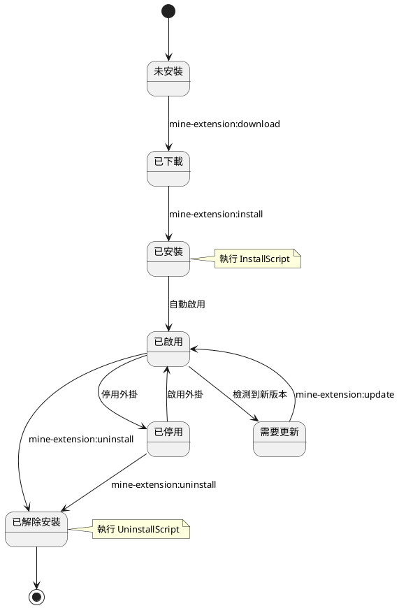
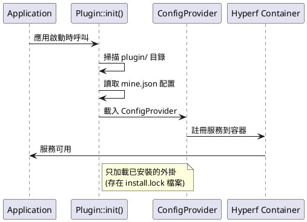
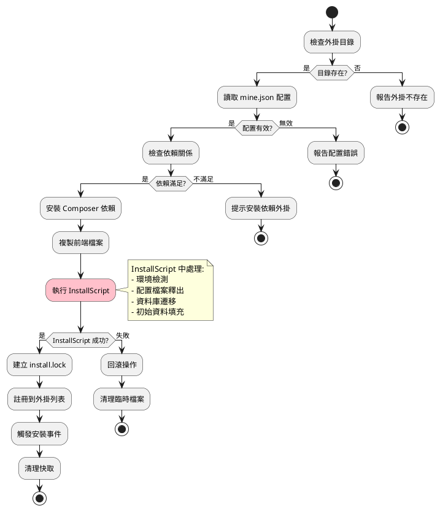
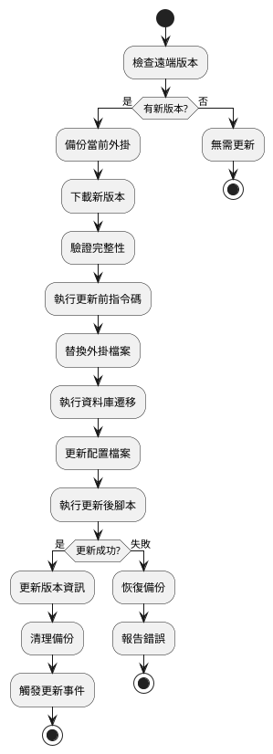
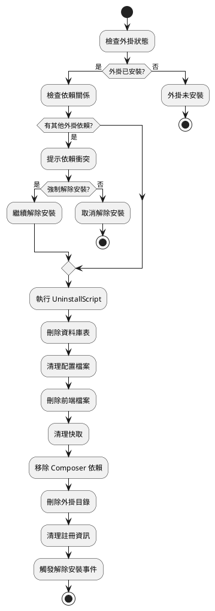

# 外掛生命週期管理

詳細介紹 MineAdmin 外掛的生命週期管理，包括安裝、啟用、停用、更新和解除安裝的完整流程。

## 生命週期概覽

MineAdmin 外掛的生命週期包括以下幾個階段：



## 外掛發現與載入

### 1. 外掛發現機制

**核心實現**: `Plugin::init()` 方法在 `bin/hyperf.php` ([GitHub](https://github.com/mineadmin/mineadmin/blob/master/bin/hyperf.php)) 中呼叫



### 2. 載入過程詳解

1. **掃描外掛目錄**: 遍歷 `plugin/` 目錄下的所有子目錄
2. **檢查安裝狀態**: 驗證是否存在 `install.lock` 檔案
3. **讀取配置**: 解析 `mine.json` 配置檔案
4. **載入 ConfigProvider**: 註冊外掛服務到 Hyperf 容器
5. **註冊路由**: 自動註冊控制器路由
6. **載入中介軟體**: 註冊外掛中介軟體
7. **註冊事件監聽器**: 載入事件監聽器

## 下載階段

### 命令使用

```bash
# 下載指定外掛
php bin/hyperf.php mine-extension:download --name plugin-name

# 檢視可下載的外掛列表
php bin/hyperf.php mine-extension:list
```

### 下載過程

1. **驗證 AccessToken**: 檢查 `MINE_ACCESS_TOKEN` 環境變數
2. **請求遠端倉庫**: 從 MineAdmin 官方倉庫獲取外掛資訊
3. **下載外掛包**: 下載壓縮包到本地臨時目錄
4. **解壓檔案**: 解壓到 `plugin/vendor/plugin-name/` 目錄
5. **驗證完整性**: 檢查 `mine.json` 檔案是否存在且格式正確

### 實現原理

**核心服務**: App-Store 元件 ([GitHub](https://github.com/mineadmin/appstore)) 提供下載功能

```php
// 虛擬碼示例
class DownloadService 
{
    public function download(string $pluginName): bool
    {
        // 1. 驗證訪問令牌
        $this->validateAccessToken();
        
        // 2. 獲取外掛資訊
        $pluginInfo = $this->getPluginInfo($pluginName);
        
        // 3. 下載外掛包
        $packagePath = $this->downloadPackage($pluginInfo['download_url']);
        
        // 4. 解壓到目標目錄
        $this->extractPackage($packagePath, $this->getPluginPath($pluginName));
        
        return true;
    }
}
```

## 安裝階段

### 命令使用

```bash
# 安裝外掛
php bin/hyperf.php mine-extension:install vendor/plugin-name --yes

# 強制重新安裝
php bin/hyperf.php mine-extension:install vendor/plugin-name --force
```

### 安裝流程詳解

> ⚠️ **重要提示**: 配置檔案釋出、環境檢測和資料庫遷移應在 `InstallScript` 中處理，而不是依賴 ConfigProvider 的 publish 功能。



### 1. 前置檢查

```php
// 安裝前檢查邏輯
class InstallChecker
{
    public function check(string $pluginPath): array
    {
        $errors = [];
        
        // 檢查外掛目錄
        if (!is_dir($pluginPath)) {
            $errors[] = '外掛目錄不存在';
        }
        
        // 檢查 mine.json
        $configPath = $pluginPath . '/mine.json';
        if (!file_exists($configPath)) {
            $errors[] = 'mine.json 配置檔案不存在';
        }
        
        // 檢查依賴關係
        $config = json_decode(file_get_contents($configPath), true);
        foreach ($config['require'] ?? [] as $dependency => $version) {
            if (!$this->isDependencyMet($dependency, $version)) {
                $errors[] = "依賴 {$dependency} 版本 {$version} 不滿足";
            }
        }
        
        return $errors;
    }
}
```

### 2. Composer 依賴安裝

安裝過程會處理外掛的 Composer 依賴：

```json
// mine.json 中的 composer 配置
{
  "composer": {
    "require": {
      "hyperf/async-queue": "^3.0",
      "symfony/console": "^6.0"
    },
    "psr-4": {
      "Plugin\\Vendor\\PluginName\\": "src"
    }
  }
}
```

系統會自動執行：
```bash
composer require hyperf/async-queue:^3.0 symfony/console:^6.0
```

### 3. InstallScript 處理 ⭐

> **最佳實踐**: 資料庫遷移、配置釋出和環境檢測應在 `InstallScript` 中處理：

```php
// 在 InstallScript 中處理所有安裝邏輯
class InstallScript
{
    public function handle(): bool
    {
        // 1. 環境檢測
        if (!$this->checkEnvironment()) {
            echo "環境不滿足要求\n";
            return false;
        }
        
        // 2. 釋出配置檔案（不使用 ConfigProvider 的 publish）
        $this->publishConfig();
        
        // 3. 執行資料庫遷移
        if (!$this->runMigrations()) {
            echo "資料庫遷移失敗\n";
            return false;
        }
        
        // 4. 初始化資料
        $this->seedData();
        
        return true;
    }
    
    private function publishConfig(): void
    {
        $source = __DIR__ . '/../publish/config/plugin.php';
        $target = BASE_PATH . '/config/autoload/plugin.php';
        
        if (!file_exists($target)) {
            copy($source, $target);
            echo "配置檔案已釋出\n";
        }
    }
    
    private function runMigrations(): bool
    {
        $migrationPath = __DIR__ . '/../Database/Migrations';
        
        if (is_dir($migrationPath)) {
            // 使用 Hyperf 的遷移命令
            $container = \Hyperf\Context\ApplicationContext::getContainer();
            $application = $container->get(\Hyperf\Contract\ApplicationInterface::class);
            
            $input = new \Symfony\Component\Console\Input\ArrayInput([
                'command' => 'migrate',
                '--path' => $migrationPath,
            ]);
            
            $output = new \Symfony\Component\Console\Output\BufferedOutput();
            $exitCode = $application->run($input, $output);
            
            return $exitCode === 0;
        }
        
        return true;
    }
}
```

### 4. 前端檔案複製

將 `web/` 目錄下的檔案複製到前端專案：

```
plugin/vendor/plugin-name/web/    →    前端專案對應目錄
├── views/example.vue             →    src/views/plugin/vendor/plugin-name/example.vue
├── components/ExampleComp.vue    →    src/components/plugin/vendor/plugin-name/ExampleComp.vue
└── api/example.js                →    src/api/plugin/vendor/plugin-name/example.js
```

### 5. 配置檔案釋出 ⚠️

> **注意**: ConfigProvider 中的 `publish` 功能在外掛系統中不可靠，應在 InstallScript 中手動處理：

```php
// 不推薦：ConfigProvider 中的 publish 可能不生效
'publish' => [
    // 這種方式在外掛中可能不會執行
]

// 推薦：在 InstallScript 中手動釋出
protected function publishConfig(): void
{
    $configs = [
        [
            'source' => __DIR__ . '/../publish/config/plugin.php',
            'target' => BASE_PATH . '/config/autoload/plugin.php',
        ],
        [
            'source' => __DIR__ . '/../publish/config/routes.php',
            'target' => BASE_PATH . '/config/routes/plugin.php',
        ],
    ];
    
    foreach ($configs as $config) {
        if (!file_exists($config['target'])) {
            copy($config['source'], $config['target']);
            echo "配置檔案已釋出: {$config['target']}\n";
        }
    }
}
```

### 6. 建立安裝鎖檔案

安裝成功後建立 `install.lock` 檔案標記安裝狀態：

```
plugin/vendor/plugin-name/install.lock
```

檔案內容包含安裝資訊：
```json
{
  "installed_at": "2024-01-01 12:00:00",
  "version": "1.0.0",
  "installer": "admin",
  "checksum": "abc123..."
}
```

## 啟用/停用管理

### 外掛狀態控制

MineAdmin 支援在不解除安裝外掛的情況下臨時停用外掛：

```bash
# 停用外掛
php bin/hyperf.php mine-extension:disable vendor/plugin-name

# 啟用外掛  
php bin/hyperf.php mine-extension:enable vendor/plugin-name

# 檢視外掛狀態
php bin/hyperf.php mine-extension:status vendor/plugin-name
```

### 狀態管理機制

狀態資訊儲存在 `install.lock` 檔案中：

```json
{
  "installed_at": "2024-01-01 12:00:00",
  "version": "1.0.0",
  "status": "enabled",  // enabled | disabled
  "disabled_at": null,
  "disabled_reason": null
}
```

## 更新階段

### 更新檢查

```bash
# 檢查外掛更新
php bin/hyperf.php mine-extension:check-updates

# 更新指定外掛
php bin/hyperf.php mine-extension:update vendor/plugin-name

# 更新所有外掛
php bin/hyperf.php mine-extension:update-all
```

### 更新流程



### 版本相容性處理

更新時會檢查版本相容性：

```php
class UpdateManager
{
    public function checkCompatibility(string $currentVersion, string $newVersion): bool
    {
        // 檢查主版本相容性
        $current = $this->parseVersion($currentVersion);
        $new = $this->parseVersion($newVersion);
        
        // 主版本不同時可能存在破壞性更新
        if ($current['major'] !== $new['major']) {
            return $this->checkBreakingChanges($currentVersion, $newVersion);
        }
        
        return true;
    }
}
```

## 解除安裝階段

### 命令使用

```bash
# 解除安裝外掛
php bin/hyperf.php mine-extension:uninstall vendor/plugin-name --yes

# 強制解除安裝 (忽略錯誤)
php bin/hyperf.php mine-extension:uninstall vendor/plugin-name --force
```

### 解除安裝流程



### 解除安裝指令碼執行

```php
// UninstallScript 示例
class UninstallScript
{
    public function handle(): bool
    {
        try {
            // 1. 清理資料庫
            $this->cleanDatabase();
            
            // 2. 清理配置檔案
            $this->cleanConfigFiles();
            
            // 3. 清理快取資料
            $this->cleanCache();
            
            // 4. 清理日誌檔案
            $this->cleanLogs();
            
            // 5. 執行自定義清理邏輯
            $this->customCleanup();
            
            return true;
        } catch (\Exception $e) {
            logger()->error('外掛解除安裝失敗: ' . $e->getMessage());
            return false;
        }
    }
    
    private function cleanDatabase(): void
    {
        // 刪除外掛相關表
        DB::statement('DROP TABLE IF EXISTS plugin_example');
        
        // 清理配置資料
        DB::table('system_config')->where('key', 'like', 'plugin.example.%')->delete();
    }
}
```

## 錯誤處理與回滾

### 安裝錯誤回滾

如果安裝過程中出現錯誤，系統會自動回滾：

```php
class InstallRollback
{
    public function rollback(string $pluginPath, array $operations): void
    {
        foreach (array_reverse($operations) as $operation) {
            try {
                switch ($operation['type']) {
                    case 'database':
                        $this->rollbackDatabase($operation['data']);
                        break;
                    case 'files':
                        $this->rollbackFiles($operation['data']);
                        break;
                    case 'config':
                        $this->rollbackConfig($operation['data']);
                        break;
                }
            } catch (\Exception $e) {
                logger()->error('回滾操作失敗: ' . $e->getMessage());
            }
        }
    }
}
```

### 依賴衝突處理

當外掛之間存在依賴衝突時的處理策略：

```php
class DependencyResolver
{
    public function resolveConflicts(array $conflicts): array
    {
        $solutions = [];
        
        foreach ($conflicts as $conflict) {
            $solution = match($conflict['type']) {
                'version_conflict' => $this->resolveVersionConflict($conflict),
                'circular_dependency' => $this->resolveCircularDependency($conflict),
                'missing_dependency' => $this->resolveMissingDependency($conflict),
                default => null
            };
            
            if ($solution) {
                $solutions[] = $solution;
            }
        }
        
        return $solutions;
    }
}
```

## 事件系統

外掛生命週期的各個階段都會觸發相應事件：

### 事件列表

```php
// 外掛生命週期事件
class PluginEvents
{
    const BEFORE_INSTALL = 'plugin.before_install';
    const AFTER_INSTALL = 'plugin.after_install';
    const BEFORE_UNINSTALL = 'plugin.before_uninstall';
    const AFTER_UNINSTALL = 'plugin.after_uninstall';
    const BEFORE_UPDATE = 'plugin.before_update';
    const AFTER_UPDATE = 'plugin.after_update';
    const ENABLED = 'plugin.enabled';
    const DISABLED = 'plugin.disabled';
}
```

### 事件監聽器示例

```php
use Hyperf\Event\Annotation\Listener;
use Hyperf\Event\Contract\ListenerInterface;

#[Listener]
class PluginInstallListener implements ListenerInterface
{
    public function listen(): array
    {
        return [
            PluginEvents::AFTER_INSTALL,
        ];
    }

    public function process(object $event): void
    {
        // 外掛安裝後的處理邏輯
        logger()->info('外掛安裝完成', [
            'plugin' => $event->getPluginName(),
            'version' => $event->getVersion()
        ]);
        
        // 清理快取
        $this->clearCache($event->getPluginName());
        
        // 傳送通知
        $this->sendNotification($event);
    }
}
```

## 狀態查詢

### 檢視外掛狀態

```bash
# 檢視所有本地外掛狀態
php bin/hyperf.php mine-extension:local-list

# 檢視遠端可用外掛
php bin/hyperf.php mine-extension:list

# 檢視特定外掛詳情
php bin/hyperf.php mine-extension:info vendor/plugin-name
```

### 狀態資訊結構

```json
{
  "name": "vendor/plugin-name",
  "version": "1.0.0",
  "status": "enabled",
  "installed_at": "2024-01-01 12:00:00",
  "last_updated": "2024-01-15 10:30:00",
  "dependencies": [
    "vendor/dependency-plugin"
  ],
  "dependents": [
    "vendor/dependent-plugin"
  ],
  "file_integrity": "valid",
  "database_status": "migrated"
}
```

## 最佳實踐

### 1. 安裝指令碼設計

- 實現冪等性：多次執行結果一致
- 提供詳細的錯誤資訊
- 支援事務回滾
- 記錄操作日誌

### 2. 解除安裝指令碼設計  

- 完全清理外掛資料
- 保留使用者重要資料的備份選項
- 處理依賴關係
- 優雅降級

### 3. 版本管理

- 遵循語義化版本規範
- 提供升級路徑說明
- 標註破壞性更新
- 維護更新日誌

## 相關文件

- [外掛開發指南](./develop.md) - 開發流程
- [外掛結構說明](./structure.md) - 目錄結構
- [API 參考](./api.md) - 介面文件
- [示例程式碼](./examples.md) - 實踐案例