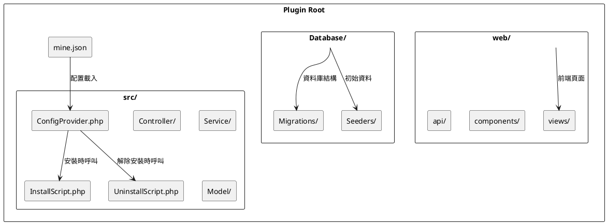

# 外掛目錄結構

詳細介紹 MineAdmin 外掛的標準目錄結構、檔案規範和組織方式。

## 標準目錄結構

一個完整的 MineAdmin 外掛目錄結構如下：

```
plugin/vendor/plugin-name/           # 外掛根目錄
├── mine.json                        # 外掛核心配置檔案 ⭐
├── README.md                        # 外掛說明文件
├── LICENSE                          # 許可證檔案
├── composer.json                    # Composer 依賴配置 (可選)
├── src/                            # 後端原始碼目錄 ⭐
│   ├── ConfigProvider.php          # 配置提供者 ⭐
│   ├── InstallScript.php           # 安裝指令碼 ⭐
│   ├── UninstallScript.php         # 解除安裝指令碼 ⭐
│   ├── Controller/                 # 控制器目錄
│   │   ├── AdminController.php     # 管理員控制器
│   │   └── ApiController.php       # API 控制器
│   ├── Service/                    # 服務層目錄
│   │   └── ExampleService.php      # 業務服務類
│   ├── Repository/                 # 倉庫層目錄
│   │   └── ExampleRepository.php   # 資料倉庫類
│   ├── Model/                      # 模型目錄
│   │   └── Example.php             # 資料模型
│   ├── Request/                    # 請求驗證目錄
│   │   ├── CreateRequest.php       # 建立請求驗證
│   │   └── UpdateRequest.php       # 更新請求驗證
│   ├── Resource/                   # 資源轉換目錄
│   │   └── ExampleResource.php     # 資源轉換類
│   ├── Middleware/                 # 中介軟體目錄
│   │   └── ExampleMiddleware.php   # 自定義中介軟體
│   ├── Command/                    # 命令列目錄
│   │   └── ExampleCommand.php      # 自定義命令
│   ├── Listener/                   # 事件監聽器目錄
│   │   └── ExampleListener.php     # 事件監聽器
│   └── Exception/                  # 異常處理目錄
│       └── ExampleException.php    # 自定義異常
├── web/                            # 前端原始碼目錄 ⭐
│   ├── views/                      # 頁面元件目錄
│   │   ├── index.vue               # 主頁面
│   │   ├── list.vue                # 列表頁面
│   │   └── form.vue                # 表單頁面
│   ├── components/                 # 公共元件目錄
│   │   └── ExampleComponent.vue    # 通用元件
│   ├── api/                        # API 介面目錄
│   │   └── example.js              # 介面定義
│   ├── router/                     # 路由配置目錄
│   │   └── index.js                # 路由配置
│   ├── store/                      # 狀態管理目錄
│   │   └── example.js              # 狀態管理
│   └── assets/                     # 靜態資源目錄
│       ├── images/                 # 圖片資源
│       └── styles/                 # 樣式檔案
├── Database/                       # 資料庫相關目錄 ⭐
│   ├── Migrations/                 # 資料庫遷移檔案
│   │   └── 2024_01_01_000000_create_example_table.php
│   └── Seeders/                    # 資料填充檔案
│       └── ExampleSeeder.php       # 資料填充類
├── config/                         # 配置檔案目錄
│   └── example.php                 # 外掛配置檔案
├── publish/                        # 釋出檔案目錄
│   ├── config/                     # 配置檔案模板
│   │   └── example.php             # 配置檔案模板
│   └── assets/                     # 靜態資源模板
├── tests/                          # 測試檔案目錄
│   ├── Unit/                       # 單元測試
│   ├── Feature/                    # 功能測試
│   └── TestCase.php                # 測試基類
├── docs/                           # 文件目錄
│   ├── installation.md             # 安裝文件
│   ├── usage.md                    # 使用文件
│   └── api.md                      # API 文件
└── .gitignore                      # Git 忽略檔案
```

## 核心檔案詳解

### 1. mine.json (外掛配置檔案)

**檔案路徑**: `mine.json` ([配置詳解](./mineJson.md))

外掛的核心配置檔案，定義外掛的基本資訊、依賴關係和載入配置：

```json
{
  "name": "vendor/plugin-name",
  "description": "外掛描述",
  "version": "1.0.0",
  "type": "mixed",
  "author": [
    {
      "name": "Author Name",
      "email": "author@example.com",
      "role": "developer"
    }
  ],
  "keywords": ["mineadmin", "plugin"],
  "homepage": "https://github.com/vendor/plugin-name",
  "license": "MIT",
  "require": {
    "php": ">=8.1",
    "hyperf/framework": "^3.0"
  },
  "package": {
    "dependencies": {
      "vue": "^3.0",
      "element-plus": "^2.0"
    }
  },
  "composer": {
    "require": {
      "hyperf/async-queue": "^3.0"
    },
    "psr-4": {
      "Plugin\\Vendor\\PluginName\\": "src"
    },
    "config": "Plugin\\Vendor\\PluginName\\ConfigProvider"
  }
}
```

### 2. ConfigProvider.php (配置提供者)

**檔案路徑**: `src/ConfigProvider.php`
**實現原理**: 基於 Hyperf ConfigProvider 機制 ([GitHub](https://github.com/hyperf/hyperf/blob/master/src/config-provider/src/ConfigProvider.php))

> ⚠️ **注意**: ConfigProvider 中的 `publish` 功能在外掛系統中存在問題，建議在 InstallScript 中處理配置檔案釋出。

```php
<?php

namespace Plugin\Vendor\PluginName;

class ConfigProvider
{
    public function __invoke(): array
    {
        return [
            'dependencies' => [],
            'annotations' => [
                'scan' => [
                    'paths' => [__DIR__],
                ],
            ],
            'commands' => [],
            'listeners' => [],
            // publish 功能在外掛中不推薦使用
            // 請在 InstallScript 中處理配置檔案釋出
        ];
    }
}
```

### 3. InstallScript.php (安裝指令碼) ⭐

**檔案路徑**: `src/InstallScript.php`
**呼叫時機**: 執行 `mine-extension:install` 命令時
**重要性**: 推薦在此處理配置釋出、環境檢測和資料庫遷移

```php
<?php

namespace Plugin\Vendor\PluginName;

use Hyperf\Contract\ApplicationInterface;
use Hyperf\Database\Commands\Migrations\MigrateCommand;

class InstallScript
{
    public function handle(): bool
    {
        // 1. 檢測環境依賴
        if (!$this->checkEnvironment()) {
            echo "環境檢測失敗\n";
            return false;
        }
        
        // 2. 釋出配置檔案
        $this->publishConfig();
        
        // 3. 執行資料庫遷移
        $this->runMigrations();
        
        // 4. 初始化資料
        $this->seedData();
        
        echo "外掛安裝成功\n";
        return true;
    }
    
    protected function checkEnvironment(): bool
    {
        // 檢查 PHP 版本
        if (version_compare(PHP_VERSION, '8.1.0', '<')) {
            echo "PHP 版本需要 >= 8.1\n";
            return false;
        }
        
        // 檢查必要的擴充套件
        $requiredExtensions = ['redis', 'pdo', 'json'];
        foreach ($requiredExtensions as $ext) {
            if (!extension_loaded($ext)) {
                echo "缺少 PHP 擴充套件: {$ext}\n";
                return false;
            }
        }
        
        return true;
    }
    
    protected function publishConfig(): void
    {
        $source = __DIR__ . '/../publish/config/plugin.php';
        $target = BASE_PATH . '/config/autoload/plugin.php';
        
        if (!file_exists($target)) {
            copy($source, $target);
            echo "配置檔案已釋出: {$target}\n";
        }
    }
    
    protected function runMigrations(): void
    {
        $migrationPath = __DIR__ . '/../Database/Migrations';
        
        if (is_dir($migrationPath)) {
            // 執行遷移命令
            $container = \Hyperf\Context\ApplicationContext::getContainer();
            $application = $container->get(ApplicationInterface::class);
            $application->setAutoExit(false);
            
            $input = new \Symfony\Component\Console\Input\ArrayInput([
                'command' => 'migrate',
                '--path' => $migrationPath,
            ]);
            
            $output = new \Symfony\Component\Console\Output\BufferedOutput();
            $application->run($input, $output);
            
            echo "資料庫遷移完成\n";
        }
    }
    
    protected function seedData(): void
    {
        // 初始化預設資料
        // 例如建立預設配置、選單等
    }
}
```

### 4. UninstallScript.php (解除安裝指令碼) ⭐

**檔案路徑**: `src/UninstallScript.php`
**呼叫時機**: 執行 `mine-extension:uninstall` 命令時
**重要性**: 清理配置檔案、資料表和相關資源

```php
<?php

namespace Plugin\Vendor\PluginName;

use Hyperf\DbConnection\Db;

class UninstallScript
{
    public function handle(): bool
    {
        // 1. 備份重要資料（可選）
        $this->backupData();
        
        // 2. 刪除資料庫表
        $this->dropTables();
        
        // 3. 清理配置檔案
        $this->removeConfig();
        
        // 4. 清理快取
        $this->clearCache();
        
        echo "外掛解除安裝完成\n";
        return true;
    }
    
    protected function backupData(): void
    {
        // 備份重要資料到指定目錄
        $backupPath = BASE_PATH . '/runtime/backup/plugin_' . date('YmdHis') . '.sql';
        // 實現備份邏輯
    }
    
    protected function dropTables(): void
    {
        // 刪除外掛建立的資料表
        $tables = ['plugin_example_table', 'plugin_settings'];
        
        foreach ($tables as $table) {
            if (Db::schema()->hasTable($table)) {
                Db::schema()->drop($table);
                echo "已刪除資料表: {$table}\n";
            }
        }
    }
    
    protected function removeConfig(): void
    {
        $configFile = BASE_PATH . '/config/autoload/plugin.php';
        
        if (file_exists($configFile)) {
            unlink($configFile);
            echo "配置檔案已刪除: {$configFile}\n";
        }
    }
    
    protected function clearCache(): void
    {
        // 清理外掛相關快取
        $redis = \Hyperf\Context\ApplicationContext::getContainer()
            ->get(\Hyperf\Redis\Redis::class);
        
        $redis->del('plugin:cache:*');
        echo "快取已清理\n";
    }
}
```

## 目錄結構圖解



## 不同型別外掛的結構差異

### Mixed (混合型外掛)
包含完整的 `src/` 和 `web/` 目錄，提供前後端完整功能。

### Backend (後端外掛)
只包含 `src/` 目錄，專注於提供 API 服務和業務邏輯：

```
plugin/vendor/backend-plugin/
├── mine.json
├── src/
│   ├── ConfigProvider.php
│   ├── Controller/
│   ├── Service/
│   └── Model/
└── Database/
```

### Frontend (前端外掛)
只包含 `web/` 目錄，專注於前端介面和互動：

```
plugin/vendor/frontend-plugin/
├── mine.json
├── web/
│   ├── views/
│   ├── components/
│   └── assets/
└── src/
    └── ConfigProvider.php  # 最小配置
```

## 命名規範

### 1. 目錄命名
- 使用小寫字母和連字元：`user-management`
- 避免使用下劃線和空格

### 2. 檔案命名
- PHP 類檔案使用 PascalCase：`UserController.php`
- Vue 元件使用 PascalCase：`UserList.vue`
- 配置檔案使用小寫：`user.php`

### 3. 名稱空間規範
遵循 PSR-4 自動載入標準：

```php
// 外掛路徑: plugin/mineadmin/user-manager/
// 名稱空間: Plugin\MineAdmin\UserManager\
namespace Plugin\MineAdmin\UserManager\Controller;
```

## 檔案許可權和安全

### 1. 檔案許可權設定
```bash
# 設定合適的檔案許可權
find plugin/ -type f -name "*.php" -exec chmod 644 {} \;
find plugin/ -type d -exec chmod 755 {} \;
```

### 2. 安全注意事項
- 敏感配置使用環境變數
- 避免在程式碼中硬編碼金鑰
- 驗證和過濾使用者輸入
- 使用 HTTPS 傳輸敏感資料

## 最佳實踐

### 1. 檔案組織
- 按功能模組組織程式碼
- 保持目錄結構清晰
- 使用有意義的檔名

### 2. 程式碼規範
- 遵循 PSR-12 編碼標準
- 新增適當的註釋
- 使用型別宣告

### 3. 版本控制
- 使用 `.gitignore` 排除不必要的檔案
- 建立清晰的提交資訊
- 使用語義化版本號

## 示例專案結構

檢視官方外掛的實際結構：

**App-Store 外掛**:  MineAdmin 官方應用市場外掛，展示了標準的混合型外掛結構

## 常見問題

### Q: 外掛目錄應該放在哪裡？
A: 外掛應該放在專案根目錄的 `plugin/` 目錄下，按 `vendor/plugin-name` 格式組織。

### Q: 如何處理外掛之間的依賴？
A: 在 `mine.json` 的 `require` 欄位中宣告依賴的其他外掛。

### Q: 前端檔案安裝後放在哪裡？
A: `web/` 目錄下的檔案會在安裝時複製到前端專案的對應位置。

### Q: 資料庫遷移檔案如何執行？
A: 在 `InstallScript.php` 中呼叫遷移執行邏輯，或使用 Hyperf 的遷移命令。