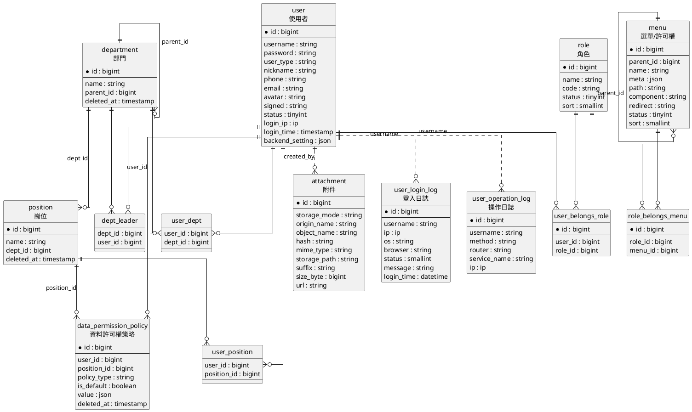

# 資料模型契約

資料模型契約定義 MineAdmin 後端實現之間共享的核心實體、欄位語義和關聯關係。不同框架可以使用不同 ORM 或資料訪問方式，但對外暴露給前臺模板、許可權系統、介面元資料和審計日誌的模型含義需要保持一致。

本文依據 MineAdmin 當前遷移檔案和模型關係整理，重點覆蓋管理後臺穩定依賴的實體。

## 核心實體

| 實體 | 表 | 作用 |
|------|----|------|
| 使用者 | `user` | 後臺賬號主體，儲存登入憑據、使用者型別、暱稱、聯絡方式、頭像、狀態、最後登入 IP/時間、後臺個人設定和審計建立/更新人。 |
| 角色 | `role` | 許可權分組主體，儲存角色名稱、唯一角色程式碼、狀態和排序；使用者透過角色獲得選單、按鈕和介面許可權。 |
| 選單/許可權 | `menu` | 前臺路由、選單樹和許可權標識的統一載體；`parent_id` 組織選單層級，`path`、`component`、`redirect` 和 `meta` 支撐前臺渲染，`name` 參與權限判斷。 |
| 部門 | `department` | 組織樹節點，透過 `parent_id` 表達上下級部門；用於使用者歸屬、部門負責人和資料許可權範圍計算。 |
| 崗位 | `position` | 部門下的崗位節點，透過 `dept_id` 歸屬部門；使用者可以關聯多個崗位，崗位也可以承載資料許可權策略。 |
| 資料許可權策略 | `data_permission_policy` | 資料範圍控制規則，按當前遷移透過 `user_id` 或 `position_id` 繫結到使用者或崗位，使用 `policy_type` 和 `value` 描述部門、自定義範圍或函式規則。 |
| 附件 | `attachment` | 上傳檔案索引，記錄儲存模式、原始檔名、物件名、雜湊、MIME、儲存路徑、字尾、大小、訪問 URL 和審計建立/更新人；前臺檔案選擇、預覽和下載能力依賴該實體。 |
| 登入日誌 | `user_login_log` | 登入審計記錄，儲存使用者名稱、登入 IP、作業系統、瀏覽器、登入狀態、提示訊息和登入時間，用於安全審計和登入軌跡查詢。 |
| 操作日誌 | `user_operation_log` | 操作審計記錄，儲存使用者名稱、請求方法、路由、業務名稱、請求 IP 和時間資訊，用於追蹤後臺功能呼叫和問題排查。 |

## 關聯表

| 關聯表 | 關係 | 說明 |
|--------|------|------|
| `user_belongs_role` | 使用者 N:N 角色 | 一個使用者可以擁有多個角色，一個角色可以分配給多個使用者。 |
| `role_belongs_menu` | 角色 N:N 選單 | 一個角色可以擁有多個選單/許可權，一個選單/許可權也可以授權給多個角色。 |
| `user_dept` | 使用者 N:N 部門 | 一個使用者可以歸屬多個部門，用於組織展示和資料許可權上下文。 |
| `user_position` | 使用者 N:N 崗位 | 一個使用者可以擁有多個崗位，崗位策略可作為使用者策略的後備來源。 |
| `dept_leader` | 部門 N:N 負責人使用者 | 一個部門可以配置多個負責人，一個使用者也可以負責多個部門。 |

## 關係約定

- 使用者與角色透過 `user_belongs_role` 多對多關聯；使用者許可權由角色關聯的選單/許可權集合彙總而來。
- 角色與選單透過 `role_belongs_menu` 多對多關聯；選單樹由 `menu.parent_id` 自關聯構成。
- 使用者與部門透過 `user_dept` 多對多關聯；部門樹由 `department.parent_id` 自關聯構成。
- 崗位透過 `position.dept_id` 歸屬部門，使用者與崗位透過 `user_position` 多對多關聯。
- 部門負責人透過 `dept_leader` 關聯使用者和部門，不等同於普通部門歸屬。
- 資料許可權策略按當前遷移使用 `data_permission_policy.user_id` 或 `position_id` 繫結；使用者讀取策略時優先使用使用者策略，沒有使用者策略時再檢查使用者崗位上的策略。
- 附件、登入日誌、操作日誌是支撐型實體，不改變許可權主鏈路，但前臺和後臺介面應保持欄位語義穩定。
- 登入日誌和操作日誌按 `username` 建索引，不包含 `user_id` 欄位；它們與使用者實體是審計追蹤關係，不是資料庫外來鍵關係。
- 圖中實線表示模型關係或關聯表關係，點線表示審計欄位形成的邏輯追蹤關係。

## ER 圖

