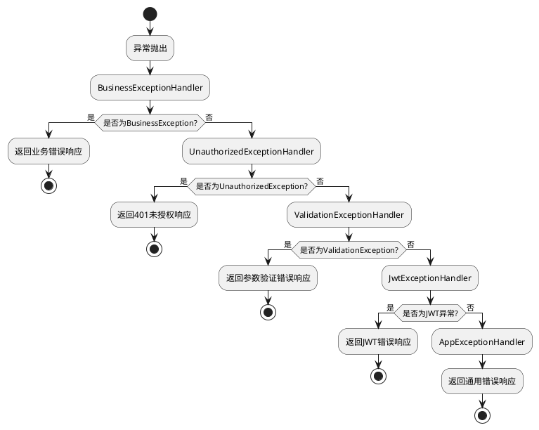

# 错误处理

## 目录

- [默认异常处理机制](#默认异常处理机制)
- [异常处理流程](#异常处理流程)
- [核心异常处理器](#核心异常处理器)
- [业务异常处理](#业务异常处理)
- [自定义异常处理器](#自定义异常处理器)
- [调试模式特性](#调试模式特性)
- [最佳实践](#最佳实践)
- [常见问题](#常见问题)

## 默认异常处理机制

::: tip 前置知识
要理解 MineAdmin 的异常处理，首先需要你对 [Hyperf](https://hyperf.io) 的错误处理有一定的了解。
本文不讲述基础性的说明，请先了解 Hyperf 异常处理的基本概念。
:::

MineAdmin 基于 Hyperf 框架实现了完善的异常处理机制。在 `config/autoload/exceptions.php` 中配置了多个异常处理器，采用责任链模式按顺序处理不同类型的异常。

## 异常处理流程



## 核心异常处理器

### 异常处理器配置

::: code-group

```php [exceptions.php]
<?php

declare(strict_types=1);
/**
 * This file is part of MineAdmin.
 *
 * @link     https://www.mineadmin.com
 * @document https://doc.mineadmin.com
 * @contact  root@imoi.cn
 * @license  https://github.com/mineadmin/MineAdmin/blob/master/LICENSE
 */
use App\Exception\Handler\AppExceptionHandler;
use App\Exception\Handler\BusinessExceptionHandler;
use App\Exception\Handler\JwtExceptionHandler;
use App\Exception\Handler\UnauthorizedExceptionHandler;
use App\Exception\Handler\ValidationExceptionHandler;
use Hyperf\ExceptionHandler\Listener\ErrorExceptionHandler;
use Hyperf\HttpServer\Exception\Handler\HttpExceptionHandler;

return [
    'handler' => [
        'http' => [
            // 处理业务异常 - 优先级最高
            BusinessExceptionHandler::class,
            // 处理未授权异常
            UnauthorizedExceptionHandler::class,
            // 处理验证器异常
            ValidationExceptionHandler::class,
            // 处理JWT异常
            JwtExceptionHandler::class,
            // 处理应用异常 - 最后兜底处理
            AppExceptionHandler::class,
        ],
    ],
];
```

:::

::: warning 注意事项
- 异常处理器的顺序很重要，越靠前的处理器优先级越高
- `AppExceptionHandler` 作为兜底处理器，应该始终放在最后
- 不要随意修改处理器的顺序，除非你完全理解其影响
:::

### 基础异常处理器类

所有的异常处理器都继承自 `AbstractHandler`，提供了统一的处理逻辑：

::: code-group

```php [AbstractHandler.php]
<?php

declare(strict_types=1);
/**
 * This file is part of MineAdmin.
 *
 * @link     https://www.mineadmin.com
 * @document https://doc.mineadmin.com
 * @contact  root@imoi.cn
 * @license  https://github.com/mineadmin/MineAdmin/blob/master/LICENSE
 */

namespace App\Exception\Handler;

use App\Http\Common\Result;
use Hyperf\Codec\Json;
use Hyperf\Context\Context;
use Hyperf\Contract\ConfigInterface;
use Hyperf\Contract\StdoutLoggerInterface;
use Hyperf\ExceptionHandler\ExceptionHandler;
use Hyperf\ExceptionHandler\Formatter\FormatterInterface;
use Hyperf\HttpMessage\Stream\SwooleStream;
use Hyperf\Logger\LoggerFactory;
use Mine\Support\Logger\UuidRequestIdProcessor;
use Mine\Support\Traits\Debugging;
use Psr\Container\ContainerInterface;
use Swow\Psr7\Message\ResponsePlusInterface;

abstract class AbstractHandler extends ExceptionHandler
{
    use Debugging;

    public function __construct(
        private readonly ConfigInterface $config,
        private readonly ContainerInterface $container,
        private readonly LoggerFactory $loggerFactory
    ) {}

    /**
     * 子类必须实现此方法，定义如何处理异常并返回结果
     */
    abstract public function handleResponse(\Throwable $throwable): Result;

    /**
     * 处理异常的主入口方法
     */
    public function handle(\Throwable $throwable, ResponsePlusInterface $response)
    {
        // 上报异常日志
        $this->report($throwable);
        
        return value(function (ResponsePlusInterface $responsePlus) use ($throwable) {
            // 如果是 debug 模式，自动处理跨域并记录详细错误信息
            if ($this->isDebug()) {
                $responsePlus
                    ->setHeader('Access-Control-Allow-Origin', '*')
                    ->setHeader('Access-Control-Allow-Credentials', 'true')
                    ->setHeader('Access-Control-Allow-Methods', 'GET, POST, PATCH, PUT, DELETE, OPTIONS')
                    ->setHeader('Access-Control-Allow-Headers', 'DNT,Keep-Alive,User-Agent,Cache-Control,Content-Type,Authorization');
                
                // 记录详细的异常信息到上下文
                Context::set(self::class . '.throwable', [
                    'message' => $throwable->getMessage(),
                    'file' => $throwable->getFile(),
                    'line' => $throwable->getLine(),
                    'trace' => $throwable->getTrace(),
                ]);
            }
            return $responsePlus;
        }, $this->handlerRequestId(
            $this->handlerResult(
                $response,
                $this->handleResponse($throwable)
            )
        ));
    }

    /**
     * 上报异常日志，包括控制台输出和文件记录
     */
    public function report(\Throwable $throwable)
    {
        // 如果是debug模式，在控制台打印格式化的错误信息
        if ($this->isDebug()) {
            $this->container->get(StdoutLoggerInterface::class)->error(
                $this->container->get(FormatterInterface::class)->format($throwable)
            );
        }
        
        // 记录异常到错误日志文件
        $this->loggerFactory
            ->get('error')
            ->error($throwable->getMessage(), ['exception' => $throwable]);
    }

    /**
     * 将结果包装到响应体中
     */
    protected function handlerResult(ResponsePlusInterface $responsePlus, Result $result): ResponsePlusInterface
    {
        $responsePlus->setHeader('Content-Type', 'application/json; charset=utf-8');

        // 调试模式下返回详细的异常信息
        if ($this->isDebug()) {
            $result = $result->toArray();
            $result['throwable'] = Context::get(self::class . '.throwable');
            return $responsePlus
                ->setBody(new SwooleStream(Json::encode($result)));
        }

        return $responsePlus
            ->setBody(new SwooleStream(Json::encode($result)));
    }

    /**
     * 为响应添加请求ID头部，便于问题追踪
     */
    private function handlerRequestId(ResponsePlusInterface $responsePlus): ResponsePlusInterface
    {
        return $responsePlus->setHeader('Request-Id', UuidRequestIdProcessor::getUuid());
    }
}
```

```php [AppExceptionHandler.php]
<?php

declare(strict_types=1);

namespace App\Exception\Handler;

use App\Http\Common\Result;
use App\Http\Common\ResultCode;

/**
 * 应用程序最终的异常处理器
 * 作为兜底处理器，捕获所有未被其他处理器处理的异常
 */
final class AppExceptionHandler extends AbstractHandler
{
    /**
     * 处理异常并返回统一的错误响应
     */
    public function handleResponse(\Throwable $throwable): Result
    {
        // 阻止异常继续传播
        $this->stopPropagation();
        
        return new Result(
            ResultCode::FAIL,
            $throwable->getMessage() ?: '系统异常，请稍后重试'
        );
    }
    
    /**
     * 该处理器处理所有类型的异常
     */
    public function isValid(\Throwable $throwable): bool
    {
        return true;
    }
}
```

:::

## Result 和 ResultCode 核心类

### Result 统一响应类

`Result` 类是 MineAdmin 中所有接口响应的标准格式，实现了 `Arrayable` 接口并支持 OpenAPI 文档注解：

::: code-group

```php [Result.php]
<?php

declare(strict_types=1);

namespace App\Http\Common;

use Hyperf\Contract\Arrayable;
use Hyperf\Swagger\Annotation as OA;

/**
 * @template T
 */
#[OA\Schema(title: 'Api Response', description: 'Api Response')]
class Result implements Arrayable
{
    /**
     * @param T $data
     */
    public function __construct(
        #[OA\Property(ref: 'ResultCode', title: '响应码')]
        public ResultCode $code = ResultCode::SUCCESS,
        #[OA\Property(title: '响应消息', type: 'string')]
        public ?string $message = null,
        #[OA\Property(title: '响应数据', type: 'array')]
        public mixed $data = []
    ) {
        // 如果未提供消息，自动从 ResultCode 获取默认消息
        if ($this->message === null) {
            $this->message = ResultCode::getMessage($this->code->value);
        }
    }

    public function toArray(): array
    {
        return [
            'code' => $this->code->value,
            'message' => $this->message,
            'data' => $this->data,
        ];
    }
}
```

:::

#### 使用示例

::: code-group

```php [成功响应]
// 成功响应 - 使用默认成功码
$result = new Result();

// 成功响应 - 带数据
$result = new Result(data: ['id' => 1, 'name' => '张三']);

// 成功响应 - 自定义消息
$result = new Result(message: '操作成功完成');
```

```php [失败响应]
// 失败响应 - 使用默认失败码
$result = new Result(ResultCode::FAIL, '操作失败');

// 失败响应 - 使用具体状态码
$result = new Result(ResultCode::UNAUTHORIZED, '用户未登录');

// 失败响应 - 带错误数据
$result = new Result(
    ResultCode::UNPROCESSABLE_ENTITY, 
    '参数验证失败',
    ['errors' => ['email' => ['邮箱格式错误']]]
);
```

:::

### ResultCode 状态码枚举

`ResultCode` 是一个基于 PHP 8.1 枚举的状态码定义，使用 Hyperf 的 Constants 特性支持国际化消息：

::: code-group

```php [ResultCode.php]
<?php

declare(strict_types=1);

namespace App\Http\Common;

use Hyperf\Constants\Annotation\Constants;
use Hyperf\Constants\Annotation\Message;
use Hyperf\Constants\ConstantsTrait;
use Hyperf\Swagger\Annotation as OA;

#[Constants]
#[OA\Schema(title: 'ResultCode', type: 'integer', default: 200)]
enum ResultCode: int
{
    use ConstantsTrait;

    #[Message('result.success')]
    case SUCCESS = 200;

    #[Message('result.fail')]
    case FAIL = 500;

    #[Message('result.unauthorized')]
    case UNAUTHORIZED = 401;

    #[Message('result.forbidden')]
    case FORBIDDEN = 403;

    #[Message('result.not_found')]
    case NOT_FOUND = 404;

    #[Message('result.method_not_allowed')]
    case METHOD_NOT_ALLOWED = 405;

    #[Message('result.not_acceptable')]
    case NOT_ACCEPTABLE = 406;

    #[Message('result.conflict')]
    case UNPROCESSABLE_ENTITY = 422;

    #[Message('result.disabled')]
    case DISABLED = 423;
}
```

:::

#### 状态码说明

| 常量名 | 数值 | HTTP 状态码 | 说明 | 使用场景 |
|--------|------|-------------|------|----------|
| `SUCCESS` | 200 | 200 OK | 操作成功 | 正常的业务处理成功 |
| `FAIL` | 500 | 500 Internal Server Error | 系统错误 | 通用的系统异常或业务处理失败 |
| `UNAUTHORIZED` | 401 | 401 Unauthorized | 未授权 | 用户未登录或令牌无效 |
| `FORBIDDEN` | 403 | 403 Forbidden | 禁止访问 | 用户无权限访问资源 |
| `NOT_FOUND` | 404 | 404 Not Found | 资源不存在 | 请求的资源不存在 |
| `METHOD_NOT_ALLOWED` | 405 | 405 Method Not Allowed | 方法不允许 | HTTP 方法不被支持 |
| `NOT_ACCEPTABLE` | 406 | 406 Not Acceptable | 不可接受 | 请求的内容特性无法满足 |
| `UNPROCESSABLE_ENTITY` | 422 | 422 Unprocessable Entity | 无法处理的实体 | 参数验证失败，业务规则验证失败 |
| `DISABLED` | 423 | 423 Locked | 资源被锁定 | 用户或资源被禁用 |

#### 国际化支持

`ResultCode` 支持通过 Hyperf 的多语言机制获取对应的消息文本：

::: code-group

```php [语言文件 - lang/zh_CN/result.php]
<?php

return [
    'success' => '操作成功',
    'fail' => '操作失败',
    'unauthorized' => '用户未授权',
    'forbidden' => '禁止访问',
    'not_found' => '资源不存在',
    'method_not_allowed' => '方法不允许',
    'not_acceptable' => '不可接受的请求',
    'conflict' => '参数验证失败',
    'disabled' => '资源已禁用',
];
```

```php [获取国际化消息]
// 通过 ResultCode 获取消息
$message = ResultCode::getMessage(ResultCode::SUCCESS->value);
// 输出：'操作成功'

// Result 构造时自动获取消息
$result = new Result(ResultCode::NOT_FOUND);
// $result->message 自动为 '资源不存在'
```

:::

## 业务异常处理

### BusinessException 业务异常类

推荐使用 `BusinessException` 来抛出业务相关的异常，而不是直接使用 `throw new Exception`：

::: code-group

```php [BusinessException.php]
<?php

declare(strict_types=1);
/**
 * This file is part of MineAdmin.
 *
 * @link     https://www.mineadmin.com
 * @document https://doc.mineadmin.com
 * @contact  root@imoi.cn
 * @license  https://github.com/mineadmin/MineAdmin/blob/master/LICENSE
 */

namespace App\Exception;

use App\Http\Common\Result;
use App\Http\Common\ResultCode;

/**
 * 业务异常类
 * 用于抛出业务逻辑相关的异常
 */
class BusinessException extends \RuntimeException
{
    private Result $response;

    /**
     * @param ResultCode $code 结果状态码
     * @param string|null $message 错误消息
     * @param mixed $data 附加数据
     */
    public function __construct(ResultCode $code = ResultCode::FAIL, ?string $message = null, mixed $data = [])
    {
        $this->response = new Result($code, $message, $data);
        parent::__construct($message ?? ResultCode::getMessage($code->value));
    }

    /**
     * 获取结构化的响应对象
     */
    public function getResponse(): Result
    {
        return $this->response;
    }
}
```

```php [BusinessExceptionHandler.php]
<?php

declare(strict_types=1);

namespace App\Exception\Handler;

use App\Exception\BusinessException;
use App\Http\Common\Result;

/**
 * 业务异常处理器
 * 专门处理 BusinessException 类型的异常
 */
class BusinessExceptionHandler extends AbstractHandler
{
    /**
     * 处理业务异常，直接返回异常中包含的结果
     */
    public function handleResponse(\Throwable $throwable): Result
    {
        $this->stopPropagation();
        
        if ($throwable instanceof BusinessException) {
            return $throwable->getResponse();
        }
        
        // 兜底处理
        return new Result(
            ResultCode::FAIL,
            $throwable->getMessage()
        );
    }
    
    /**
     * 只处理 BusinessException 类型的异常
     */
    public function isValid(\Throwable $throwable): bool
    {
        return $throwable instanceof BusinessException;
    }
}
```

:::

### 实际使用示例

::: code-group

```php [UserService.php]
<?php

declare(strict_types=1);

namespace App\Service;

use App\Exception\BusinessException;
use App\Http\Common\ResultCode;

class UserService
{
    /**
     * 用户登录验证
     */
    public function login(string $username, string $password): array
    {
        // 检查用户名格式
        if (empty($username)) {
            throw new BusinessException(
                ResultCode::UNPROCESSABLE_ENTITY,
                trans('validation.required', ['attribute' => '用户名'])
            );
        }
        
        // 查找用户
        $user = $this->findUserByUsername($username);
        if (!$user) {
            throw new BusinessException(
                ResultCode::NOT_FOUND,
                trans('auth.user_not_found')
            );
        }
        
        // 验证密码
        if (!$this->verifyPassword($password, $user['password'])) {
            throw new BusinessException(
                ResultCode::UNAUTHORIZED,
                trans('auth.invalid_credentials')
            );
        }
        
        // 检查用户状态
        if ($user['status'] !== 'active') {
            throw new BusinessException(
                ResultCode::DISABLED,
                trans('auth.user_disabled'),
                ['reason' => $user['disable_reason'] ?? '未知原因']
            );
        }
        
        return $user;
    }

    /**
     * 更新用户资料
     */
    public function updateProfile(int $userId, array $data): bool
    {
        $user = $this->findUserById($userId);
        if (!$user) {
            throw new BusinessException(
                ResultCode::NOT_FOUND,
                '用户不存在'
            );
        }

        // 检查邮箱是否已被使用
        if (isset($data['email']) && $this->isEmailExists($data['email'], $userId)) {
            throw new BusinessException(
                ResultCode::UNPROCESSABLE_ENTITY,
                '邮箱已被其他用户使用'
            );
        }

        return $this->updateUser($userId, $data);
    }
}
```

```php [UserController.php]
<?php

declare(strict_types=1);

namespace App\Controller;

use App\Service\UserService;
use App\Http\Common\Result;
use App\Http\Common\ResultCode;

class UserController extends AbstractController
{
    public function __construct(
        private readonly UserService $userService
    ) {}
    
    /**
     * 用户登录
     * 
     * 业务异常会被 BusinessExceptionHandler 自动捕获并转换为相应的响应
     */
    public function login(): Result
    {
        $username = $this->request->input('username');
        $password = $this->request->input('password');
        
        // 如果 UserService 抛出 BusinessException，
        // 会被自动捕获并返回相应的错误响应
        $user = $this->userService->login($username, $password);
        
        // 生成令牌等后续逻辑...
        $token = $this->generateToken($user);
        
        return $this->success([
            'token' => $token,
            'user' => $user
        ]);
    }

    /**
     * 更新用户资料
     */
    public function updateProfile(): Result
    {
        $userId = $this->getUserId();
        $data = $this->request->all();
        
        $this->userService->updateProfile($userId, $data);
        
        return $this->success(message: '资料更新成功');
    }
}
```

:::

## 自定义异常处理器

当需要处理特定类型的异常时，可以创建自定义的异常处理器。

### 创建自定义异常类

::: code-group

```php [PaymentException.php]
<?php

declare(strict_types=1);

namespace App\Exception;

use App\Http\Common\ResultCode;

/**
 * 支付相关异常
 */
class PaymentException extends \RuntimeException
{
    public function __construct(
        private readonly string $paymentMethod,
        private readonly string $transactionId,
        string $message = '支付处理失败',
        int $code = 0,
        ?\Throwable $previous = null
    ) {
        parent::__construct($message, $code, $previous);
    }

    public function getPaymentMethod(): string
    {
        return $this->paymentMethod;
    }

    public function getTransactionId(): string
    {
        return $this->transactionId;
    }
}
```

:::

### 创建自定义异常处理器

::: code-group

```php [PaymentExceptionHandler.php]
<?php

declare(strict_types=1);

namespace App\Exception\Handler;

use App\Exception\PaymentException;
use App\Http\Common\Result;
use App\Http\Common\ResultCode;

/**
 * 支付异常处理器
 */
class PaymentExceptionHandler extends AbstractHandler
{
    public function handleResponse(\Throwable $throwable): Result
    {
        $this->stopPropagation();
        
        if ($throwable instanceof PaymentException) {
            // 记录支付异常的详细信息
            $this->loggerFactory
                ->get('payment')
                ->error('支付异常', [
                    'payment_method' => $throwable->getPaymentMethod(),
                    'transaction_id' => $throwable->getTransactionId(),
                    'message' => $throwable->getMessage(),
                    'trace' => $throwable->getTraceAsString(),
                ]);
            
            return new Result(
                ResultCode::FAIL,
                '支付处理失败，请稍后重试或联系客服',
                [
                    'transaction_id' => $throwable->getTransactionId(),
                    'support_contact' => config('payment.support_contact'),
                ]
            );
        }
        
        return new Result(
            ResultCode::FAIL,
            $throwable->getMessage()
        );
    }
    
    public function isValid(\Throwable $throwable): bool
    {
        return $throwable instanceof PaymentException;
    }
}
```

:::

### 注册自定义异常处理器

在 `config/autoload/exceptions.php` 中注册你的自定义处理器：

::: code-group

```php [exceptions.php]
<?php

return [
    'handler' => [
        'http' => [
            // 业务异常处理器
            BusinessExceptionHandler::class,
            // 自定义的支付异常处理器
            PaymentExceptionHandler::class,
            // 其他处理器...
            UnauthorizedExceptionHandler::class,
            ValidationExceptionHandler::class,
            JwtExceptionHandler::class,
            AppExceptionHandler::class,
        ],
    ],
];
```

:::

### 使用自定义异常

::: code-group

```php [PaymentService.php]
<?php

declare(strict_types=1);

namespace App\Service;

use App\Exception\PaymentException;

class PaymentService
{
    public function processPayment(string $method, float $amount, string $transactionId): bool
    {
        try {
            // 调用第三方支付接口
            $result = $this->callPaymentGateway($method, $amount, $transactionId);
            
            if (!$result['success']) {
                throw new PaymentException(
                    paymentMethod: $method,
                    transactionId: $transactionId,
                    message: "支付失败：{$result['error_msg']}"
                );
            }
            
            return true;
        } catch (\Throwable $e) {
            // 将所有支付相关的异常包装为 PaymentException
            throw new PaymentException(
                paymentMethod: $method,
                transactionId: $transactionId,
                message: "支付处理异常：{$e->getMessage()}",
                previous: $e
            );
        }
    }
}
```

:::

## 调试模式特性

### 开启调试模式

在 `.env` 文件中设置：

```env
APP_DEBUG=true
```

### 调试模式功能

当 `APP_DEBUG=true` 时，异常处理器会提供以下额外功能：

1. **详细的异常信息**：响应中包含异常的文件、行号和调用栈
2. **控制台输出**：异常信息会输出到命令行控制台
3. **CORS 头部**：自动添加跨域请求头，方便前端调试
4. **Request-Id**：每个响应都包含唯一的请求ID，便于日志追踪

### 调试响应格式

调试模式下的响应示例：

::: code-group

```json [调试模式响应]
{
  "code": 500,
  "message": "用户不存在",
  "data": null,
  "throwable": {
    "message": "用户不存在",
    "file": "/app/Service/UserService.php",
    "line": 45,
    "trace": [
      {
        "file": "/app/Controller/UserController.php",
        "line": 23,
        "function": "findUser",
        "class": "App\\Service\\UserService",
        "type": "->"
      }
    ]
  }
}
```

```json [生产模式响应]
{
  "code": 500,
  "message": "用户不存在",
  "data": null
}
```

:::

::: warning 安全提醒
生产环境中务必关闭调试模式（`APP_DEBUG=false`），避免泄露敏感的系统信息。
:::

## 最佳实践

### 1. 异常分层处理

```php
// 推荐：使用语义化的异常类型
throw new BusinessException(ResultCode::NOT_FOUND, trans('user.not_found'));

// 不推荐：直接抛出通用异常
throw new \Exception('用户不存在');
```

### 2. 合理使用 ResultCode

```php
// 推荐：使用语义化的结果码
throw new BusinessException(
    ResultCode::UNPROCESSABLE_ENTITY,
    trans('validation.email_format')
);

// 不推荐：使用通用的失败码
throw new BusinessException(
    ResultCode::FAIL,
    '邮箱格式错误'
);
```

### 3. 异常信息国际化

```php
// 推荐：使用多语言支持
throw new BusinessException(
    ResultCode::NOT_FOUND,
    trans('auth.user_not_found')
);

// 可接受：在特定情况下使用固定文本
throw new BusinessException(
    ResultCode::FAIL,
    '系统维护中，请稍后重试'
);
```

### 4. 记录详细的上下文信息

```php
public function processOrder(int $orderId): bool
{
    try {
        // 业务逻辑...
        return true;
    } catch (\Throwable $e) {
        // 记录详细的上下文信息
        logger('order')->error('订单处理失败', [
            'order_id' => $orderId,
            'user_id' => $this->getCurrentUserId(),
            'error' => $e->getMessage(),
            'trace' => $e->getTraceAsString(),
        ]);
        
        throw new BusinessException(
            ResultCode::FAIL,
            '订单处理失败，请稍后重试'
        );
    }
}
```

## 常见问题

### Q1: 异常没有被正确捕获？

**可能原因：**
- 异常处理器的 `isValid` 方法返回了 `false`
- 异常处理器没有正确注册
- 异常处理器的顺序不正确

**解决方案：**
1. 检查异常处理器的 `isValid` 方法逻辑
2. 确认异常处理器已在 `exceptions.php` 中注册
3. 调整异常处理器的顺序，确保更具体的处理器在前面

### Q2: 调试信息在生产环境中被泄露？

**解决方案：**
- 确保生产环境的 `.env` 文件中设置了 `APP_DEBUG=false`
- 使用环境变量或配置管理工具确保不同环境的配置隔离

### Q3: 异常处理器执行顺序混乱？

**解决方案：**
- 在 `exceptions.php` 中，将更具体的异常处理器放在前面
- 确保 `AppExceptionHandler` 始终在最后作为兜底处理器

### Q4: 同一个异常被多个处理器记录导致日志重复？

**解决方案：**
- 在具体的异常处理器中调用 `$this->stopPropagation()` 阻止异常继续传播
- 只在最终处理器中进行日志记录

### Q5: 如何处理异步任务中的异常？

**解决方案：**
```php
// 在异步任务中使用 try-catch 包装业务逻辑
use Hyperf\AsyncQueue\Job;

class SendEmailJob extends Job
{
    public function handle()
    {
        try {
            // 发送邮件的业务逻辑
            $this->sendEmail();
        } catch (BusinessException $e) {
            // 记录业务异常
            logger('job')->warning('邮件发送业务异常', [
                'job_id' => $this->getJobId(),
                'message' => $e->getMessage(),
            ]);
        } catch (\Throwable $e) {
            // 记录系统异常并重新抛出，让队列系统处理重试
            logger('job')->error('邮件发送系统异常', [
                'job_id' => $this->getJobId(),
                'error' => $e->getMessage(),
                'trace' => $e->getTraceAsString(),
            ]);
            throw $e;
        }
    }
}
```

通过以上的异常处理机制，MineAdmin 提供了完善、可扩展的错误处理能力，帮助开发者构建稳定可靠的应用系统。