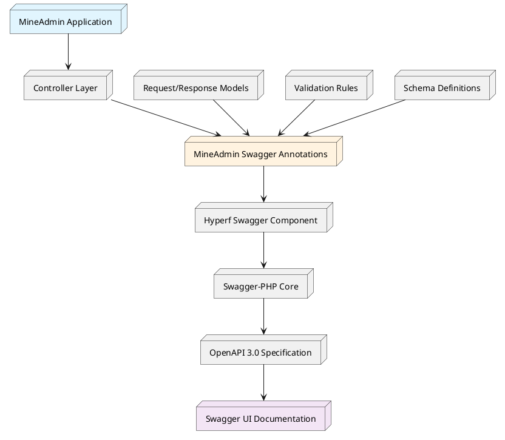
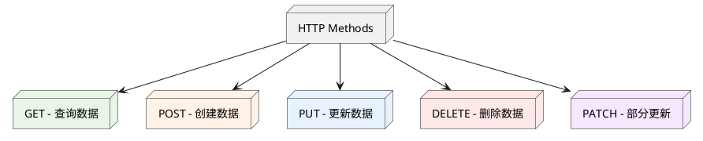
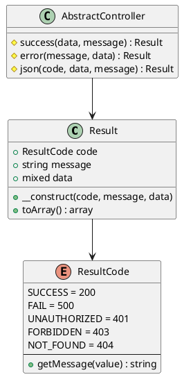
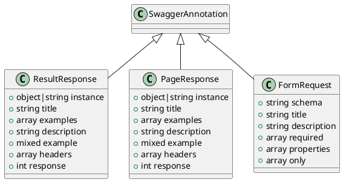
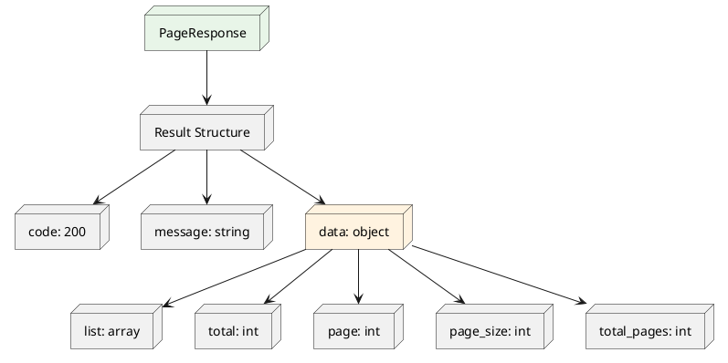

# 路由与API文档系统

## 目录

1. [概述与架构](#_1-概述与架构)
2. [快速开始](#_2-快速开始)
3. [HTTP规范与最佳实践](#_3-http规范与最佳实践)
4. [响应结构体系统](#_4-响应结构体系统)
5. [MineAdmin自定义注解](#_5-mineadmin自定义注解)
6. [实际应用示例](#_6-实际应用示例)
10. [常见问题与解决方案](#_10-常见问题与解决方案)

---

## 1. 概述与架构

### 1.1 系统概述

MineAdmin 内置了完整的 API 文档生成系统，基于 [Swagger/OpenAPI 3.0](https://swagger.io) 规范，为开发者提供了强大的 API 文档自动生成和管理功能。

**访问方式**: 本地开发时访问 `http://localhost:9503/swagger` 查看完整的 API 文档

### 1.2 架构层级

::: tip 技术栈架构

MineAdmin 的 API 文档系统采用多层架构设计：

- **[mineadmin/swagger](https://github.com/mineadmin/Swagger)** - MineAdmin 专用的 Swagger 注解封装层
- **[hyperf/swagger](https://github.com/hyperf/swagger)** - Hyperf 框架的 Swagger 集成组件
- **[zircote/swagger-php](https://github.com/zircote/swagger-php)** - PHP Swagger 注解处理核心
- **[OpenAPI 规范](https://github.com/OAI/OpenAPI-Specification)** - 业界标准的 API 文档规范

:::

### 1.3 系统架构图



### 1.4 核心优势

- **自动化文档生成**: 基于代码注解自动生成完整的 API 文档
- **类型安全**: 强类型支持，确保文档与实际代码一致
- **实时同步**: 代码变更时文档自动更新
- **交互式测试**: 内置的 Swagger UI 支持直接测试 API
---

## 2. 快速开始

### 2.1 基础配置

确保你的项目已正确安装 MineAdmin Swagger 组件：

```bash
composer require mineadmin/swagger
```

### 2.2 第一个 API 接口

创建一个简单的 API 接口：

```php
<?php

namespace App\Http\Admin\Controller;

use App\Http\Common\Result;
use Mine\Swagger\Attributes\ResultResponse;
use Hyperf\Swagger\Annotation as OA;

#[OA\Tag(name: "用户管理", description: "用户相关的API接口")]
class UserController extends AbstractController
{
    #[OA\Get(
        path: "/admin/user/info",
        summary: "获取用户信息",
        description: "根据用户ID获取详细的用户信息"
    )]
    #[ResultResponse(
        instance: new Result(data: ["id" => 1, "name" => "张三"]),
        title: "获取成功",
        description: "成功获取用户信息"
    )]
    public function getUserInfo(): Result
    {
        return $this->success([
            'id' => 1,
            'name' => '张三',
            'email' => 'zhangsan@example.com'
        ]);
    }
}
```

### 2.3 访问文档

启动服务后，访问 `http://localhost:9503/swagger` 查看生成的文档。

---

## 3. HTTP规范与最佳实践

### 3.1 RESTful API 设计原则

MineAdmin 推荐遵循 RESTful 架构风格，确保 API 接口的一致性和可预测性。

#### 3.1.1 HTTP 方法映射



#### 3.1.2 标准路由设计模式

以用户管理模块为例，展示标准的 RESTful API 设计：

| HTTP方法 | 路由路径 | 功能描述 | 响应数据 |
|---------|----------|---------|----------|
| `GET` | `/admin/user/list` | 获取用户列表（分页） | 用户列表数据 |
| `GET` | `/admin/user/{id}` | 获取单个用户详情 | 单个用户数据 |
| `POST` | `/admin/user` | 创建新用户 | 创建的用户数据 |
| `PUT` | `/admin/user/{id}` | 完整更新用户信息 | 更新后的用户数据 |
| `PATCH` | `/admin/user/{id}` | 部分更新用户信息 | 更新后的用户数据 |
| `DELETE` | `/admin/user/{id}` | 删除用户 | 删除确认信息 |

#### 3.1.3 最佳实践建议

::: tip 设计原则

1. **资源命名**: 使用名词而非动词，采用复数形式
   ```
   ✅ /admin/users
   ❌ /admin/getUsers
   ```

2. **嵌套资源**: 体现资源间的层次关系
   ```
   ✅ /admin/users/{id}/roles
   ❌ /admin/user-roles?user_id={id}
   ```

3. **状态码语义**: 正确使用 HTTP 状态码
   ```
   200 - 请求成功
   201 - 资源创建成功
   400 - 请求参数错误
   401 - 未授权访问
   403 - 权限不足
   404 - 资源不存在
   500 - 服务器内部错误
   ```

4. **灵活性优先**: 规范是基础，业务需求是核心
   - 遵循 RESTful 原则但不拘泥于严格规范
   - 以业务的可持续迭代为主要考量
   - 保持团队内部的一致性

:::

### 3.2 URL 设计规范

#### 3.2.1 命名约定

```php
// 推荐的命名方式
GET    /admin/users              // 获取用户列表
GET    /admin/users/{id}         // 获取指定用户
POST   /admin/users              // 创建用户
PUT    /admin/users/{id}         // 更新用户
DELETE /admin/users/{id}         // 删除用户

// 特殊操作的命名
POST   /admin/users/{id}/enable  // 启用用户
POST   /admin/users/{id}/disable // 禁用用户
GET    /admin/users/search       // 搜索用户
```

#### 3.2.2 参数传递规范

```php
// 查询参数 - 用于过滤、排序、分页
GET /admin/users?page=1&page_size=20&status=active&sort=created_at,desc

// 路径参数 - 用于唯一标识资源
GET /admin/users/123

// 请求体参数 - 用于复杂数据传递
POST /admin/users
Content-Type: application/json
{
    "username": "zhangsan",
    "email": "zhangsan@example.com",
    "roles": [1, 2, 3]
}
```

---

## 4. 响应结构体系统

### 4.1 统一响应格式

MineAdmin 采用统一的响应结构 `\App\Http\Common\Result`，确保所有 API 接口返回格式的一致性。

### 4.2 Result 类架构



### 4.3 核心实现代码

#### 4.3.1 Result 响应类

::: code-group

```php [Result.php]
<?php

declare(strict_types=1);
/**
 * This file is part of MineAdmin.
 */

namespace App\Http\Common;

use Hyperf\Contract\Arrayable;
use Hyperf\Swagger\Annotation as OA;

/**
 * 统一的API响应结构
 * @template T
 */
#[OA\Schema(title: 'API 响应结构', description: '统一的API响应格式')]
class Result implements Arrayable
{
    public function __construct(
        #[OA\Property(ref: 'ResultCode', title: '响应状态码', description: '业务状态码，不同于HTTP状态码')]
        public ResultCode $code = ResultCode::SUCCESS,
        
        #[OA\Property(title: '响应消息', type: 'string', description: '响应的描述信息')]
        public ?string $message = null,
        
        #[OA\Property(title: '响应数据', type: 'mixed', description: '实际的业务数据')]
        public mixed $data = []
    ) {
        if ($this->message === null) {
            $this->message = ResultCode::getMessage($this->code->value);
        }
    }

    /**
     * 转换为数组格式
     */
    public function toArray(): array
    {
        return [
            'code' => $this->code->value,
            'message' => $this->message,
            'data' => $this->data,
        ];
    }
}
```

```php [AbstractController.php]
<?php

namespace App\Http\Common\Controller;

use App\Http\Common\Result;
use App\Http\Common\ResultCode;

/**
 * 基础控制器类
 * 提供统一的响应方法
 */
abstract class AbstractController
{
    /**
     * 成功响应
     */
    protected function success(mixed $data = [], ?string $message = null): Result
    {
        return new Result(ResultCode::SUCCESS, $message, $data);
    }

    /**
     * 错误响应
     */
    protected function error(?string $message = null, mixed $data = []): Result
    {
        return new Result(ResultCode::FAIL, $message, $data);
    }

    /**
     * 自定义响应
     */
    protected function json(ResultCode $code, mixed $data = [], ?string $message = null): Result
    {
        return new Result($code, $message, $data);
    }
    
    /**
     * 分页响应
     */
    protected function paginate(array $list, int $total, int $page = 1, int $pageSize = 10): Result
    {
        return $this->success([
            'list' => $list,
            'total' => $total,
            'page' => $page,
            'page_size' => $pageSize,
            'total_pages' => ceil($total / $pageSize)
        ]);
    }
}
```

```php [AdminController.php]
<?php

namespace App\Http\Admin\Controller;

use App\Http\Common\Controller\AbstractController as Base;
use Hyperf\Context\ApplicationContext;
use Hyperf\HttpServer\Contract\RequestInterface;

/**
 * 管理后台控制器基类
 * 扩展了分页处理功能
 */
abstract class AbstractController extends Base
{
    /**
     * 获取当前页码
     */
    protected function getCurrentPage(): int
    {
        return (int) $this->getRequest()->input('page', 1);
    }

    /**
     * 获取每页大小
     */
    protected function getPageSize(int $default = 10, int $max = 100): int
    {
        $size = (int) $this->getRequest()->input('page_size', $default);
        return min($size, $max); // 限制最大页面大小
    }

    /**
     * 获取请求实例
     */
    protected function getRequest(): RequestInterface
    {
        return ApplicationContext::getContainer()->get(RequestInterface::class);
    }
    
    /**
     * 获取排序参数
     */
    protected function getOrderBy(string $default = 'id'): array
    {
        $sort = $this->getRequest()->input('sort', $default);
        $order = $this->getRequest()->input('order', 'asc');
        
        return [$sort, in_array(strtolower($order), ['asc', 'desc']) ? $order : 'asc'];
    }
}
```

:::

### 4.4 ResultCode 枚举类

MineAdmin 提供了一套完整的业务状态码枚举系统，用于标准化 API 响应的状态信息。

#### 4.4.1 核心实现

```php
<?php

declare(strict_types=1);
/**
 * This file is part of MineAdmin.
 */

namespace App\Http\Common;

use Hyperf\Constants\Annotation\Constants;
use Hyperf\Constants\Annotation\Message;
use Hyperf\Constants\ConstantsTrait;
use Hyperf\Swagger\Annotation as OA;

/**
 * 业务状态码枚举
 * 提供标准化的API响应状态码
 */
#[Constants]
#[OA\Schema(title: 'ResultCode', type: 'integer', default: 200, description: '业务状态码')]
enum ResultCode: int
{
    use ConstantsTrait;

    // 成功状态
    #[Message('操作成功')]
    case SUCCESS = 200;

    // 通用错误状态
    #[Message('操作失败')]
    case FAIL = 500;

    #[Message('未授权访问')]
    case UNAUTHORIZED = 401;

    #[Message('权限不足')]
    case FORBIDDEN = 403;

    #[Message('资源不存在')]
    case NOT_FOUND = 404;

    #[Message('请求方法不被允许')]
    case METHOD_NOT_ALLOWED = 405;

    #[Message('请求格式不可接受')]
    case NOT_ACCEPTABLE = 406;

    #[Message('请求实体处理错误')]
    case UNPROCESSABLE_ENTITY = 422;
    
    // 业务相关错误
    #[Message('参数验证失败')]
    case VALIDATION_ERROR = 10001;
    
    #[Message('业务逻辑错误')]
    case BUSINESS_ERROR = 10002;
    
    #[Message('数据库操作失败')]
    case DATABASE_ERROR = 10003;
    
    #[Message('外部服务调用失败')]
    case EXTERNAL_SERVICE_ERROR = 10004;
}
```

#### 4.4.2 响应格式示例

不同状态码对应的响应格式：

```json
// 成功响应
{
    "code": 200,
    "message": "操作成功",
    "data": {
        "id": 1,
        "username": "admin"
    }
}

// 错误响应
{
    "code": 10001,
    "message": "参数验证失败",
    "data": {
        "errors": {
            "username": ["用户名不能为空"]
        }
    }
}

// 分页响应
{
    "code": 200,
    "message": "操作成功",
    "data": {
        "list": [...],
        "total": 100,
        "page": 1,
        "page_size": 20,
        "total_pages": 5
    }
}
```

### 4.5 使用最佳实践

#### 4.5.1 控制器中的使用

```php
class UserController extends AbstractController
{
    public function index(): Result
    {
        try {
            $users = $this->userService->getList();
            return $this->success($users, '获取用户列表成功');
        } catch (ValidationException $e) {
            return $this->json(ResultCode::VALIDATION_ERROR, [], $e->getMessage());
        } catch (\Exception $e) {
            return $this->error('系统异常，请稍后重试');
        }
    }
}
```

---

## 5. MineAdmin自定义注解

MineAdmin 提供了三个核心的自定义 Swagger 注解，用于简化 API 文档的编写和维护。所有注解都位于 `Mine\Swagger\Attributes\` 命名空间下。

### 5.1 注解架构概览



### 5.2 ResultResponse 注解

用于定义单个资源或操作的响应结构，自动生成标准的 API 响应文档。

#### 5.2.1 构造函数签名

```php
ResultResponse::__construct(
    object|string $instance,           // 响应数据的类实例或类名
    ?string $title = null,             // 响应标题
    ?array $examples = null,           // 多个示例数组
    ?string $description = null,       // 响应描述
    mixed $example = Generator::UNDEFINED, // 单个示例
    ?array $headers = null,            // 响应头信息
    ?int $response = 200               // HTTP状态码
)
```

#### 5.2.2 参数详解

| 参数 | 类型 | 必填 | 说明 |
|-----|------|------|------|
| `$instance` | `object\|string` | ✅ | 响应数据的类实例或类名，支持自动解析注解 |
| `$title` | `string` | ❌ | 响应的标题，用于文档显示 |
| `$examples` | `array` | ❌ | 多个响应示例，键值对形式 |
| `$description` | `string` | ❌ | 详细的响应说明 |
| `$example` | `mixed` | ❌ | 单个响应示例，JSON字符串或对象 |
| `$headers` | `array` | ❌ | 自定义响应头信息 |
| `$response` | `int` | ❌ | HTTP状态码，默认200 |

#### 5.2.3 实际应用示例

基于用户登录接口的完整示例：

::: code-group

```php [登录控制器]
<?php

namespace App\Http\Admin\Controller;

use App\Http\Common\Result;
use App\Http\Admin\Request\PassportLoginRequest;
use App\Schema\PassportLoginVo;
use Mine\Swagger\Attributes\ResultResponse;
use Hyperf\Swagger\Annotation as OA;

class PassportController extends AbstractController
{
    #[OA\Post(
        path: '/admin/passport/login',
        summary: '用户登录',
        description: '管理员用户登录接口',
        tags: ['认证管理']
    )]
    #[ResultResponse(
        instance: new Result(data: new PassportLoginVo()),
        title: '登录成功',
        description: '用户登录成功后返回的令牌信息',
        example: '{"code":200,"message":"登录成功","data":{"access_token":"eyJ0eXAiOiJKV1QiLCJhbGciOiJIUzI1NiJ9...","refresh_token":"eyJ0eXAiOiJKV1QiLCJhbGciOiJIUzI1NiJ9...","expire_at":7200}}'
    )]
    public function login(PassportLoginRequest $request): Result
    {
        $credentials = $request->validated();
        $tokenData = $this->authService->login($credentials);
        
        return $this->success($tokenData, '登录成功');
    }
}
```

```php [响应数据模型]
<?php

namespace App\Schema;

use Hyperf\Swagger\Annotation as OA;

/**
 * 登录成功响应数据模型
 */
#[OA\Schema(
    title: '登录响应数据',
    description: '用户登录成功后返回的令牌信息',
    type: 'object'
)]
final class PassportLoginVo
{
    #[OA\Property(
        property: 'access_token',
        description: '访问令牌，用于API请求认证',
        type: 'string',
        example: 'eyJ0eXAiOiJKV1QiLCJhbGciOiJIUzI1NiJ9.eyJpYXQiOjE3MjIwOTQwNTY...'
    )]
    public string $access_token;

    #[OA\Property(
        property: 'refresh_token',
        description: '刷新令牌，用于获取新的访问令牌',
        type: 'string',
        example: 'eyJ0eXAiOiJKV1QiLCJhbGciOiJIUzI1NiJ9.eyJpYXQiOjE3MjIwOTQwNTY...'
    )]
    public string $refresh_token;

    #[OA\Property(
        property: 'expire_at',
        description: '令牌过期时间，单位：秒',
        type: 'integer',
        example: 7200
    )]
    public int $expire_at;

    #[OA\Property(
        property: 'user_info',
        description: '用户基本信息',
        type: 'object',
        properties: [
            'id' => ['type' => 'integer', 'description' => '用户ID'],
            'username' => ['type' => 'string', 'description' => '用户名'],
            'nickname' => ['type' => 'string', 'description' => '昵称'],
        ]
    )]
    public array $user_info;
}
```

:::

#### 5.2.4 最佳实践

::: warning 注意事项

1. **instance 参数**: 推荐使用具体的类实例而非类名，确保注解能正确解析
2. **示例数据**: 提供真实、完整的示例数据，便于前端开发者理解
3. **描述信息**: 详细说明响应的业务含义和使用场景
4. **状态码**: 根据实际业务情况设置合适的 HTTP 状态码

:::

### 5.3 PageResponse 注解

专门用于分页数据的响应结构注解，自动生成包含分页信息的标准响应文档。

#### 5.3.1 构造函数签名

`PageResponse` 的构造函数与 `ResultResponse` 完全一致，但在语义上专门用于分页响应。

```php
PageResponse::__construct(
    object|string $instance,           // 分页数据项的类实例或类名
    ?string $title = null,             // 响应标题
    ?array $examples = null,           // 多个示例数组
    ?string $description = null,       // 响应描述
    mixed $example = Generator::UNDEFINED, // 单个示例
    ?array $headers = null,            // 响应头信息
    ?int $response = 200               // HTTP状态码
)
```

#### 5.3.2 分页响应结构



### 5.4 FormRequest 注解

专门用于请求参数的结构化文档注解，基于现有的 Schema 类自动生成请求参数文档。

#### 5.4.1 构造函数签名

```php
FormRequest::__construct(
    ?string $schema = null,        // 需要解析的 schema 类名
    ?string $title = null,         // 表单标题
    ?string $description = null,   // 表单描述
    ?array $required = null,       // 必填字段数组
    ?array $properties = null,     // 额外的属性定义
    array $only = []               // 只显示指定的字段
)
```

#### 5.4.2 参数详解

| 参数 | 类型 | 必填 | 说明 |
|-----|------|------|------|
| `$schema` | `string` | ❌ | 基础 Schema 类名，用于字段解析 |
| `$title` | `string` | ❌ | 请求表单的标题 |
| `$description` | `string` | ❌ | 请求表单的详细描述 |
| `$required` | `array` | ❌ | 必填字段列表 |
| `$properties` | `array` | ❌ | 额外的字段属性定义 |
| `$only` | `array` | ❌ | 只显示指定的字段，用于字段过滤 |

---

## 6. 实际应用示例

### 6.1 完整的CRUD接口示例

以文章管理为例，展示完整的CRUD接口实现：

```php
<?php

namespace App\Http\Admin\Controller;

use App\Http\Common\Result;
use App\Http\Admin\Request\ArticleRequest;
use App\Schema\ArticleSchema;
use Mine\Swagger\Attributes\{ResultResponse, PageResponse, FormRequest};
use Hyperf\Swagger\Annotation as OA;

#[OA\Tag(name: "文章管理", description: "文章相关的CRUD操作")]
class ArticleController extends AbstractController
{
    /**
     * 获取文章列表
     */
    #[OA\Get(
        path: "/admin/articles",
        summary: "获取文章列表",
        description: "分页获取文章列表，支持搜索过滤"
    )]
    #[PageResponse(instance: ArticleSchema::class, title: "文章列表")]
    public function index(): Result
    {
        $filters = $this->getRequest()->all();
        $page = $this->getCurrentPage();
        $pageSize = $this->getPageSize();
        
        $result = $this->articleService->paginate($filters, $page, $pageSize);
        return $this->paginate($result['list'], $result['total'], $page, $pageSize);
    }

    /**
     * 获取单篇文章
     */
    #[OA\Get(
        path: "/admin/articles/{id}",
        summary: "获取文章详情",
        description: "根据ID获取单篇文章的详细信息"
    )]
    #[OA\Parameter(name: "id", description: "文章ID", in: "path", required: true, schema: new OA\Schema(type: "integer"))]
    #[ResultResponse(instance: new Result(data: new ArticleSchema()), title: "文章详情")]
    public function show(int $id): Result
    {
        $article = $this->articleService->findById($id);
        return $this->success($article);
    }

    /**
     * 创建文章
     */
    #[OA\Post(
        path: "/admin/articles",
        summary: "创建文章",
        description: "创建新的文章"
    )]
    #[OA\RequestBody(content: new OA\JsonContent(ref: ArticleRequest::class))]
    #[ResultResponse(instance: new Result(data: new ArticleSchema()), title: "创建成功", response: 201)]
    public function store(ArticleRequest $request): Result
    {
        $data = $request->validated();
        $article = $this->articleService->create($data);
        return $this->success($article, '文章创建成功');
    }

    /**
     * 更新文章
     */
    #[OA\Put(
        path: "/admin/articles/{id}",
        summary: "更新文章",
        description: "更新指定文章的信息"
    )]
    #[OA\Parameter(name: "id", description: "文章ID", in: "path", required: true, schema: new OA\Schema(type: "integer"))]
    #[OA\RequestBody(content: new OA\JsonContent(ref: ArticleRequest::class))]
    #[ResultResponse(instance: new Result(data: new ArticleSchema()), title: "更新成功")]
    public function update(int $id, ArticleRequest $request): Result
    {
        $data = $request->validated();
        $article = $this->articleService->update($id, $data);
        return $this->success($article, '文章更新成功');
    }

    /**
     * 删除文章
     */
    #[OA\Delete(
        path: "/admin/articles/{id}",
        summary: "删除文章",
        description: "删除指定的文章"
    )]
    #[OA\Parameter(name: "id", description: "文章ID", in: "path", required: true, schema: new OA\Schema(type: "integer"))]
    #[ResultResponse(instance: new Result(), title: "删除成功")]
    public function destroy(int $id): Result
    {
        $this->articleService->delete($id);
        return $this->success([], '文章删除成功');
    }
}
```

### 6.2 请求验证类示例

```php
<?php

namespace App\Http\Admin\Request;

use App\Schema\ArticleSchema;
use Hyperf\Validation\Request\FormRequest;
use Mine\Swagger\Attributes\FormRequest as FormRequestAnnotation;

#[FormRequestAnnotation(
    schema: ArticleSchema::class,
    title: "文章请求参数",
    description: "创建或更新文章时的请求参数",
    required: ['title', 'content', 'status'],
    only: ['title', 'content', 'excerpt', 'status', 'category_id', 'tags']
)]
class ArticleRequest extends FormRequest
{
    public function authorize(): bool
    {
        return true;
    }

    public function rules(): array
    {
        return [
            'title' => 'required|string|max:200',
            'content' => 'required|string',
            'excerpt' => 'nullable|string|max:500',
            'status' => 'required|integer|in:0,1',
            'category_id' => 'nullable|integer|exists:categories,id',
            'tags' => 'nullable|array',
            'tags.*' => 'integer|exists:tags,id',
        ];
    }

    public function attributes(): array
    {
        return [
            'title' => '文章标题',
            'content' => '文章内容',
            'excerpt' => '文章摘要',
            'status' => '发布状态',
            'category_id' => '分类ID',
            'tags' => '标签列表',
        ];
    }
}
```

### 6.3 数据模型Schema示例

```php
<?php

namespace App\Schema;

use Hyperf\Swagger\Annotation as OA;

#[OA\Schema(title: "文章信息", description: "文章详细信息结构")]
class ArticleSchema
{
    #[OA\Property(property: "id", title: "文章ID", type: "integer")]
    public int $id;

    #[OA\Property(property: "title", title: "文章标题", type: "string", example: "这是一篇测试文章")]
    public string $title;

    #[OA\Property(property: "content", title: "文章内容", type: "string")]
    public string $content;

    #[OA\Property(property: "excerpt", title: "文章摘要", type: "string")]
    public ?string $excerpt;

    #[OA\Property(property: "status", title: "发布状态", type: "integer", description: "0-草稿，1-已发布")]
    public int $status;

    #[OA\Property(property: "category", title: "文章分类", type: "object", 
        properties: [
            "id" => ["type" => "integer", "description" => "分类ID"],
            "name" => ["type" => "string", "description" => "分类名称"]
        ]
    )]
    public ?array $category;

    #[OA\Property(property: "tags", title: "文章标签", type: "array", 
        items: new OA\Items(type: "object", 
            properties: [
                "id" => ["type" => "integer", "description" => "标签ID"],
                "name" => ["type" => "string", "description" => "标签名称"]
            ]
        )
    )]
    public array $tags;

    #[OA\Property(property: "created_at", title: "创建时间", type: "string", format: "date-time")]
    public string $created_at;

    #[OA\Property(property: "updated_at", title: "更新时间", type: "string", format: "date-time")]
    public string $updated_at;
}
```

---

## 7. 性能优化与最佳实践

#### 7.1 选择性扫描

```php
// config/autoload/swagger.php
// 只扫描必要的目录，避免全项目扫描
    'scan' => [
        'paths' => [
            Finder::create()
                ->in([BASE_PATH . '/app/Http', BASE_PATH . '/app/Schema'])
                ->name('*.php')
                ->getIterator()
        ],
    ],
```

### 7.2 代码组织最佳实践

#### 7.2.1 目录结构建议

```
app/
├── Http/
│   ├── Admin/
│   │   ├── Controller/          # 管理后台控制器
│   │   └── Request/            # 请求验证类
│   └── Common/
│       ├── Result.php          # 统一响应结构
│       └── ResultCode.php      # 状态码枚举
├── Schema/                     # Swagger Schema 定义
│   ├── UserSchema.php
│   └── ArticleSchema.php
└── Service/                    # 业务逻辑层
    ├── UserService.php
    └── ArticleService.php
```

---

## 8. 错误处理与调试

### 8.1 常见错误类型

#### 8.1.1 注解解析错误

```php
// ❌ 错误示例 - 注解语法错误
#[ResultResponse(
    instance: UserSchema,  // 缺少 ::class
    title = '用户信息'      // 使用了 = 而不是 :
)]

// ✅ 正确示例
#[ResultResponse(
    instance: UserSchema::class,
    title: '用户信息'
)]
```

#### 8.1.2 循环引用问题

```php
// ❌ 可能导致循环引用
class UserSchema
{
    #[OA\Property(ref: 'GroupSchema')]
    public GroupSchema $group;
}

class GroupSchema
{
    #[OA\Property(type: 'array', items: new OA\Items(ref: 'UserSchema'))]
    public array $users;
}

// ✅ 使用懒加载避免循环引用
class UserSchema
{
    #[OA\Property(ref: '#/components/schemas/GroupSchema')]
    public array $group;
}
```

### 8.2 调试技巧

#### 8.2.1 启用详细错误日志

```php
// config/autoload/logger.php
return [
    'swagger' => [
        'handler' => [
            'class' => Monolog\Handler\StreamHandler::class,
            'constructor' => [
                'stream' => BASE_PATH . '/runtime/logs/swagger.log',
                'level' => Monolog\Logger::DEBUG,
            ],
        ],
        'formatter' => [
            'class' => Monolog\Formatter\LineFormatter::class,
        ],
    ],
];
```

#### 8.2.2 文档相关命令

```shell
# 重新生成Swagger文档
php bin/hyperf.php gen:swagger
# 根据指定的 model 生成 Swagger Schema
php bin/hyperf.php gen:swagger-schema
```

---

## 10. 常见问题与解决方案

### 10.1 注解相关问题

#### 10.1.1 注解不生效

**问题描述**: 添加了注解但在Swagger文档中不显示

**可能原因**:
1. 注解语法错误
2. 类未被扫描到
3. 缓存问题

**解决方案**:

```php
// 1. 检查注解语法
#[OA\Get(path: "/users", summary: "获取用户列表")]  // ✅ 正确
// #[OA\Get(path = "/users", summary = "获取用户列表")]  // ❌ 错误语法

// 2. 确保类在扫描范围内
// config/autoload/swagger.php
    'scan' => [
        'paths' => [
            Finder::create()
                ->in([BASE_PATH . '/app/Http', BASE_PATH . '/app/Schema'])
                ->name('*.php')
                ->getIterator()
        ],
    ],

// 3. 清除缓存并重新生成文档
php bin/hyperf.php swagger:generate
```

#### 10.1.2 Schema引用问题

**问题描述**: Schema引用无法正确解析

**解决方案**:

```php
// ❌ 错误的引用方式
#[OA\Property(ref: 'UserSchema')]

// ✅ 正确的引用方式
#[OA\Property(ref: '#/components/schemas/UserSchema')]

// 或者使用类引用
#[ResultResponse(instance: UserSchema::class)]
```

### 10.2 最佳实践总结

#### 10.2.1 开发阶段

1. **渐进式添加**: 先为核心接口添加文档，再逐步完善
2. **模板复用**: 创建通用的注解模板，提高开发效率
3. **即时验证**: 开发过程中及时检查文档生成效果

#### 10.2.2 生产环境

1. **定期更新**: 建立文档更新机制，确保文档与代码同步
2. **访问控制**: 生产环境考虑对Swagger UI的访问控制

#### 10.2.3 团队协作

1. **规范制定**: 建立团队统一的注解编写规范
2. **Code Review**: 将API文档检查纳入代码审查流程
3. **自动化**: 通过CI/CD自动检查文档完整性

---