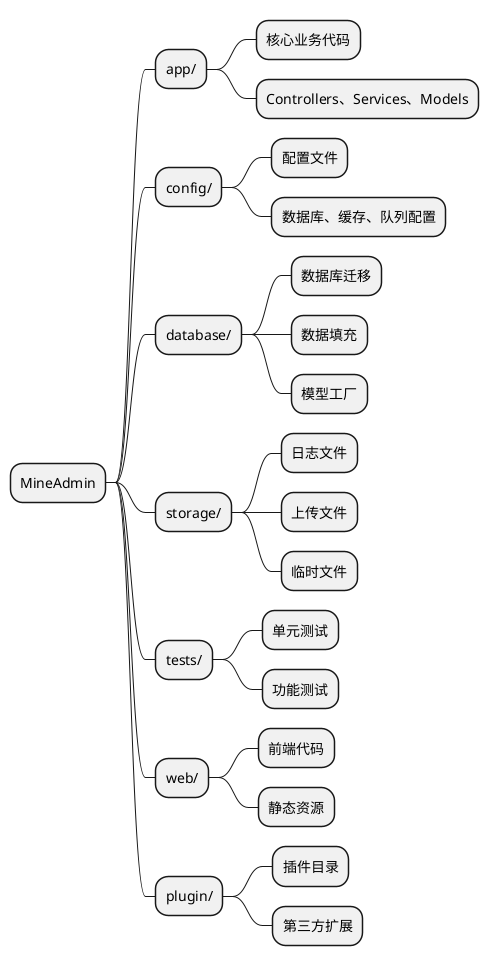
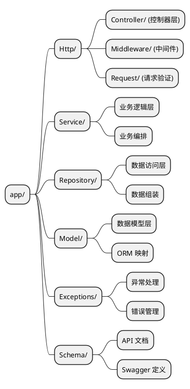
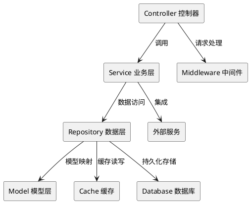

# 项目目录结构

MineAdmin 采用现代化的分层架构设计，提供清晰的代码组织结构和最佳实践。本文档将详细介绍项目的目录结构、设计理念以及开发规范。

## 概述

MineAdmin 的项目结构参考了 [Laravel](https://laravel.com/) 框架的设计理念，同时结合了现代化的分层架构模式。如果你熟悉 Laravel 开发，那么理解 MineAdmin 的结构将会非常容易。

### 架构理念

MineAdmin 采用以下核心设计原则：

- **分层架构**：Controller → Service → Repository → Model 的清晰分层
- **职责分离**：每个目录都有明确的职责边界
- **可扩展性**：支持插件化开发和模块化扩展
- **标准化**：遵循 PSR 规范和最佳实践

## 项目根目录结构



### 目录详细说明

#### `/app` - 应用核心目录

应用程序的核心业务逻辑所在地，包含控制器、服务层、数据层等核心组件。

**主要特点：**
- 包含 99% 的业务代码
- 遵循 MVC 分层架构
- 支持模块化开发

#### `/config` - 配置目录

存放所有应用程序配置文件，提供灵活的环境配置管理。

**典型配置文件：**
- `database.php` - 数据库配置
- `cache.php` - 缓存配置  
- `queue.php` - 队列配置

#### `/database` - 数据库目录

管理数据库相关的所有文件，包括结构变更和测试数据。

**目录结构：**
```
database/
├── migrations/     # 数据库迁移文件
├── seeders/        # 数据填充文件
```

#### `/storage` - 存储目录

存放应用程序运行时产生的文件和数据。

**目录用途：**
- `uploads/` - 用户上传文件
- `swagger/` - API 文档文件

#### `/tests` - 测试目录

包含自动化测试套件，确保代码质量和功能正确性。

**测试类型：**
- **单元测试** - 测试单个类或方法
- **功能测试** - 测试完整的业务流程
- **API 测试** - 测试 API 接口

#### `/web` - 前端目录

存放前端应用代码和静态资源文件。

#### `/plugin` - 插件目录

存放从插件市场下载的插件包，支持系统功能扩展。

## App 目录深度解析

`app` 目录是整个应用的核心，采用严格的分层架构设计。



### Http 目录 - 请求处理层

负责处理所有 HTTP 请求的入口层，包含控制器、中间件和请求验证。

#### 目录结构
```
Http/
├── Admin/              # 后台管理模块
│   ├── Controller/     # 后台控制器
│   ├── Middleware/     # 后台中间件
│   ├── Request/        # 后台请求验证类
│   ├── Subscriber/     # 事件订阅者
│   └── Vo/            # 值对象类
├── Api/                # API 接口模块
│   ├── Controller/     # API 控制器
│   │   └── V1/        # API 版本控制
│   ├── Middleware/     # API 中间件
│   └── Request/        # API 请求验证类
│       └── V1/        # API 版本请求类
├── Common/             # 通用模块
│   ├── Controller/     # 通用控制器
│   ├── Event/         # 事件类
│   ├── Middleware/     # 通用中间件
│   ├── Request/        # 通用请求类
│   ├── Result.php      # 响应结果类
│   ├── ResultCode.php  # 结果状态码
│   └── Swagger/        # API 文档配置
└── CurrentUser.php     # 当前用户上下文
```

#### 模块化架构说明

**Admin 模块** - 后台管理功能
- 包含权限管理、用户管理、菜单管理等后台功能
- 采用完整的 MVC 结构，包含事件订阅者和值对象

**Api 模块** - 对外 API 接口  
- 支持版本控制（V1, V2 等）
- 独立的认证中间件和请求验证
- RESTful API 设计规范

**Common 模块** - 通用组件
- 提供跨模块共享的基础功能
- 统一的响应格式和状态码管理
- API 文档自动生成配置

### Service 目录 - 业务逻辑层

Service 层是核心业务逻辑的实现场所，负责业务规则的编排和执行。

#### 设计原则

1. **单一职责** - 每个 Service 类只处理一个业务域
2. **依赖注入** - 通过构造函数注入依赖
3. **事务管理** - 确保业务操作的原子性
4. **异常处理** - 统一的异常处理机制

#### Service 层职责

**核心功能：**
- 业务逻辑编排和执行
- 事务管理和数据一致性
- 调用 Repository 层进行数据操作
- 业务规则验证和处理

### Repository 目录 - 数据访问层

Repository 模式提供了数据访问的抽象层，封装了数据查询和操作逻辑。

#### 设计特点

- **数据源抽象** - 可以轻松切换数据源（MySQL、Redis、ES等）
- **查询复用** - 公共查询逻辑的复用
- **缓存集成** - 透明的缓存层集成
- **性能优化** - 查询优化和批量操作

#### Repository 层特点

**主要职责：**
- 数据访问抽象层  
- 复杂查询逻辑封装
- 缓存策略实现
- 数据源切换和优化

### Model 目录 - 数据模型层

Model 层基于 Hyperf 的 Eloquent ORM，提供数据库表的对象关系映射。

#### 模型特性

- **关联关系** - 定义表之间的关联
- **访问器/修改器** - 数据格式化
- **事件监听** - 模型生命周期事件
- **软删除** - 逻辑删除支持

#### Model 层特性

**核心功能：**
- 数据表映射和关系定义
- 属性访问器和修改器
- 模型事件和观察者
- 数据类型转换和验证

### Exceptions 目录 - 异常处理

统一的异常处理机制，提供友好的错误信息和日志记录。


### Schema 目录 - API 文档

包含 Swagger/OpenAPI 文档定义，用于 API 文档生成。

::: danger 重要提醒
Schema 类严格禁止参与业务逻辑调度，仅用于 API 文档生成。
:::


## 开发最佳实践

### 代码组织规范

1. **命名规范**
   - 类名使用 `PascalCase`
   - 方法名使用 `camelCase`  
   - 常量使用 `UPPER_SNAKE_CASE`

2. **文件组织**
   - 一个文件一个类
   - 文件名与类名保持一致
   - 合理使用命名空间

3. **依赖注入**
   - 优先使用构造函数注入
   - 避免使用静态调用
   - 面向接口编程

### 架构模式建议



### 错误处理策略

1. **异常分类**
   - 业务异常 - 可预期的错误
   - 系统异常 - 不可预期的错误
   - 验证异常 - 数据格式错误

2. **日志记录**
   - 关键操作记录
   - 异常信息记录
   - 性能监控记录

## 相关资源

### 参考文档

- [Laravel 官方文档](https://laravel.com/docs/11.x)
- [Laravel 中文文档](https://learnku.com/docs/laravel/10.x)
- [Hyperf 协程框架](https://hyperf.wiki/3.1/#/en/)

::: warning ORM 差异说明
MineAdmin 使用的是由 [Hyperf](https://github.com/hyperf/hyperf) 维护的协程版 Eloquent ORM，在用法上与 Laravel 官方版本存在一定差异。在开发时请注意协程环境下的特殊用法。
:::

