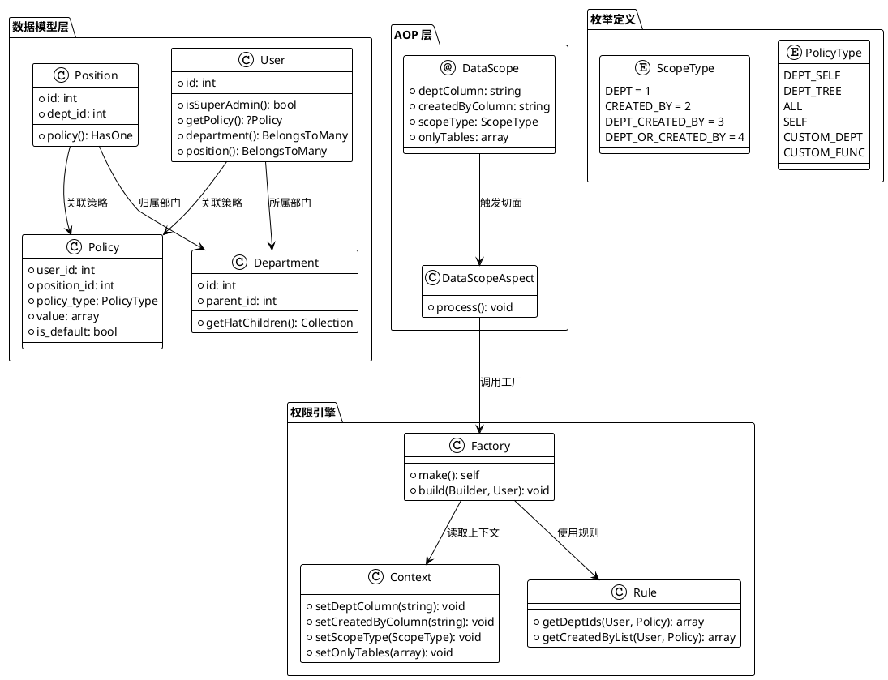
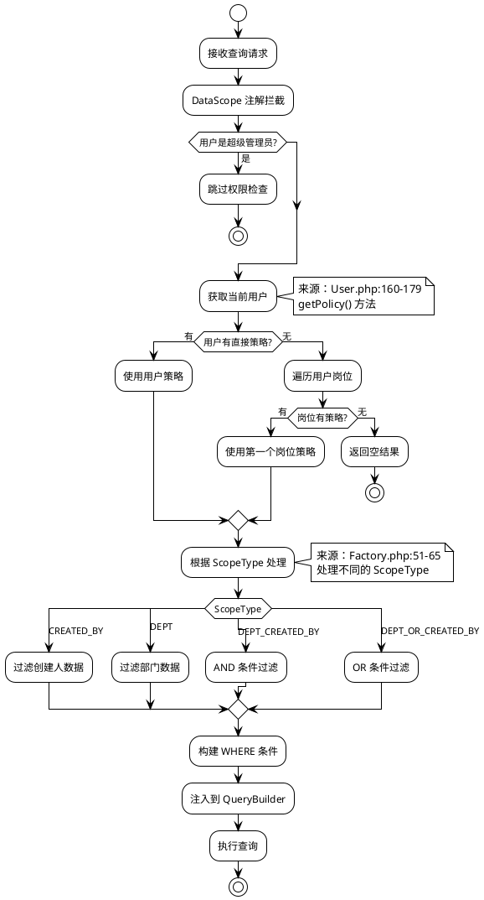
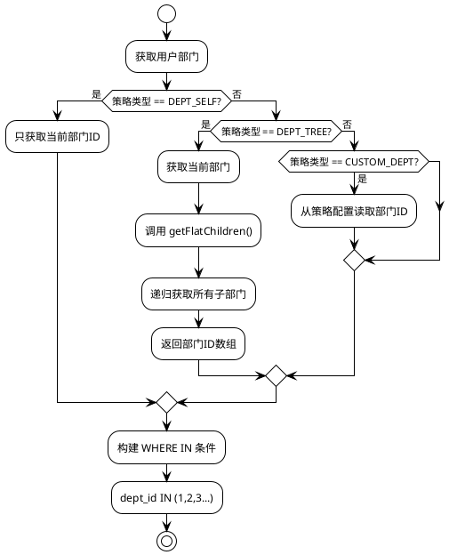
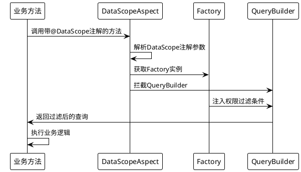

# 系统架构

## 数据权限系统架构设计

MineAdmin 数据权限系统基于 AOP（面向切面编程）设计，通过注解和切面拦截的方式自动为数据查询注入权限过滤条件。

## 核心组件架构图



## 权限解析流程



## 数据权限执行机制

### Factory 工厂类

权限过滤的核心实现：

```php
// /mineadmin/app/Library/DataPermission/Factory.php
class Factory
{
    public function build(Builder $builder, User $user): void 
    {
        // 1. 超级管理员绕过检查
        if ($user->isSuperAdmin()) {
            return;
        }
        
        // 2. 获取用户策略
        if (($policy = $user->getPolicy()) === null) {
            return;
        }
        
        // 3. 获取当前 ScopeType
        $scopeType = Context::getScopeType();
        
        // 4. 处理自定义函数
        if ($policy->policy_type === PolicyType::CustomFunc) {
            $customFunc = $policy->value[0] ?? null;
            $this->rule->loadCustomFunc($customFunc, $builder, $user, $policy, $scopeType);
        }
        
        // 5. 根据 ScopeType 处理不同的过滤逻辑
        switch ($scopeType) {
            case ScopeType::CREATED_BY:
                $this->handleCreatedBy($user, $policy, $builder);
                break;
            case ScopeType::DEPT:
                $this->handleDept($user, $policy, $builder);
                break;
            case ScopeType::DEPT_CREATED_BY:
                $this->handleDeptCreatedBy($user, $policy, $builder);
                break;
            case ScopeType::DEPT_OR_CREATED_BY:
                $this->handleDeptOrCreatedBy($user, $policy, $builder);
                break;
        }
    }
}
```

### 具体过滤实现

各种过滤条件的具体实现：

```php
// /mineadmin/app/Library/DataPermission/Factory.php:67-102

// 创建人过滤
private function handleCreatedBy(User $user, Policy $policy, Builder $builder): void
{
    $builder->when($this->rule->getCreatedByList($user, $policy), 
        static function (Builder $query, array $createdByList) {
            $query->whereIn(Context::getCreatedByColumn(), $createdByList);
        });
}

// 部门过滤
private function handleDept(User $user, Policy $policy, Builder $builder): void
{
    $builder->when($this->rule->getDeptIds($user, $policy), 
        static function (Builder $query, array $deptList) {
            $query->whereIn(Context::getDeptColumn(), $deptList);
        });
}

// 部门 AND 创建人过滤
private function handleDeptCreatedBy(User $user, Policy $policy, Builder $builder): void
{
    $builder->when($this->rule->getDeptIds($user, $policy), 
        static function (Builder $query, array $deptList) {
            $query->whereIn(Context::getDeptColumn(), $deptList);
        })->when($this->rule->getCreatedByList($user, $policy), 
        static function (Builder $query, array $createdByList) {
            $query->whereIn(Context::getCreatedByColumn(), $createdByList);
        });
}

// 部门 OR 创建人过滤
private function handleDeptOrCreatedBy(User $user, Policy $policy, Builder $builder): void
{
    $createdByList = $this->rule->getCreatedByList($user, $policy);
    $deptList = $this->rule->getDeptIds($user, $policy);
    
    $builder->where(static function (Builder $query) use ($createdByList, $deptList) {
        if ($createdByList) {
            $query->whereIn(Context::getCreatedByColumn(), $createdByList);
        }
        if ($deptList) {
            $query->orWhereIn(Context::getDeptColumn(), $deptList);
        }
    });
}
```

## Context 上下文管理

### 上下文存储机制

```php
// /mineadmin/app/Library/DataPermission/Context.php
final class Context
{
    private const DEPT_COLUMN_KEY = 'data_permission_dept_column';
    private const CREATED_BY_COLUMN_KEY = 'data_permission_created_by_column';
    private const SCOPE_TYPE_KEY = 'data_permission_scope_type';
    private const ONLY_TABLES_KEY = 'data_permission_only_tables';

    public static function setDeptColumn(string $column = 'dept_id'): void
    {
        Ctx::set(self::DEPT_COLUMN_KEY, $column);
    }

    public static function getDeptColumn(): string
    {
        return Ctx::get(self::DEPT_COLUMN_KEY, 'dept_id');
    }
    
    // ... 其他方法类似
}
```

## 部门层级处理

### 递归部门树算法

```php
// /mineadmin/app/Model/Permission/Department.php
public function getFlatChildren(): Collection
{
    $flat = collect();
    $this->load('children'); // 预加载子部门
    
    $traverse = static function ($departments) use (&$traverse, $flat) {
        foreach ($departments as $department) {
            $flat->push($department);
            if ($department->children->isNotEmpty()) {
                $traverse($department->children); // 递归处理
            }
        }
    };
    
    $traverse($this->children);
    return $flat->prepend($this); // 包含自身
}
```

### 部门权限处理流程



## AOP 切面机制

### DataScope 注解定义

```php
// /mineadmin/app/Library/DataPermission/Attribute/DataScope.php
#[\Attribute(\Attribute::TARGET_CLASS | \Attribute::TARGET_METHOD)]
class DataScope extends AbstractAnnotation
{
    public function __construct(
        private readonly string $deptColumn = 'dept_id',
        private readonly string $createdByColumn = 'created_by',
        private readonly ScopeType $scopeType = ScopeType::DEPT_CREATED_BY,
        private readonly ?array $onlyTables = null
    ) {}
}
```

### 切面拦截处理



## 自定义函数扩展

### 自定义函数配置

```php
// /mineadmin/config/autoload/department/custom.php
return [
    'testction' => function (Builder $builder, ScopeType $scopeType, Policy $policy, User $user) {
        // 只针对特定用户生效
        if ($user->id !== 2) {
            return;
        }
        
        $createdByColumn = Context::getCreatedByColumn();
        $deptColumn = Context::getDeptColumn();
        
        switch ($scopeType) {
            case ScopeType::CREATED_BY:
                $builder->where($createdByColumn, $user->id);
                break;
            case ScopeType::DEPT:
                $builder->whereIn($deptColumn, 
                    $user->department()->get()->pluck('id'));
                break;
            case ScopeType::DEPT_CREATED_BY:
                $builder->whereIn($deptColumn, 
                    $user->department()->get()->pluck('id'));
                $builder->where($createdByColumn, $user->id);
                break;
            case ScopeType::DEPT_OR_CREATED_BY:
                $builder->whereIn($deptColumn, 
                    $user->department()->get()->pluck('id'));
                $builder->orWhere($createdByColumn, $user->id);
                break;
        }
    }
];
```

## 实际使用示例

### 在 Service 中的使用

```php
// /mineadmin/app/Service/Permission/UserService.php:94-98
class UserService
{
    #[DataScope(
        scopeType: ScopeType::CREATED_BY,
        onlyTables: ['user'],
        createdByColumn: 'id'
    )]
    public function page(array $params, int $page = 1, int $pageSize = 10): array
    {
        return parent::page($params, $page, $pageSize);
    }
}
```

这个真实的使用示例展示了如何在 MineAdmin 中应用数据权限注解来控制用户列表的访问权限。

通过这个架构设计，MineAdmin 实现了声明式的数据权限控制，开发者只需要在方法上添加 `@DataScope` 注解，系统就会自动根据当前用户的权限策略过滤数据。