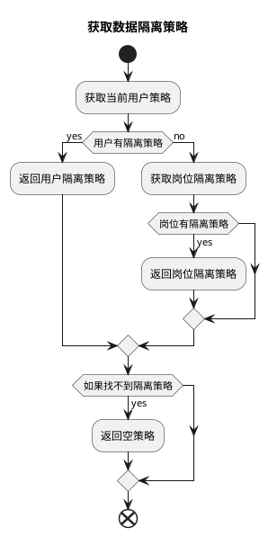

# 数据权限配置与使用示例

本文将讲解在数据权限配置中各种策略的配置与使用方式

## 数据隔离方式

数据隔离目前仅支持行级隔离，但是支持多种隔离策略。

主要分为以创建人、所属部门为依据的隔离方式。

* `部门`隔离以用户当前所属部门为依据，查询数据时会自动添加部门过滤条件。
* `创建人`隔离以数据创建人作为依据，查询数据时会自动添加创建人过滤条件。

## 优先级

目前支持`对指定用户设置隔离策略`，`为用户指定岗位，对岗位设置隔离策略`两种方式
如果用户同时设置了隔离策略和岗位隔离策略，则会优先使用对指定用户设置的隔离策略。



逻辑代码为

```php
// /mineadmin/app/Model/Permission/User.php:160-179

public function getPolicy(): ?Policy
{
    /**
     * @var null|Policy $policy
     */
    $policy = $this->policy()->first();
    if (! empty($policy)) {
        return $policy;
    }

    $this->load('position');
    $positionList = $this->position;
    foreach ($positionList as $position) {
        $current = $position->policy()->first();
        if (! empty($current)) {
            return $current;
        }
    }
    return null;
}

```

## 示例

以现在的表 `user` 为隔离表，假设有以下数据：

### 示例数据

部门表

---

| id | name | parent_id |
|----|------|-----------|
| 1  | 部门1  | 0         |
| 2  | 部门2  | 1         |
| 3  | 部门3  | 0         |

部门 1 是顶级部门，没有父部门。
部门 2 属于部门 1 的子部门。
部门 3 是顶级部门，没有父部门。

---

岗位表

| id | name | dept_id |
|----|------|---------|
| 1  | 岗位1  | 1       |
| 2  | 岗位2  | 2       |
| 3  | 岗位3  | 3       |

部门 1 有岗位 1，部门 2 有岗位 2，部门 3 有岗位 3。

---

用户表

| id | name  | dept_id | created_by | post_id |
|----|-------|---------|------------|---------|
| 1  | 超级管理员 | 0       | 0          | 0       |
| 2  | a1    | 1       | 1          | 1       |
| 3  | a2    | 2       | 1          | 1       |
| 4  | a3    | 1       | 2          | 2       |
| 5  | a4    | 2       | 2          | 0       |
| 6  | a5    | 0       | 4          | 0       |

用户表中，`dept_id` 为 0 的用户标识没有部门，`created_by` 为 0 的用户标识没有创建人。
超管员可以看到所有数据。

a1、a3 属于部门1，a2、a4 属于部门2。

a1、a2 的创建人是超级管理员，a3、a4 的创建人是 a1。

a1、a2 的岗位是岗位1，a3 的岗位是岗位2，a4 没有岗位。

以下举一些例子，讲明在不同策略中数据的查询结果。

### PolicyType::SELF `仅查询自己`

假设当前用户 id 为 2 的 a1 用户，设置了仅查询自己策略。

1. 隔离方式为仅根据创建人隔离。 则会拼接查询条件为 `创建人为当前用户 id`，也就是查询到用户 a3、a4。

```sql
SELECT * FROM user WHERE created_by in (4,5);
```

2. 隔离方式为仅根据部门隔离，则会拼接查询条件为 `部门为当前用户所在部门`，也就是查询到用户 a1、a3。

```sql
SELECT * FROM user WHERE dept_id in(1);
```

3. 隔离方式为根据创建人和部门隔离，则会拼接查询条件为 `创建人为当前用户 id` 并且 `部门为当前用户所在部门`，也就是查询到用户 a3。

```sql
SELECT * FROM user WHERE created_by in(2) AND dept_id in(1);
```
4. 隔离方式为根据部门 or 创建人过滤，则会拼接查询条件为 `创建人为当前用户 id` 或者 `部门为当前用户所在部门`，也就是查询到用户 a1、a3、a4。

```sql
SELECT * FROM user WHERE dept_id in(1) OR created_by in(2);
```

### PolicyType::DEPT_SELF `仅查询本部门`

假设当前用户 id 为 2 的 a1 用户，设置了仅查询本部门策略。

1. 隔离方式为仅根据创建人隔离。则会拼接查询条件为 `创建人为当前用户同属部门下的所有用户 id`，也就是查询到用户 a3、a4、a5。

```sql

SELECT * FROM user WHERE created_by in (2,4,5);

```

2. 隔离方式为仅根据部门隔离。则会拼接查询条件为 `部门为当前用户所在部门`，也就是查询到用户 a1、a3。

```sql

SELECT * FROM user WHERE dept_id in(1);
```

3. 隔离方式为根据创建人和部门隔离。则会拼接查询条件为 `创建人为当前用户同属部门下的所有用户 id` 并且 `部门为当前用户所在部门`，也就是查询到用户 a3。

```sql
SELECT * FROM user WHERE created_by in(2,4,5) AND dept_id in(1);
```

4. 隔离方式为根据部门 or 创建人过滤。则会拼接查询条件为 `创建人为当前用户同属部门下的所有用户 id` 或者 `部门为当前用户所在部门`，也就是查询到用户 a1、a3、a4、a5。

```sql
SELECT * FROM user WHERE created_by in(2,4,5) OR dept_id in(1);
```

### PolicyType::DEPT_TREE `查询本部门及子部门`

假设当前用户 id 为 2 的 a1 用户，设置了查询本部门及子部门策略。

1. 隔离方式为仅根据创建人隔离。则会拼接查询条件为 `创建人为当前用户同属部门以及下级部门的所有用户 id`，也就是查询到用户 a3、a4、a5。

```sql
SELECT * FROM user WHERE created_by in (2,4,5);
```

2. 隔离方式为仅根据部门隔离。则会拼接查询条件为 `部门为当前用户所在部门及下级部门`，也就是查询到用户 a1、a2、a3、a4。

```sql

SELECT * FROM user WHERE dept_id in(1,2);
```

3. 隔离方式为根据创建人和部门隔离。则会拼接查询条件为 `创建人为当前用户同属部门以及下级部门的所有用户 id` 并且 `部门为当前用户所在部门及下级部门`，也就是查询到用户 a3、a4。

```sql
SELECT * FROM user WHERE created_by in(2,4,5) AND dept_id in(1,2);
```

4. 隔离方式为根据部门 or 创建人过滤。则会拼接查询条件为 `创建人为当前用户同属部门以及下级部门的所有用户 id` 或者 `部门为当前用户所在部门及下级部门`，也就是查询到用户 a1、a2、a3、a4、a5。

```sql
SELECT * FROM user WHERE created_by in(2,4,5) OR dept_id in(1,2);
```

### PolicyType::ALL `查询所有`
假设当前用户 id 为 2 的 a1 用户，设置了查询所有策略。则会取消所有限制

### PolicyType::CUSTOM_DEPT `自定义部门`

假设当前用户 id 为 2 的 a1 用户，设置了只能查看部门 2 和 3 的数据。

1. 隔离方式为仅根据创建人隔离。则会拼接查询条件为 `创建人所属部门为 2 和 3 的所有用户 id`，也就是查询到用户 a2、a4、a5。

```sql
SELECT * FROM user WHERE created_by in (2,4,5);
```

2. 隔离方式为仅根据部门隔离。则会拼接查询条件为 `部门为 2 和 3`，也就是查询到用户 a2、a4。

```sql
SELECT * FROM user WHERE dept_id in(2,3);
```

3. 隔离方式为根据创建人和部门隔离。则会拼接查询条件为 `创建人所属部门为 2 和 3 的所有用户 id` 并且 `部门为 2 和 3`，也就是查询到用户 a2、a4。

```sql
SELECT * FROM user WHERE created_by in(2,4,5) AND dept_id in(2,3);
```

4. 隔离方式为根据部门 or 创建人过滤。则会拼接查询条件为 `创建人所属部门为 2 和 3 的所有用户 id` 或者 `部门为 2 和 3`，也就是查询到用户 a2、a4、a5。

```sql
SELECT * FROM user WHERE created_by in(2,4,5) OR dept_id in(2,3);
```

### PolicyType::CUSTOM_FUNC `自定义函数`

假设当前用户 id 为 2 的 a1 用户，设置了自定义函 `testction` 的策略

在 `/Users/zhuzhu/project/mineadmin/config/autoload/department/custom.php` 中定义了自定义函数 `testction`：

```php
// /mineadmin/config/autoload/department/custom.php
return [
    'testction' =>  function (Builder $builder, ScopeType $scopeType, Policy $policy, User $user) {
        // 只针对 id 为 2 的用户生效
        if ($user->id !== 2) {
            return;
        }
        // 获取当前上下文中的创建人字段名称
        $createdByColumn = Context::getCreatedByColumn();
        // 获取当前上下文中的部门字段名称
        $deptColumn = Context::getDeptColumn();
        switch ($scopeType){
            // 隔离类型为根据创建人
            case ScopeType::CREATED_BY:
                // 创建人字段为当前用户
                $builder->where($createdByColumn, $user->id);
                break;
            case ScopeType::DEPT:
                // 部门字段为当前用户部门
                $builder->whereIn($deptColumn, $user->department()->get()->pluck('id'));
                break;
            case ScopeType::DEPT_CREATED_BY:
                // 部门字段为当前用户部门
                $builder->whereIn($deptColumn, $user->department()->get()->pluck('id'));
                // 创建人为当前用户
                $builder->where($createdByColumn, $user->id);
                break;
            case ScopeType::DEPT_OR_CREATED_BY:
                // 部门字段为当前用户部门
                $builder->whereIn($deptColumn, $user->department()->get()->pluck('id'));
                // 创建人为当前用户
                $builder->orWhere($createdByColumn, $user->id);
                break;
        }
    }
];

```

则会在隔离生效时将当前上下文中的用户、隔离方式、权限策略传入自定义函数 `testction` 中进行处理。
以便开发者自定义复杂的隔离逻辑。