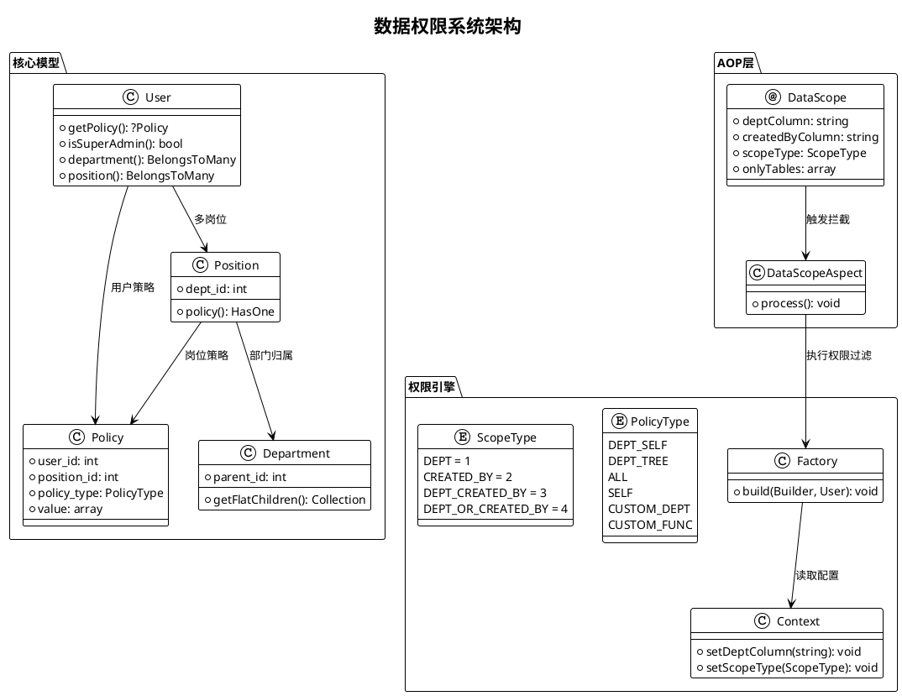
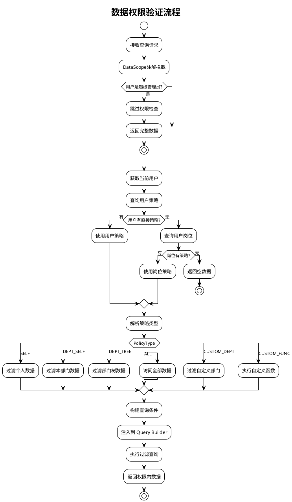
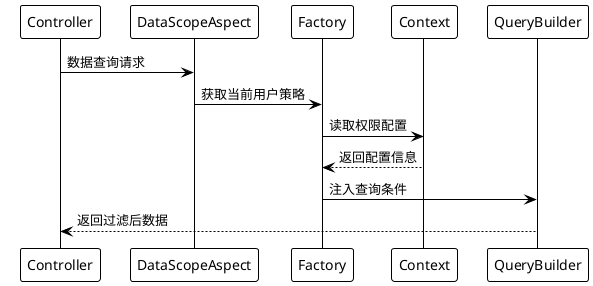

# 核心概念

本功能指在系统中实现数据的分层管理和权限控制，主要包括部门管理、岗位管理、数据权限等模块。

相对比 `master` 分支来说新增了部门管理和岗位管理的功能模块、实现了多种数据隔离方式，增强了系统的组织架构和角色定义能力。

## 系统架构图



## 权限验证流程



## 核心组件

### 部门管理

#### 功能定位

组织架构的基础单元，实现树形层级管理。

#### 核心特性

- 支持无限级父子部门结构
- 部门关联岗位和用户
- 支持设置部门负责人

#### 数据模型

```php
// /mineadmin/app/Model/Permission/Department.php
class Department {
    int $id;
    string $name; 
    int $parent_id;
    HasMany $children; // 子部门
    BelongsToMany $users; // 部门用户
    BelongsToMany $leaders; // 部门领导
    
    // 递归获取所有子部门
    public function getFlatChildren(): Collection
    {
        $flat = collect();
        $this->load('children');
        $traverse = static function ($departments) use (&$traverse, $flat) {
            foreach ($departments as $department) {
                $flat->push($department);
                if ($department->children->isNotEmpty()) {
                    $traverse($department->children);
                }
            }
        };
        $traverse($this->children);
        return $flat->prepend($this);
    }
}
```

---

### 岗位管理

#### 功能定位

部门内的职能角色定义

#### 核心特性

- 必须归属于具体部门
- 可设置数据权限策略
- 支持用户多岗位分配

#### 数据模型

```php
// /mineadmin/app/Model/Permission/Position.php
class Position {
    int $id;
    string $name;
    int $dept_id;
    
    public function policy(): HasOne
    {
        return $this->hasOne(Policy::class, 'position_id', 'id');
    }
}
```

## 数据权限体系

### 策略类型

```php
// /mineadmin/app/Model/Enums/DataPermission/PolicyType.php
enum PolicyType: string
{
    case DeptSelf = 'DEPT_SELF';     // 本部门
    case DeptTree = 'DEPT_TREE';     // 本部门及下级部门
    case All = 'ALL';                // 全部数据
    case Self = 'SELF';              // 仅本人
    case CustomDept = 'CUSTOM_DEPT'; // 自定义部门
    case CustomFunc = 'CUSTOM_FUNC'; // 自定义函数
}
```

| 权限标识码 | 类型 | 作用域 | 备注 |
|-------|----|-----|----|
| DEPT_SELF | 部门 | 当前部门 | 仅限当前部门数据 |
| DEPT_TREE | 部门 | 当前部门及子部门 | 包括当前部门和所有子部门数据 |
| ALL | 全局 | 全部数据 | 包括所有部门和用户数据 |
| SELF | 个人 | 个人数据 | 仅限当前用户数据 |
| CUSTOM_DEPT | 自定义 | 自定义部门 | 允许选择特定部门 |
| CUSTOM_FUNC | 自定义 | 自定义函数 | 允许自定义处理逻辑 |

### 隔离方式

```php
// /mineadmin/app/Library/DataPermission/ScopeType.php
enum ScopeType: int
{
    case DEPT = 1;                    // 只根据部门过滤
    case CREATED_BY = 2;              // 只根据创建人过滤
    case DEPT_CREATED_BY = 3;         // 根据部门 and 创建人过滤
    case DEPT_OR_CREATED_BY = 4;      // 根据部门 or 创建人过滤
}
```

### 实现机制

数据权限通过与`岗位` or `用户` 关联的`数据权限策略`实现。每个岗位或用户可以有一个或多个数据权限策略，系统根据这些策略来过滤和控制数据访问。

#### 策略模型

```php
// /mineadmin/app/Model/DataPermission/Policy.php
class Policy {
    int $user_id; // 用户ID
    int $position_id; // 岗位ID 
    PolicyType $policy_type;
    bool $is_default;
    array $value; // 策略值
}
```

#### 策略解析优先级

```php
// /mineadmin/app/Model/Permission/User.php:160-179
public function getPolicy(): ?Policy
{
    // 1. 优先检查用户专属策略
    $policy = $this->policy()->first();
    if (! empty($policy)) {
        return $policy;
    }

    // 2. 如果用户没有直接策略，则查找岗位策略
    $this->load('position');
    $positionList = $this->position;
    foreach ($positionList as $position) {
        $current = $position->policy()->first();
        if (! empty($current)) {
            return $current;
        }
    }
    return null;
}
```

#### 执行流程



## 核心API

### DataScope 注解

```php
// /mineadmin/app/Library/DataPermission/Attribute/DataScope.php
#[\Attribute(\Attribute::TARGET_CLASS | \Attribute::TARGET_METHOD)]
class DataScope extends AbstractAnnotation
{
    public function __construct(
        private readonly string $deptColumn = 'dept_id',
        private readonly string $createdByColumn = 'created_by',
        private readonly ScopeType $scopeType = ScopeType::DEPT_CREATED_BY,
        private readonly ?array $onlyTables = null
    ) {}
}
```

### Context 上下文管理

```php
// /mineadmin/app/Library/DataPermission/Context.php
final class Context
{
    public static function setDeptColumn(string $column = 'dept_id'): void;
    public static function setCreatedByColumn(string $column = 'created_by'): void;
    public static function setScopeType(ScopeType $scopeType): void;
    public static function setOnlyTables(?array $tables): void;
    
    public static function getDeptColumn(): string;
    public static function getCreatedByColumn(): string;
    public static function getScopeType(): ScopeType;
    public static function getOnlyTables(): array;
}
```

### Factory 权限工厂

```php
// /mineadmin/app/Library/DataPermission/Factory.php
class Factory
{
    public static function make(): self;
    
    public function build(Builder $builder, User $user): void
    {
        if ($user->isSuperAdmin()) {
            return; // 超级管理员跳过权限检查
        }
        
        if (($policy = $user->getPolicy()) === null) {
            return; // 无策略则跳过
        }
        
        // 根据 ScopeType 处理不同的数据权限逻辑
        $scopeType = Context::getScopeType();
        // ... 权限处理逻辑
    }
}
```

## 安全特性

### 超级管理员绕过

超级管理员会自动跳过所有数据权限检查：

```php
// /mineadmin/app/Library/DataPermission/Factory.php:37-39
if ($user->isSuperAdmin()) {
    return; // 超级管理员跳过所有数据权限检查
}
```

### 自定义函数支持

系统支持通过配置文件定义自定义权限函数：

```php
// /mineadmin/config/autoload/department/custom.php
return [
    'testction' => function (Builder $builder, ScopeType $scopeType, Policy $policy, User $user) {
        // 自定义权限逻辑
        if ($user->id !== 2) {
            return;
        }
        
        $createdByColumn = Context::getCreatedByColumn();
        $deptColumn = Context::getDeptColumn();
        
        switch ($scopeType) {
            case ScopeType::CREATED_BY:
                $builder->where($createdByColumn, $user->id);
                break;
            case ScopeType::DEPT:
                $builder->whereIn($deptColumn, $user->department()->get()->pluck('id'));
                break;
            // ... 其他逻辑
        }
    }
];
```