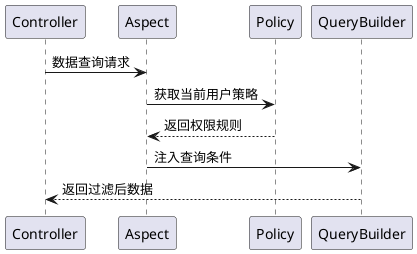

# 核心概念

本功能指在系统中实现数据的分层管理和权限控制，主要包括部门管理、岗位管理、数据权限等模块。

相对比 `master` 分支来说新增了部门管理和岗位管理的功能模块、实现了多种数据隔离方式，增强了系统的组织架构和角色定义能力。

## 新增功能

### 部门管理

#### 功能定位

组织架构的基础单元，实现树形层级管理。

#### 核心特性

- 支持无限级父子部门结构
- 部门关联岗位和用户
- 支持设置部门负责人

#### 数据模型

```php
 class Department {
    int $id;
    string $name; 
    int $parent_id;
    HasMany $positions; // 关联岗位
    BelongsToMany $department_users; // 部门用户
    BelongsToMany $leader; // 部门领导
  }
```

---

### 岗位管理

#### 功能定位

部门内的职能角色定义

#### 核心特性

- 必须归属于具体部门
- 可设置数据权限策略
- 支持用户多岗位分配

#### 数据模型

```php
class Position {
    int $id;
    string $name;
    int $dept_id;
    HasOne $policy; // 数据权限策略
  }
```

## 数据权限体系

### 策略类型

| 权限标识码 | 类型 | 作用域 | 备注 |
|-------|----|-----|----|
| DEPT_SELF | 部门 | 当前部门 | 仅限当前部门数据 |
| DEPT_TREE | 部门 | 当前部门及子部门 | 包括当前部门和所有子部门数据 |
| ALL | 全局 | 全部数据 | 包括所有部门和用户数据 |
| SELF | 个人 | 个人数据 | 仅限当前用户数据 |
| CUSTOM_DEPT | 自定义 | 自定义部门 | 允许选择特定部门 |
| CUSTOM_FUNC | 自定义 | 自定义函数 | 允许自定义处理逻辑 |

### 实现机制

数据权限通过与`岗位` or `用户` 关联的`数据权限策略`实现。每个岗位或用户可以有一个或多个数据权限策略，系统根据这些策略来过滤和控制数据访问。

#### 策略模型

```php
class Policy {
    int $user_id; // 用户ID
    int $position_id; // 岗位ID 
    PolicyType $policy_type;
    bool $is_default;
    array $value; // 策略值
  }
```

#### 执行流程


