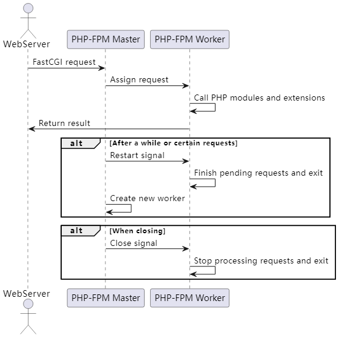

# 生命周期

::: tip

MineAdmin 是构建运行在 [PHP](https://php.net) + ([Swoole](https://swoole.com) or [Swow](https://github.com/swow/swow)) + [Hyperf](https://github.com/hyperf/hyperf)
上的，想要了解透彻 MineAdmin 的生命周期，那么理解基层架构的生命周期也是至关重要的。

本文将列举 MineAdmin 在不同基层设施下的生命周期。请求周期以及系统业务的生命周期

:::

## 前言

首先，不论是 swoole 或 swow。在 hyperf 中。都是由 [symfony/console](https://github.com/symfony/console) 
组件来提供启动命令 `php bin/hyperf.php start` ，也就是意味着从一开始就将代码常驻在内存当中。

而在 fpm 项目中，通常为以下流程

