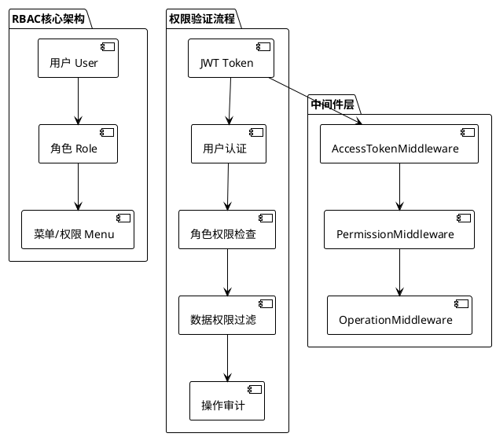
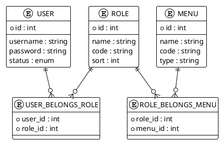

# 用户授权（RBAC）

## 系统概述

MineAdmin采用基于角色的访问控制（RBAC）系统，结合JWT认证、多层权限验证和数据级权限控制，为企业级应用提供全面的安全保障。

### 核心架构



## 认证系统

### JWT认证机制

使用双Token策略保障安全性：

```php
// 登录认证流程
public function login(string $username, string $password): array
{
    $user = $this->repository->findByUnameType($username, Type::SYSTEM);
    
    // 密码验证
    if (!$user->verifyPassword($password)) {
        throw new BusinessException(ResultCode::UNPROCESSABLE_ENTITY, trans('auth.password_error'));
    }
    
    // 用户状态检查
    if ($user->status->isDisable()) {
        throw new BusinessException(ResultCode::DISABLED);
    }
    
    // 生成Token
    $jwt = $this->getJwt();
    return [
        'access_token' => $jwt->builderAccessToken((string) $user->id)->toString(),
        'refresh_token' => $jwt->builderRefreshToken((string) $user->id)->toString(),
        'expire_at' => (int) $jwt->getConfig('ttl', 0),
    ];
}
```

### 密码安全

系统使用PHP内置的安全哈希函数：

```php
// 密码设置
public function setPasswordAttribute($value): void
{
    $this->attributes['password'] = password_hash((string) $value, \PASSWORD_DEFAULT);
}

// 密码验证
public function verifyPassword(string $password): bool
{
    return password_verify($password, $this->password);
}
```

## 权限系统

### 三层权限模型



### 权限检查实现

```php
// User模型中的权限检查方法
public function hasPermission(string $permission): bool
{
    return $this->roles()->whereRelation('menus', 'name', $permission)->exists();
}

public function getPermissions(): Collection
{
    return $this->roles()->with('menus')->orderBy('sort')->get()->pluck('menus')->flatten();
}

public function isSuperAdmin(): bool
{
    return $this->roles()->where('code', 'SuperAdmin')->exists();
}
```

### 权限注解使用

在控制器方法上使用`@Permission`注解进行权限控制：

```php
use Mine\Annotation\Permission;

class UserController
{
    #[Permission(code: 'permission:user:index')]
    public function pageList(): Result
    {
        // 用户列表查询
    }
    
    #[Permission(code: ['permission:user:save', 'permission:user:update'], operation: Permission::OPERATION_OR)]
    public function save(): Result
    {
        // 用户保存或更新
    }
    
    #[Permission(code: ['permission:user:delete', 'permission:role:admin'], operation: Permission::OPERATION_AND)]
    public function delete(): Result
    {
        // 需要同时具备删除权限和管理员角色
    }
}
```

## 中间件体系

### 三层中间件保护

```php
#[Middleware(middleware: AccessTokenMiddleware::class, priority: 100)]
#[Middleware(middleware: PermissionMiddleware::class, priority: 99)]
#[Middleware(middleware: OperationMiddleware::class, priority: 98)]
class AdminController
{
    // 控制器逻辑
}
```

#### 1. AccessTokenMiddleware

验证访问令牌的有效性：

```php
public function process(ServerRequestInterface $request, RequestHandlerInterface $handler): ResponseInterface
{
    $token = $this->getTokenFromRequest($request);
    
    try {
        $jwt = $this->getJwt();
        $token = $jwt->parseToken($token);
        
        // 检查黑名单
        if ($jwt->isBlacklisted($token)) {
            throw new TokenValidException('Token已被列入黑名单');
        }
        
        // 设置当前用户
        $this->setCurrentUser($token);
        
    } catch (\Throwable $e) {
        throw new BusinessException(ResultCode::UNAUTHORIZED, $e->getMessage());
    }
    
    return $handler->handle($request);
}
```

#### 2. PermissionMiddleware

执行权限验证逻辑：

```php
private function handlePermission(Permission $permission): void
{
    $operation = $permission->getOperation();
    $codes = $permission->getCode();
    
    foreach ($codes as $code) {
        $hasPermission = $this->currentUser->user()->hasPermission($code);
        
        if ($operation === Permission::OPERATION_AND && !$hasPermission) {
            throw new BusinessException(code: ResultCode::FORBIDDEN);
        }
        
        if ($operation === Permission::OPERATION_OR && $hasPermission) {
            return;
        }
    }
    
    if ($operation === Permission::OPERATION_OR) {
        throw new BusinessException(code: ResultCode::FORBIDDEN);
    }
}
```

#### 3. OperationMiddleware

记录操作日志：

```php
public function process(ServerRequestInterface $request, RequestHandlerInterface $handler): ResponseInterface
{
    $response = $handler->handle($request);
    
    // 记录操作日志
    $this->dispatcher->dispatch(new RequestOperationEvent(
        $this->user->id(),
        $operator->summary,
        $request->getUri()->getPath(),
        $request->getClientIps(),
        $request->getMethod(),
    ));
    
    return $response;
}
```

## API参考

### CurrentUser服务

```php
use Mine\Support\CurrentUser;

class ExampleController
{
    public function __construct(private readonly CurrentUser $currentUser) {}
    
    public function getUserInfo(): array
    {
        $user = $this->currentUser->user();
        
        return [
            'id' => $user->id,
            'username' => $user->username,
            'roles' => $user->roles,
            'permissions' => $user->getPermissions(),
            'is_super_admin' => $user->isSuperAdmin(),
        ];
    }
    
    public function checkPermission(string $permission): bool
    {
        return $this->currentUser->user()->hasPermission($permission);
    }
}
```

### 权限验证方法

```php
// AND操作：需要同时具备所有权限
#[Permission(code: ['user:read', 'user:write'], operation: Permission::OPERATION_AND)]

// OR操作：具备任一权限即可
#[Permission(code: ['user:read', 'admin:all'], operation: Permission::OPERATION_OR)]

// 单一权限检查
#[Permission(code: 'user:delete')]

// 程序化权限检查
if ($this->currentUser->user()->hasPermission('user:create')) {
    // 允许创建用户
}
```


## 故障排除

### 常见问题

#### 权限检查失败

**问题**: 用户无法访问有权限的资源

**调试步骤**:
```php
// 1. 检查用户角色
$user = User::find($userId);
dd($user->roles);

// 2. 检查角色权限
foreach ($user->roles as $role) {
    dd($role->menus);
}

// 3. 检查权限码
$hasPermission = $user->hasPermission('permission:user:index');
dd($hasPermission);

// 4. 检查SuperAdmin状态
dd($user->isSuperAdmin());
```