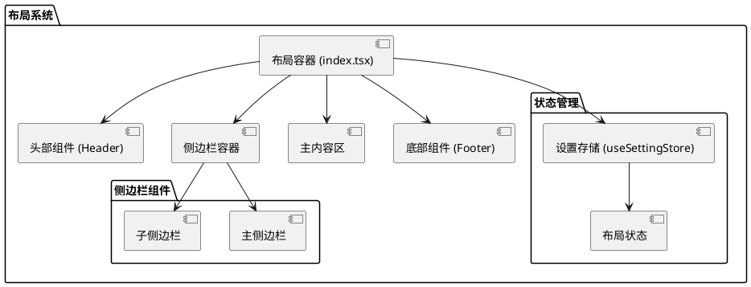

# 布局系统

MineAdmin 3.0 的布局系统是一个灵活且强大的前端布局解决方案，支持多种布局模式和动态切换。相比 2.0 版本，新的布局系统采用了统一的架构设计，所有布局逻辑都集中在 `src/layouts/index.tsx` 文件中，提供了更好的维护性和扩展性。

## 布局架构概览



## 布局模式

MineAdmin 支持三种主要的布局模式：

### 1. 经典布局 (Classic Layout)
- **特点**: 传统的左侧边栏 + 主内容区布局
- **适用场景**: 标准的后台管理界面
- **组件结构**: 固定左侧菜单，右侧内容区域

### 2. 混合布局 (Mixed Layout)
- **特点**: 顶部菜单 + 左侧子菜单的组合布局
- **适用场景**: 需要多级菜单导航的复杂应用
- **组件结构**: 顶部主菜单，左侧当前分类的子菜单

### 3. 分栏布局 (Columns Layout)
- **特点**: 多栏式菜单布局
- **适用场景**: 菜单分类较多的大型应用
- **组件结构**: 左侧主菜单栏，中间子菜单栏，右侧内容区

## 布局相关API

### useSettingStore API 参考

| 方法名 | 返回类型 | 说明 | 使用示例 |
|--------|----------|------|----------|
| `isMixedLayout()` | `boolean` | 判断当前是否为混合布局模式 | `store.isMixedLayout()` |
| `isColumnsLayout()` | `boolean` | 判断当前是否为分栏布局模式 | `store.isColumnsLayout()` |
| `isClassicLayout()` | `boolean` | 判断当前是否为经典布局模式 | `store.isClassicLayout()` |
| `getFixedAsideState()` | `boolean` | 获取子侧边栏是否为固定状态 | `store.getFixedAsideState()` |
| `getMenuCollapseState()` | `boolean` | 获取菜单是否为折叠状态 | `store.getMenuCollapseState()` |
| `getMobileState()` | `boolean` | 判断当前是否为移动端状态 | `store.getMobileState()` |

::: tip API 源码位置
- **GitHub**: [useSettingStore.ts](https://github.com/mineadmin/MineAdmin/blob/master/web/src/store/modules/useSettingStore.ts)
- **本地路径**: `mineadmin/web/src/store/modules/useSettingStore.ts`
:::

### 使用示例

```typescript
// 在Vue组件中使用布局API
import { useSettingStore } from '@/stores/modules/settingStore'

export default defineComponent({
  setup() {
    const settingStore = useSettingStore()
    
    // 检查当前布局模式
    const isClassic = computed(() => settingStore.isClassicLayout())
    const isMixed = computed(() => settingStore.isMixedLayout())
    const isColumns = computed(() => settingStore.isColumnsLayout())
    
    // 获取菜单状态
    const isMenuCollapsed = computed(() => settingStore.getMenuCollapseState())
    const isAsideFixed = computed(() => settingStore.getFixedAsideState())
    
    // 响应式判断设备类型
    const isMobile = computed(() => settingStore.getMobileState())
    
    return {
      isClassic,
      isMixed, 
      isColumns,
      isMenuCollapsed,
      isAsideFixed,
      isMobile
    }
  }
})
```

## 布局切换功能

### 动态布局切换

```typescript
// 布局模式切换示例
import { useSettingStore } from '@/stores/modules/settingStore'

const settingStore = useSettingStore()

// 切换到经典布局
const switchToClassic = () => {
  settingStore.updateSettings({
    layout: 'classic'
  })
}

// 切换到混合布局
const switchToMixed = () => {
  settingStore.updateSettings({
    layout: 'mixed'
  })
}

// 切换到分栏布局
const switchToColumns = () => {
  settingStore.updateSettings({
    layout: 'columns'
  })
}

// 切换菜单折叠状态
const toggleMenuCollapse = () => {
  settingStore.toggleMenuCollapse()
}
```

## 全局样式配置

### CSS 变量定义

::: tip 配置文件位置
- **GitHub**: [https://github.com/mineadmin/mineadmin/blob/master/web/src/assets/styles/global.scss](https://github.com/mineadmin/mineadmin/blob/master/web/src/assets/styles/global.scss)
- **本地路径**: `mineadmin/web/src/assets/styles/global.scss`
:::

```scss
/* 布局尺寸变量 */
:root {
  /* ========== 头部区域 ========== */
  --mine-g-header-height: 55px;
  --mine-g-toolbar-height: 55px;
  
  /* ========== 底部区域 ========== */
  --mine-g-footer-height: 50px;
  
  /* ========== 侧边栏区域 ========== */
  --mine-g-main-aside-width: 80px;           /* 主侧边栏宽度 */
  --mine-g-sub-aside-width: 200px;           /* 子侧边栏展开宽度 */
  --mine-g-sub-aside-collapse-width: 65px;   /* 子侧边栏折叠宽度 */
  --mine-g-menu-retract-width: 15px;         /* 菜单缩进宽度 */
  
  /* ========== 标签栏 ========== */
  --mine-g-tabbar-height: 40px;
  
  /* ========== 主题色彩 ========== */
  --mine-g-box-shadow-color: rgb(0 0 0 / 18%);
  --el-color-primary: --ui-primery;
  
  /* ========== 响应式断点 ========== */
  --mine-g-mobile-breakpoint: 768px;
  --mine-g-tablet-breakpoint: 1024px;
}
```

### 响应式布局配置

```scss
/* 响应式布局样式 */
@media screen and (max-width: 768px) {
  :root {
    --mine-g-main-aside-width: 0px;
    --mine-g-sub-aside-width: 100vw;
    --mine-g-header-height: 50px;
  }
}

@media screen and (min-width: 768px) and (max-width: 1024px) {
  :root {
    --mine-g-main-aside-width: 60px;
    --mine-g-sub-aside-width: 180px;
  }
}
```

## 高级配置

### 自定义布局样式

```scss
/* 自定义布局配置示例 */
.mine-layout {
  /* 自定义头部样式 */
  &__header {
    background: var(--el-bg-color);
    border-bottom: 1px solid var(--el-border-color-light);
    height: var(--mine-g-header-height);
  }
  
  /* 自定义侧边栏样式 */
  &__aside {
    width: var(--mine-g-main-aside-width);
    transition: width 0.3s ease;
    
    &--collapsed {
      width: var(--mine-g-sub-aside-collapse-width);
    }
  }
  
  /* 自定义内容区域样式 */
  &__main {
    margin-left: var(--mine-g-main-aside-width);
    transition: margin-left 0.3s ease;
    min-height: calc(100vh - var(--mine-g-header-height));
  }
}
```

### 布局状态持久化

```typescript
// 布局状态持久化配置
import { defineStore } from 'pinia'

export const useLayoutStore = defineStore('layout', {
  state: () => ({
    mode: 'classic' as 'classic' | 'mixed' | 'columns',
    isAsideCollapsed: false,
    isAsideFixed: true,
    isMobile: false
  }),
  
  persist: {
    key: 'mine-admin-layout',
    storage: localStorage,
    paths: ['mode', 'isAsideCollapsed', 'isAsideFixed']
  }
})
```

## 性能优化

### 布局组件懒加载

```typescript
// 布局组件异步加载
import { defineAsyncComponent } from 'vue'

export const LayoutComponents = {
  Header: defineAsyncComponent(() => import('@/layouts/components/Header.vue')),
  Aside: defineAsyncComponent(() => import('@/layouts/components/Aside.vue')),
  Main: defineAsyncComponent(() => import('@/layouts/components/Main.vue')),
  Footer: defineAsyncComponent(() => import('@/layouts/components/Footer.vue'))
}
```

### 布局切换动画优化

```scss
/* 布局切换动画优化 */
.layout-transition {
  transition: all 0.3s cubic-bezier(0.4, 0, 0.2, 1);
  will-change: transform, width, margin;
}

/* 减少不必要的重绘 */
.layout-aside {
  contain: layout style paint;
  transform: translateZ(0); /* 启用硬件加速 */
}
```

## 常见问题解决

### 1. 移动端布局适配问题

```typescript
// 移动端适配解决方案
import { useBreakpoints } from '@vueuse/core'

const breakpoints = useBreakpoints({
  mobile: 0,
  tablet: 768,
  desktop: 1024
})

const isMobile = breakpoints.smaller('tablet')
const isTablet = breakpoints.between('tablet', 'desktop')
const isDesktop = breakpoints.greater('desktop')
```

### 2. 布局闪烁问题

```scss
/* 防止布局闪烁 */
.mine-layout {
  opacity: 0;
  transition: opacity 0.2s ease;
  
  &.loaded {
    opacity: 1;
  }
}
```

### 3. 侧边栏滚动问题

```scss
/* 侧边栏滚动优化 */
.layout-aside {
  overflow-y: auto;
  scrollbar-width: thin;
  scrollbar-color: var(--el-border-color) transparent;
  
  &::-webkit-scrollbar {
    width: 6px;
  }
  
  &::-webkit-scrollbar-thumb {
    background: var(--el-border-color);
    border-radius: 3px;
  }
}
```

## 相关文档

- [常用 Store](/front/high/store) - 状态管理相关文档

::: tip 源码参考
完整的布局系统源码可以在以下位置找到：
- **GitHub**: [web/src/layouts](https://github.com/mineadmin/mineadmin/tree/master/web/src/layouts)
- **本地路径**: `mineadmin/web/src/layouts/`
:::