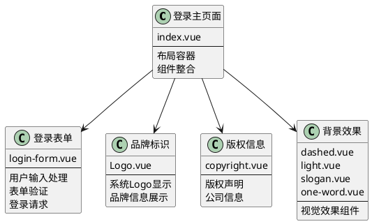
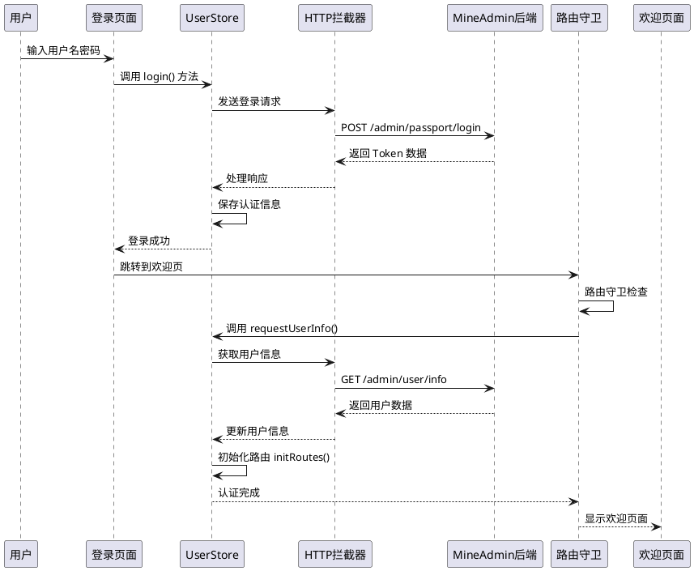
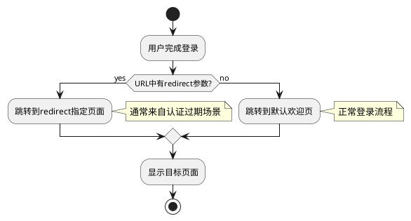

# 登录与欢迎页

:::tip 概述
本章节详细介绍 MineAdmin 3.0 的登录页面架构、登录流程处理、Token 管理机制，以及登录成功后的欢迎页配置。内容包括组件结构分析、数据流转过程、路由守卫机制和自定义配置方法。

**重要说明**：本文档中所有代码示例均来自 MineAdmin 开源项目的实际代码，源代码位于 [GitHub 仓库](https://github.com/mineadmin/mineadmin)。
:::

## 登录页面架构

### 页面组件结构

登录页面主文件位于 `src/modules/base/views/login/index.vue`，采用组件化设计，将登录功能拆分为多个独立的子组件，提高代码可维护性和复用性。

**源代码位置**：
- **GitHub 地址**：[mineadmin/web/src/modules/base/views/login/index.vue](https://github.com/mineadmin/mineadmin/blob/master/web/src/modules/base/views/login/index.vue)
- **本地路径**：`src/modules/base/views/login/index.vue`



### 响应式布局设计

登录页面采用响应式设计，适配桌面端和移动端：

```vue
<template>
  <div class="h-full min-w-[380px] w-full flex items-center justify-center overflow-hidden border-1 bg-blue-950 lg:justify-between lg:bg-white">
    <!-- 桌面端左侧装饰区域 -->
    <div class="relative hidden h-full w-10/12 md:hidden lg:flex">
      <div class="gradient-rainbow" />
      <Dashed />
      <Light />
      <Slogan />
      <OneWord />
    </div>
    
    <!-- 登录表单区域 -->
    <div class="login-form-container">
      <Logo />
      <LoginForm />
      <CopyRight />
    </div>
    
    <!-- 移动端背景效果 -->
    <div class="min-[380px] relative left-0 top-0 z-4 h-full max-w-[1024px] w-full flex lg:hidden">
      <Dashed />
      <Light />
    </div>
  </div>
</template>
```

### 组件库说明

::: warning 组件库注意事项
登录页面的表单组件并非使用 `Element Plus` 组件库，而是基于 MineAdmin 自身的基础组件库构建。这些组件专为系统设计，具有以下特点：

- **轻量化设计**：只包含必要的登录功能，减少依赖
- **统一样式风格**：与整个系统的设计语言保持一致
- **定制化程度高**：可根据业务需求灵活调整

**自定义建议**：
- 不建议直接修改源码，以免影响后续版本升级
- 推荐通过[插件系统](/front/high/plugins.md)替换登录组件
- 可通过路由配置覆盖默认的 `login` 路由组件
:::

## 登录流程与数据处理

### 登录流程概览

登录流程采用现代化的前后端分离架构，基于 JWT Token 进行身份认证，支持 Token 自动刷新和权限验证。



### 核心数据流转

::: info 开发提示
如果只需要修改登录页面 UI 而不涉及登录逻辑，可以跳过本节的详细流程说明，直接查看[欢迎页配置](#默认欢迎页配置)部分。
:::

#### 1. 用户登录认证

**文件位置**：`src/store/modules/useUserStore.ts`

`login()` 方法负责处理用户认证过程：

```typescript
// 登录方法核心逻辑
async login(loginParams: LoginParams) {
  try {
    // 发送登录请求
    const response = await http.post('/admin/passport/login', loginParams)
    
    // 保存认证信息到本地存储
    const { access_token, refresh_token, expire_at } = response.data
    
    // 存储到 Pinia Store
    this.token = access_token
    this.refreshToken = refresh_token
    this.expireAt = expire_at
    
    // 存储到浏览器缓存
    cache.set('token', access_token)
    cache.set('refresh_token', refresh_token)
    cache.set('expire', useDayjs().unix() + expire_at, { exp: expire_at })
    
    return Promise.resolve(response)
  } catch (error) {
    return Promise.reject(error)
  }
}
```

#### 2. 路由守卫拦截

登录成功后页面跳转会触发路由守卫，自动执行用户信息获取：

```typescript
// 路由守卫逻辑（简化版）
router.beforeEach(async (to, from, next) => {
  const userStore = useUserStore()
  
  if (to.path !== '/login' && !userStore.isLogin) {
    // 未登录，跳转到登录页
    next('/login')
  } else if (userStore.isLogin && !userStore.userInfo) {
    // 已登录但未获取用户信息
    try {
      await userStore.requestUserInfo()
      next()
    } catch (error) {
      // 获取用户信息失败，清除登录状态
      await userStore.logout()
      next('/login')
    }
  } else {
    next()
  }
})
```

#### 3. 用户信息获取

**文件位置**：`src/store/modules/useUserStore.ts`

`requestUserInfo()` 方法获取用户基础数据和权限信息：

```typescript
async requestUserInfo() {
  try {
    // 并行请求用户数据、菜单权限、角色信息
    const [userInfo, menuList, roleList] = await Promise.all([
      http.get('/admin/user/info'),          // 用户基础信息
      http.get('/admin/menu/index'),         // 菜单权限数据
      http.get('/admin/role/index')          // 角色权限数据
    ])
    
    // 更新 Store 状态
    this.userInfo = userInfo.data
    this.menuList = menuList.data
    this.roleList = roleList.data
    
    // 初始化路由系统
    const routeStore = useRouteStore()
    await routeStore.initRoutes()
    
    return Promise.resolve(userInfo)
  } catch (error) {
    return Promise.reject(error)
  }
}
```

#### 4. 动态路由初始化

**文件位置**：`src/store/modules/useRouteStore.ts`

`initRoutes()` 方法根据用户权限动态生成路由：

```typescript
async initRoutes() {
  const userStore = useUserStore()
  const { menuList } = userStore
  
  // 根据菜单数据生成路由配置
  const routes = this.generateRoutes(menuList)
  
  // 动态添加路由
  routes.forEach(route => {
    router.addRoute(route)
  })
  
  // 更新路由状态
  this.isRoutesInitialized = true
}
```

### Token 管理机制

系统采用双 Token 机制确保安全性和用户体验：

- **Access Token**：短期有效（默认 1 小时），用于 API 请求认证
- **Refresh Token**：长期有效（默认 2 小时），用于刷新 Access Token

详细的 Token 刷新机制请参考 [请求与拦截器](/front/advanced/request.md#token-刷新机制) 文档。

## 欢迎页配置与路由管理

### 登录后跳转逻辑

MineAdmin 支持多种登录后跳转策略，确保用户体验的连续性：



#### 跳转规则说明

1. **带重定向参数的登录**
   ```
   /#/login?redirect=/admin/user/index
   ```
   登录成功后会自动跳转到 `redirect` 参数指定的页面。这种情况通常发生在：
   - 用户访问需要权限的页面但未登录时
   - Token 过期后自动跳转到登录页时

2. **默认登录跳转**
   ```
   /#/login
   ```
   没有 `redirect` 参数时，登录成功后跳转到系统配置的默认欢迎页面。

### 欢迎页配置详解

#### 默认配置结构

**配置文件位置**：`src/provider/settings/index.ts`

MineAdmin 实际的默认欢迎页配置：

```typescript
// MineAdmin 默认欢迎页配置
welcomePage: {
  name: 'welcome',                    // 路由名称
  path: '/welcome',                   // 路由路径
  title: '欢迎页',                 // 页面标题
  icon: 'icon-park-outline:jewelry',  // 菜单图标
},
```

注意：MineAdmin 中欢迎页的组件路径是通过路由系统自动解析的，位于 `src/modules/base/views/welcome/index.vue`。

#### 配置项详细说明

| 配置项 | 类型 | 必填 | 默认值 | 说明 |
|--------|------|------|---------|------|
| `name` | `string` | ✅ | `'welcome'` | 路由名称，必须全局唯一 |
| `path` | `string` | ✅ | `'/welcome'` | 访问路径，支持动态路由 |
| `title` | `string` | ✅ | `'欢迎页'` | 页面标题，显示在浏览器标签和面包屑中 |
| `icon` | `string` | ❌ | `'icon-park-outline:jewelry'` | 图标标识，用于菜单显示 |
| `component` | `Function` | ❌ | 动态导入组件 | 页面组件，支持异步加载 |

### 自定义欢迎页配置

::: tip 最佳实践
为了保证系统升级时配置不被覆盖，强烈建议在 `settings.config.ts` 中进行自定义配置，而不是直接修改 `index.ts` 文件。
:::

#### 配置方式

**步骤 1**：编辑 `src/provider/settings/settings.config.ts`

注意：该文件已存在于 MineAdmin 项目中，无需创建。

```typescript
import type { SystemSettings } from '#/global'

const globalConfigSettings: SystemSettings.all = {
  // 自定义欢迎页配置
  welcomePage: {
    name: 'dashboard',                        // 修改为仪表板
    path: '/dashboard',                       // 路径改为仪表板路径
    title: '数据概览',                        // 自定义标题
    icon: 'mdi:view-dashboard-outline',       // 使用仪表板图标
  },
  
  // 其他系统配置...
  app: {
    // 应用相关配置
  }
}

export default globalConfigSettings
```

**步骤 2**：系统自动合并配置

系统启动时会自动将 `settings.config.ts` 中的配置与默认配置进行深度合并：

```typescript
// MineAdmin 实际的配置合并逻辑
import { defaultsDeep } from 'lodash-es'
import globalConfigSettings from '@/provider/settings/settings.config.ts'

// 默认配置与用户配置合并
const systemSetting = defaultsDeep(globalConfigSettings, defaultGlobalConfigSettings)
```

### 高级配置示例

#### 1. 条件化欢迎页

根据用户角色或权限设置不同的欢迎页：

```typescript
const globalConfigSettings: SystemSettings.all = {
  welcomePage: {
    name: 'adaptive-welcome',
    path: '/adaptive-welcome',
    title: '个性化欢迎页',
    icon: 'mdi:account-star',
    // 使用自定义组件处理条件逻辑
    component: () => import('@/views/custom/AdaptiveWelcome.vue')
  }
}
```

#### 2. 多语言支持

结合国际化配置设置多语言欢迎页：

```typescript
const globalConfigSettings: SystemSettings.all = {
  welcomePage: {
    name: 'welcome',
    path: '/welcome',
    // 使用国际化键值
    title: 'menu.welcome', 
    icon: 'icon-park-outline:jewelry',
  }
}
```

#### 3. 外部链接跳转

配置登录后跳转到外部系统：

```typescript
const globalConfigSettings: SystemSettings.all = {
  welcomePage: {
    name: 'external-system',
    path: 'https://external-dashboard.com',  // 外部链接
    title: '外部系统',
    icon: 'mdi:open-in-new',
    // 设置为外部链接类型
    meta: {
      isExternal: true,
      target: '_blank'
    }
  }
}
```

### 欢迎页组件开发

#### 基础组件结构

```vue
<!-- src/views/custom/CustomWelcome.vue -->
<template>
  <div class="welcome-container">
    <div class="welcome-header">
      <h1>{{ $t('welcome.title') }}</h1>
      <p>{{ $t('welcome.subtitle') }}</p>
    </div>
    
    <div class="welcome-content">
      <!-- 用户信息卡片 -->
      <UserInfoCard :user="userInfo" />
      
      <!-- 快捷操作 -->
      <QuickActions :actions="quickActions" />
      
      <!-- 数据统计 -->
      <DataStatistics :stats="systemStats" />
    </div>
  </div>
</template>

<script setup lang="ts">
import { ref, onMounted } from 'vue'
import { useUserStore } from '@/store/modules/useUserStore'
import UserInfoCard from '@/components/UserInfoCard.vue'
import QuickActions from '@/components/QuickActions.vue'
import DataStatistics from '@/components/DataStatistics.vue'

const userStore = useUserStore()
const userInfo = ref(userStore.userInfo)
const systemStats = ref({})
const quickActions = ref([
  { name: '用户管理', icon: 'mdi:account-group', path: '/admin/user' },
  { name: '角色权限', icon: 'mdi:shield-account', path: '/admin/role' },
  { name: '系统设置', icon: 'mdi:cog', path: '/admin/system' },
])

// MineAdmin 欢迎页不需要动态加载数据
// 所有数据都是静态的，直接在组件中定义

// MineAdmin 中欢迎页使用的是静态数据，不需要 API 调用
// 如果需要动态数据，可以添加相应的 API 调用
// 例如：useHttp().get('/admin/user/info') 等实际存在的 API
</script>

<style scoped>
.welcome-container {
  padding: 24px;
  max-width: 1200px;
  margin: 0 auto;
}

.welcome-header {
  text-align: center;
  margin-bottom: 32px;
}

.welcome-content {
  display: grid;
  grid-template-columns: repeat(auto-fit, minmax(300px, 1fr));
  gap: 24px;
}
</style>
```

## 安全考虑与最佳实践

### 认证安全

1. **Token 安全存储**
   - Access Token 存储在内存中，避免 XSS 攻击
   - Refresh Token 使用 HttpOnly Cookie 存储
   - 敏感信息不存储在 localStorage 中

2. **路由权限验证**
   ```typescript
   // 路由守卫中的权限检查
   router.beforeEach(async (to, from, next) => {
     const userStore = useUserStore()
     
     // 检查路由是否需要认证
     if (to.meta.requiresAuth && !userStore.isLogin) {
       next(`/login?redirect=${to.fullPath}`)
       return
     }
     
     // 检查用户权限
     if (to.meta.permissions && !userStore.hasPermissions(to.meta.permissions)) {
       next('/403') // 权限不足页面
       return
     }
     
     next()
   })
   ```

### 性能优化

1. **组件懒加载**
   
   MineAdmin 使用模块化路由加载，组件会自动懒加载：
   ```typescript
   // MineAdmin 中的动态组件加载
   const moduleViews = import.meta.glob('../../modules/**/views/**/**.{vue,jsx,tsx}')
   const pluginViews = import.meta.glob('../../plugins/*/**/views/**/**.{vue,jsx,tsx}')
   
   // 自动解析组件路径
   if (moduleViews[`../../modules/${item.component}${suffix}`]) {
     component = moduleViews[`../../modules/${item.component}${suffix}`]
   }
   ```

2. **数据预加载**
   
   MineAdmin 在路由守卫中处理用户信息加载：
   ```typescript
   // MineAdmin 的数据预加载机制
   router.beforeEach(async (to, from, next) => {
     if (userStore.isLogin) {
       if (userStore.getUserInfo() === null) {
         // 预加载用户信息、菜单和权限数据
         await userStore.requestUserInfo()
         next({ path: to.fullPath, query: to.query })
       }
       else {
         next()
       }
     }
   })
   ```

## 常见问题与解决方案

### Q: 登录成功后页面没有跳转？

**MineAdmin 中可能的原因和解决方案**：

1. **路由配置问题**
   ```typescript
   // 检查欢迎页路由是否正确注册
   const routes = [
     {
       name: 'welcome',
       path: '/welcome',
       component: () => import('@/views/Welcome.vue'),
       meta: { requiresAuth: true }
     }
   ]
   ```

2. **权限验证失败**
   ```typescript
   // 确保用户有访问欢迎页的权限
   if (!userStore.hasPermission('welcome:access')) {
     // 处理权限不足情况
   }
   ```

### Q: 自定义欢迎页配置不生效？

**解决方案**：

1. **确认配置文件路径**
   ```bash
   src/provider/settings/settings.config.ts  # 正确路径
   ```

2. **检查配置语法**
   ```typescript
   // ❌ 错误：配置对象结构不正确
   const config = {
     welcomePage: '/dashboard'
   }
   
   // ✅ 正确：完整的配置对象
   const config = {
     welcomePage: {
       name: 'dashboard',
       path: '/dashboard',
       title: '仪表板'
     }
   }
   ```

3. **重启开发服务器**
   ```bash
   pnpm run dev
   ```

### Q: 如何实现登录后的个性化跳转？

**解决方案**：

```typescript
// 在 UserStore 中实现个性化跳转逻辑
async login(params: LoginParams) {
  const response = await http.post('/admin/passport/login', params)
  
  // 根据用户角色确定跳转页面
  const userRole = response.data.user.role
  const redirectMap = {
    'admin': '/dashboard',
    'user': '/profile',
    'guest': '/welcome'
  }
  
  const targetPath = redirectMap[userRole] || '/welcome'
  
  // 执行跳转
  await router.push(targetPath)
}
```

## 相关文档链接

- [系统配置详解](/front/advanced/system-config.md) - 系统全局配置说明
- [请求与拦截器](/front/advanced/request.md) - HTTP 请求和 Token 管理
- [路由与菜单](/front/base/route-menu.md) - 路由系统配置
- [插件系统](/front/high/plugins.md) - 插件开发与配置
- [后端认证机制](/backend/security/passport.md) - 后端 JWT 认证实现

