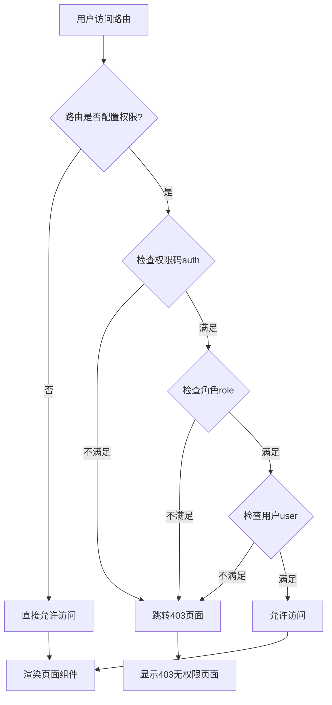
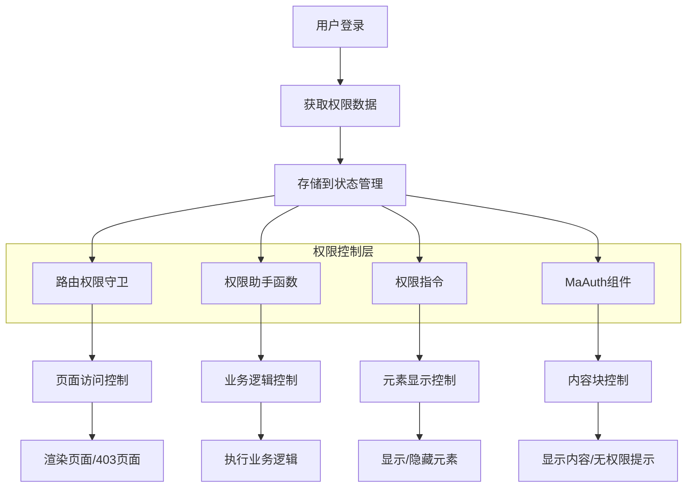

# MineAdmin 权限控制系统

## 概述

MineAdmin 提供了一套完整的前端权限控制系统，实现了细粒度的权限管理。权限控制分为两个层面：

:::tip 权限架构概览
- **路由级权限**：基于后端返回的菜单数据控制页面访问权限
- **内容级权限**：通过助手函数、指令和组件控制页面内容的显示和隐藏

权限系统与后端 Hyperf 框架深度集成，确保前后端权限控制的一致性。
:::

### 权限类型

MineAdmin 支持三种细粒度的权限控制：

| 权限类型 | 判断依据 | 应用场景 | 实现方式 |
|---------|---------|---------|---------|
| **权限码权限** | 菜单的 `name` 字段 | 功能模块权限控制 | 函数、指令、组件 |
| **角色权限** | 角色的 `code` 字段 | 基于职责的权限控制 | 函数、指令 |
| **用户权限** | 用户的 `username` 字段 | 特定用户权限控制 | 函数、指令 |

::: info 实现原理
权限系统基于用户登录后获取的权限数据，通过对比当前用户拥有的权限码、角色码和用户标识来判断是否有权限访问特定功能。权限数据存储在前端状态管理中，实现高效的权限验证。
:::

## 权限助手函数

### 函数引入和基本用法

MineAdmin 提供三个核心权限判断函数，位于 `web/src/utils/permission/` 目录下：

```javascript
// 权限码检查函数
import hasAuth from '@/utils/permission/hasAuth'
// 角色检查函数  
import hasRole from '@/utils/permission/hasRole'
// 用户检查函数
import hasUser from '@/utils/permission/hasUser'
```

::: tip 函数位置说明
**源码路径**：
- GitHub: `https://github.com/mineadmin/mineadmin/tree/master/web/src/utils/permission/`
- 本地开发: `/web/src/utils/permission/`

这些函数已在全局注册，支持在组件中直接调用。
:::

### 业务逻辑中使用

```vue
<script setup>
// 权限码验证 - 支持单个权限或权限数组
if (hasAuth('user:list') || hasAuth(['user:list', 'user:create'])) {
  // 用户管理权限验证通过
  console.log('具有用户管理权限')
}

// 角色验证 - 支持单个角色或角色数组
if (hasRole('SuperAdmin') || hasRole(['admin', 'manager'])) {
  // 管理员角色验证通过
  console.log('具有管理员权限')
}

// 用户验证 - 支持单个用户名或用户名数组
if (hasUser('admin') || hasUser(['admin', 'root'])) {
  // 特定用户验证通过
  console.log('特定用户验证通过')
}

// 复合权限判断示例
const canManageUsers = hasAuth(['user:list', 'user:create']) && hasRole('admin')
if (canManageUsers) {
  // 同时满足权限码和角色要求
}
</script>
```

### 模板中使用

```vue
<script setup>
// 导入权限判断函数
import hasAuth from '@/utils/permission/hasAuth'
import hasRole from '@/utils/permission/hasRole'
import hasUser from '@/utils/permission/hasUser'
</script>

<template>
  <div>
    <!-- 权限码验证 -->
    <div v-if="hasAuth('user:list') || hasAuth(['user:list', 'user:create'])">
      <el-button type="primary">用户管理</el-button>
    </div>
    
    <!-- 角色验证 -->
    <div v-if="hasRole('SuperAdmin') || hasRole(['admin', 'manager'])">
      <el-button type="danger">系统设置</el-button>
    </div>

    <!-- 用户验证 -->
    <div v-if="hasUser('admin') || hasUser(['root', 'administrator'])">
      <el-button type="warning">高级功能</el-button>
    </div>

    <!-- 复合条件验证 -->
    <div v-if="hasAuth('role:manage') && hasRole('admin')">
      <el-button>角色管理</el-button>
    </div>
  </div>
</template>
```

### 函数参数说明

所有权限函数都支持以下两种参数格式：

```javascript
// 字符串格式 - 单一权限检查
hasAuth('user:list')
hasRole('admin')  
hasUser('admin')

// 数组格式 - 多权限检查（OR逻辑）
hasAuth(['user:list', 'user:create', 'user:edit'])
hasRole(['admin', 'manager', 'supervisor'])
hasUser(['admin', 'root', 'system'])
```

::: warning 注意事项
- 数组参数采用 **OR 逻辑**，即只要满足其中任一条件即返回 `true`
- 如需 **AND 逻辑**，请使用多个函数调用组合：`hasAuth('a') && hasAuth('b')`
- 权限码建议采用 `模块:操作` 的命名规范，如 `user:list`、`role:create`
:::

### 路由权限参数

权限函数支持第二个可选参数 `checkRoute`，用于是否同时检查路由权限：

```javascript
// 第二个参数默认为 false，仅检查功能权限
hasAuth('user:list', false)  

// 设置为 true 时，同时检查路由权限
hasAuth('user:list', true)
```

## 权限指令

MineAdmin 提供了三个权限指令，简化了模板中的权限控制。指令位于 `web/src/directives/permission/` 目录下：

::: tip 指令源码位置
**GitHub路径**：
- `https://github.com/mineadmin/mineadmin/tree/master/web/src/directives/permission/auth/`
- `https://github.com/mineadmin/mineadmin/tree/master/web/src/directives/permission/role/`
- `https://github.com/mineadmin/mineadmin/tree/master/web/src/directives/permission/user/`

**本地路径**：`/web/src/directives/permission/`
:::

### 指令使用方式

```vue
<template>
  <div>
    <!-- 权限码指令 - 支持字符串和数组 -->
    <div v-auth="'user:list'">
      单一权限码控制
    </div>
    <div v-auth="['user:list', 'user:create']">
      多权限码控制（满足任一即可）
    </div>
    
    <!-- 角色指令 -->
    <div v-role="'admin'">
      单一角色控制
    </div>
    <div v-role="['admin', 'manager']">
      多角色控制（满足任一即可）
    </div>

    <!-- 用户指令 -->
    <div v-user="'admin'">
      单一用户控制
    </div>
    <div v-user="['admin', 'root']">
      多用户控制（满足任一即可）
    </div>

    <!-- 实际业务场景示例 -->
    <el-button v-auth="'user:create'" type="primary">
      新增用户
    </el-button>
    
    <el-button v-role="'SuperAdmin'" type="danger">
      删除数据
    </el-button>
    
    <div v-auth="['log:operation', 'log:login']" class="log-panel">
      日志查看面板
    </div>
  </div>
</template>
```

### 指令 vs 函数对比

| 方式 | 优势 | 适用场景 | 示例 |
|------|------|----------|------|
| **指令方式** | 简洁直观，自动控制元素显示/隐藏 | 简单的权限控制，静态权限检查 | `v-auth="'user:list'"` |
| **函数方式** | 灵活性高，支持复杂逻辑判断 | 业务逻辑中的权限判断，动态权限检查 | `v-if="hasAuth('a') && hasRole('b')"` |

::: warning 指令使用注意事项
- 指令采用 **OR 逻辑**，数组中任一条件满足即显示元素
- 指令直接控制 DOM 元素的显示/隐藏，无权限时元素不会渲染
- 复杂的权限逻辑组合建议使用函数方式而非指令
:::

## MaAuth 权限组件

### 组件介绍

`MaAuth` 组件是 MineAdmin 提供的权限控制组件，适用于大范围内容的权限控制。相比函数和指令，组件方式更适合复杂的权限展示逻辑。

::: info 组件源码位置
**GitHub 路径**：`https://github.com/mineadmin/mineadmin/tree/master/web/src/components/ma-auth/index.vue`

**本地路径**：`/web/src/components/ma-auth/index.vue`

该组件已全局注册，在任何 Vue 组件中都可直接使用，无需手动导入。
:::

### 基本使用

```vue
<template>
  <!-- 单一权限控制 -->
  <ma-auth :value="'user:list'">
    <div class="user-management">
      <h3>用户管理面板</h3>
      <p>您拥有用户列表查看权限</p>
    </div>
  </ma-auth>

  <!-- 多权限控制（满足任一权限即显示） -->
  <ma-auth :value="['user:list', 'user:create', 'user:edit']">
    <div class="user-operations">
      <el-button type="primary">新增用户</el-button>
      <el-button type="success">编辑用户</el-button>
      <el-button type="danger">删除用户</el-button>
    </div>
  </ma-auth>
</template>
```

### 无权限时的提示

组件提供了 `#notAuth` 插槽，用于自定义无权限时的显示内容：

```vue
<template>
  <ma-auth :value="['admin:system', 'admin:config']">
    <!-- 有权限时显示的内容 -->
    <div class="admin-panel">
      <h2>系统管理</h2>
      <el-form>
        <el-form-item label="系统配置">
          <el-input placeholder="配置项" />
        </el-form-item>
      </el-form>
    </div>
    
    <!-- 无权限时显示的内容 -->
    <template #notAuth>
      <el-alert
        title="权限不足"
        description="您没有系统管理权限，请联系管理员申请相关权限"
        type="warning"
        :closable="false"
        show-icon
      />
    </template>
  </ma-auth>
</template>
```

### 高级用法

#### 嵌套权限控制

```vue
<template>
  <ma-auth :value="'module:access'">
    <!-- 模块级权限 -->
    <div class="module-container">
      <h2>业务模块</h2>
      
      <!-- 功能级权限 -->
      <ma-auth :value="'feature:read'">
        <div class="read-section">
          <p>只读内容区域</p>
        </div>
        <template #notAuth>
          <p class="text-gray">您没有读取权限</p>
        </template>
      </ma-auth>

      <!-- 操作级权限 -->
      <ma-auth :value="['feature:create', 'feature:edit']">
        <div class="action-buttons">
          <el-button>创建</el-button>
          <el-button>编辑</el-button>
        </div>
        <template #notAuth>
          <p class="text-muted">您没有操作权限</p>
        </template>
      </ma-auth>
    </div>
    
    <template #notAuth>
      <el-empty description="您没有访问此模块的权限" />
    </template>
  </ma-auth>
</template>
```

#### 与其他组件结合

```vue
<template>
  <!-- 表格操作权限控制 -->
  <el-table :data="tableData">
    <el-table-column label="姓名" prop="name" />
    <el-table-column label="操作">
      <template #default="{ row }">
        <ma-auth :value="'user:edit'">
          <el-button size="small" @click="editUser(row)">编辑</el-button>
          <template #notAuth>
            <el-button size="small" disabled>无权限</el-button>
          </template>
        </ma-auth>
        
        <ma-auth :value="'user:delete'">
          <el-button size="small" type="danger" @click="deleteUser(row)">
            删除
          </el-button>
        </ma-auth>
      </template>
    </el-table-column>
  </el-table>
</template>
```

### 组件参数

| 参数 | 类型 | 默认值 | 说明 |
|------|------|--------|------|
| `value` | `string \| string[]` | `[]` | 需要验证的权限码，支持字符串或数组 |

### 组件插槽

| 插槽名 | 说明 | 参数 |
|--------|------|------|
| `default` | 有权限时显示的内容 | - |
| `notAuth` | 无权限时显示的内容 | - |

### 组件 vs 其他方式对比

| 方式 | 适用场景 | 优势 | 劣势 |
|------|----------|------|------|
| **MaAuth 组件** | 大块内容权限控制、需要无权限提示 | 支持插槽自定义、代码结构清晰 | 稍显冗余 |
| **权限指令** | 简单元素权限控制 | 简洁直观 | 不支持无权限提示 |
| **权限函数** | 复杂业务逻辑权限判断 | 灵活性最高 | 需要手动处理显示逻辑 |

## 路由权限控制

### 静态路由权限配置

MineAdmin 支持在路由级别进行权限控制，通过在路由的 `meta` 属性中配置权限参数来实现访问控制。

::: tip 路由权限机制
**控制范围**：仅对带组件页面的路由生效，不包含按钮等页面内元素

**检查时机**：路由跳转时自动检查权限

**权限验证失败**：显示 403 页面

**源码位置**：`/web/src/router/` - 路由配置和权限守卫逻辑
:::

### 路由权限配置语法

在路由配置文件中，通过 `meta` 对象配置权限参数：

```javascript
// 示例路由配置
const routes = [
  {
    path: '/user',
    name: 'User',
    component: () => import('@/views/user/index.vue'),
    meta: {
      // 权限码控制 - 需要用户管理权限
      auth: ['user:list', 'user:manage'],
      
      // 角色控制 - 需要管理员或超级管理员角色
      role: ['admin', 'SuperAdmin'],
      
      // 用户控制 - 特定用户可访问
      user: ['admin', 'root']
    }
  },
  {
    path: '/system',
    name: 'System',
    component: () => import('@/views/system/index.vue'),
    meta: {
      // 只需要权限码
      auth: ['system:config']
    }
  },
  {
    path: '/public',
    name: 'Public',
    component: () => import('@/views/public/index.vue'),
    meta: {
      // 不配置权限参数或设置为空数组，表示无权限限制
      auth: []
    }
  }
]
```

### 权限参数说明

| 参数 | 类型 | 说明 | 逻辑关系 |
|------|------|------|----------|
| `auth` | `string[]` | 权限码数组，基于菜单权限控制 | OR（满足任一权限即可） |
| `role` | `string[]` | 角色码数组，基于用户角色控制 | OR（满足任一角色即可） |
| `user` | `string[]` | 用户名数组，基于特定用户控制 | OR（满足任一用户即可） |

::: warning 权限配置注意事项
- 所有权限参数类型必须为 `string[]`（字符串数组）
- 同一路由可同时配置多种权限类型，关系为 **AND 逻辑**
- 不配置权限参数或设置为空数组 `[]` 表示无权限限制
- 权限验证失败会自动跳转到 403 页面
:::

### 实际应用场景

#### 用户管理模块

```javascript
// 用户管理相关路由
const userRoutes = [
  {
    path: '/user',
    name: 'UserManagement',
    component: () => import('@/views/user/index.vue'),
    meta: {
      title: '用户管理',
      auth: ['user:list'] // 需要用户列表权限
    },
    children: [
      {
        path: 'create',
        name: 'UserCreate',
        component: () => import('@/views/user/create.vue'),
        meta: {
          title: '新增用户',
          auth: ['user:create'] // 需要用户创建权限
        }
      },
      {
        path: 'edit/:id',
        name: 'UserEdit',
        component: () => import('@/views/user/edit.vue'),
        meta: {
          title: '编辑用户',
          auth: ['user:edit'] // 需要用户编辑权限
        }
      }
    ]
  }
]
```

#### 系统管理模块

```javascript
// 系统管理 - 需要多重权限验证
const systemRoutes = [
  {
    path: '/system',
    name: 'SystemManagement',
    component: () => import('@/views/system/index.vue'),
    meta: {
      title: '系统管理',
      auth: ['system:config'], // 需要系统配置权限
      role: ['SuperAdmin']     // 且需要超级管理员角色
    }
  },
  {
    path: '/logs',
    name: 'SystemLogs',
    component: () => import('@/views/logs/index.vue'),
    meta: {
      title: '系统日志',
      auth: ['log:operation', 'log:login'], // 需要操作日志或登录日志权限
      role: ['admin', 'auditor']            // 且需要管理员或审计员角色
    }
  }
]
```

#### 特殊权限控制

```javascript
// 开发调试页面 - 仅特定用户可访问
const devRoutes = [
  {
    path: '/dev-tools',
    name: 'DevTools',
    component: () => import('@/views/dev/index.vue'),
    meta: {
      title: '开发工具',
      user: ['admin', 'developer'], // 仅管理员和开发者用户可访问
      auth: ['dev:tools']          // 且需要开发工具权限
    }
  }
]
```

### 权限验证流程



### 权限守卫实现

MineAdmin 的路由权限守卫逻辑位于路由配置中，核心实现逻辑：

```javascript
// 路由守卫示例（简化版本）
router.beforeEach((to, from, next) => {
  const { auth, role, user } = to.meta || {}
  
  // 无权限限制，直接通过
  if (!auth?.length && !role?.length && !user?.length) {
    return next()
  }
  
  // 检查权限码
  if (auth?.length && !hasAuth(auth)) {
    return next({ name: '403' })
  }
  
  // 检查角色
  if (role?.length && !hasRole(role)) {
    return next({ name: '403' })
  }
  
  // 检查用户
  if (user?.length && !hasUser(user)) {
    return next({ name: '403' })
  }
  
  next()
})
```

## 最佳实践

### 权限粒度建议

1. **页面级权限**：使用路由 meta 配置
2. **功能级权限**：使用 MaAuth 组件
3. **元素级权限**：使用权限指令
4. **逻辑级权限**：使用权限函数

### 权限命名规范

```javascript
// 推荐的权限码命名规范 - 模块:操作 格式
const permissionCodes = [
  'user:list',      // 用户列表
  'user:create',    // 用户创建
  'user:edit',      // 用户编辑  
  'user:delete',    // 用户删除
  'role:manage',    // 角色管理
  'system:config',  // 系统配置
  'log:operation',  // 操作日志
  'log:login'       // 登录日志
]

// 角色命名建议
const roleCodes = [
  'SuperAdmin',     // 超级管理员
  'admin',          // 管理员
  'manager',        // 经理
  'operator',       // 操作员
  'viewer'          // 观察者
]
```

### 性能优化建议

1. **避免深层嵌套**：过多的权限组件嵌套会影响性能
2. **合理缓存**：权限数据应适当缓存，避免频繁请求
3. **按需加载**：结合路由懒加载，仅加载有权限的页面组件
4. **权限预检**：在数据请求前进行权限预检，避免无效请求

### 常见问题和解决方案

#### 1. 权限验证失效

**问题**：权限函数返回 `false`，但实际应该有权限

**解决方案**：
- 检查用户登录状态和权限数据是否正确加载
- 确认权限码、角色码、用户名拼写正确
- 查看浏览器控制台是否有相关错误信息

#### 2. 403 页面频繁出现

**问题**：用户访问页面时经常看到 403 错误页面

**解决方案**：
- 检查路由 meta 配置是否过于严格
- 确认用户角色和权限分配是否合理
- 考虑添加默认权限或降低权限要求

#### 3. 权限组件不生效

**问题**：MaAuth 组件没有正确控制内容显示

**解决方案**：
```vue
<!-- 确保正确的属性名 -->
<ma-auth :value="['user:list']"> <!-- 正确：使用 :value -->
  内容
</ma-auth>

<!-- 错误示例 -->
<ma-auth :auth="['user:list']">   <!-- 错误：属性名不对 -->
  内容
</ma-auth>
```

## 权限系统架构图



### 核心特性

- **多层次权限控制**：从路由到元素的全方位权限管控
- **三种权限类型**：权限码、角色、用户三种粒度的权限验证
- **多种实现方式**：函数、指令、组件三种使用方式满足不同场景
- **易于集成**：与 Vue 3 和 Element Plus 深度集成，使用简便

### 源码位置总结

| 功能 | GitHub 路径 | 本地路径 |
|------|-------------|----------|
| 权限函数 | `https://github.com/mineadmin/mineadmin/tree/master/web/src/utils/permission/` | `/web/src/utils/permission/` |
| 权限指令 | `https://github.com/mineadmin/mineadmin/tree/master/web/src/directives/permission/` | `/web/src/directives/permission/` |
| 权限组件 | `https://github.com/mineadmin/mineadmin/tree/master/web/src/components/ma-auth/` | `/web/src/components/ma-auth/` |
| 路由配置 | `https://github.com/mineadmin/mineadmin/tree/master/web/src/router/` | `/web/src/router/` |

### 选择建议

根据不同的应用场景选择合适的权限控制方式：

- **页面级控制** → 路由 meta 配置
- **大块内容控制** → MaAuth 组件  
- **简单元素控制** → 权限指令
- **复杂业务逻辑** → 权限函数

通过合理使用这些权限控制工具，可以构建出安全、易维护的前端权限管理系统。

