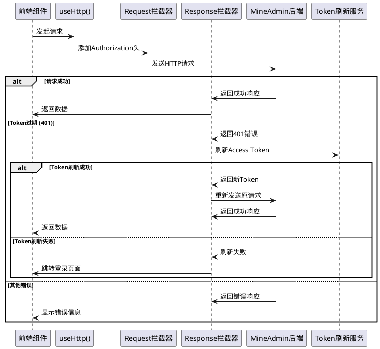
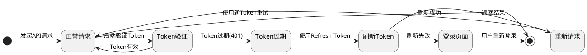

# 请求与拦截器

MineAdmin 基于 [axios](https://github.com/axios/axios) 作为请求库，提供了完整的请求拦截器和响应处理机制，支持自动 Token 刷新、错误处理、加载状态管理等功能。

## 概述

### 双重请求架构

系统提供两种请求处理方式，满足不同的使用场景：

1. **内部请求** - 专门用于 MineAdmin 后端 API 的请求封装
   - 自动处理 JWT Token 认证
   - 内置错误处理和用户提示
   - 支持 Token 自动刷新机制
   - 集成加载状态管理

2. **外部请求** - 用于第三方 API 或其他后端服务的通用请求
   - 支持自定义 baseURL 和请求配置
   - 可独立配置拦截器和错误处理
   - 灵活的参数传递方式

### 请求处理流程



## 内部请求 (useHttp)

### 基本用法

在项目的任意位置都可以直接使用 `useHttp()` 函数，无需手动导入：

```ts
// 获取请求实例
const http = useHttp()

// GET 请求 - 获取用户列表
const getUserList = async (params?: any) => {
  return await http.get('/admin/user/index', params)
}

// POST 请求 - 创建新用户
const createUser = async (userData: any) => {
  return await http.post('/admin/user/save', userData)
}

// PUT 请求 - 更新用户信息
const updateUser = async (id: number, userData: any) => {
  return await http.put(`/admin/user/update/${id}`, userData)
}

// DELETE 请求 - 删除用户
const deleteUser = async (id: number) => {
  return await http.delete(`/admin/user/destroy/${id}`)
}
```

### 高级配置

支持传入额外的 axios 配置参数：

```ts
const http = useHttp()

// 设置请求超时时间
const result = await http.get('/admin/user/index', {}, {
  timeout: 10000, // 10秒超时
  headers: {
    'X-Custom-Header': 'CustomValue'
  }
})

// 上传文件请求
const uploadFile = async (file: File) => {
  const formData = new FormData()
  formData.append('file', file)
  
  return await http.post('/admin/upload/image', formData, {
    headers: {
      'Content-Type': 'multipart/form-data'
    },
    timeout: 60000 // 上传超时设为60秒
  })
}

// 下载文件
const downloadFile = async (fileId: string) => {
  return await http.get(`/admin/file/download/${fileId}`, {}, {
    responseType: 'blob' // 二进制数据
  })
}
```

### 实际使用示例

在组件中的完整使用示例：

```vue
<script setup lang="ts">
import { ref, onMounted } from 'vue'
import { ElMessage } from 'element-plus'

const http = useHttp()
const users = ref([])
const loading = ref(false)

// 获取用户列表
const fetchUsers = async () => {
  try {
    loading.value = true
    const response = await http.get('/admin/user/index', {
      page: 1,
      size: 20
    })
    
    users.value = response.data.items
    ElMessage.success('用户列表加载成功')
  } catch (error) {
    ElMessage.error('加载用户列表失败')
    console.error('获取用户列表错误:', error)
  } finally {
    loading.value = false
  }
}

// 删除用户
const handleDeleteUser = async (userId: number) => {
  try {
    await http.delete(`/admin/user/destroy/${userId}`)
    ElMessage.success('用户删除成功')
    fetchUsers() // 重新加载列表
  } catch (error) {
    ElMessage.error('删除用户失败')
  }
}

onMounted(() => {
  fetchUsers()
})
</script>
```

## Token 刷新机制

### 自动刷新原理

MineAdmin 实现了基于双 Token 的无感刷新机制：

1. **Access Token** - 用于业务 API 认证，过期时间较短（默认1小时）
2. **Refresh Token** - 用于刷新 Access Token，过期时间较长（默认2小时）



### 并发请求处理

当有多个并发请求时，系统会智能处理 Token 刷新：

```ts
// 并发场景示例
const [users, roles, permissions] = await Promise.all([
  http.get('/admin/user/index'),
  http.get('/admin/role/index'), 
  http.get('/admin/permission/index')
])

// 如果 Token 过期，只会刷新一次，其他请求会等待
// 刷新完成后，所有请求会使用新 Token 重新发送
```

具体刷新机制详情可参考 [用户认证文档](/zh/backend/security/passport.md)。

## 外部请求

### 基本用法

用于请求第三方 API 或非 MineAdmin 后端服务：

```ts
import request from '@/utils/http'

const { createHttp } = request

// 创建第三方API请求实例
const thirdPartyHttp = createHttp('https://api.example.com', {
  headers: {
    'User-Agent': 'MineAdmin/1.0',
    'X-API-Key': 'your-api-key'
  },
  timeout: 15000
})

// 使用第三方API
const getExternalData = async () => {
  try {
    const response = await thirdPartyHttp.get('/users')
    return response.data
  } catch (error) {
    console.error('第三方API请求失败:', error)
    throw error
  }
}
```

### 多个外部服务

可以为不同的外部服务创建多个请求实例：

```ts
// 地图服务API
const mapHttp = createHttp('https://api.map.com', {
  headers: { 'Authorization': 'Bearer map-token' }
})

// 支付服务API  
const paymentHttp = createHttp('https://api.payment.com', {
  headers: { 'Authorization': 'Bearer payment-token' }
})

// 短信服务API
const smsHttp = createHttp('https://api.sms.com', {
  headers: { 'X-API-Key': 'sms-api-key' }
})

// 使用示例
const sendSms = async (phone: string, message: string) => {
  return await smsHttp.post('/send', { phone, message })
}
```

## 拦截器详解

### 响应拦截器源码分析

MineAdmin 的响应拦截器位于 `src/utils/http.ts` 文件中，主要处理以下场景：

1. **成功响应处理**
2. **Token 过期自动刷新**  
3. **错误状态码处理**
4. **文件下载响应处理**
#### 核心拦截器逻辑

```ts:line-numbers
http.interceptors.response.use(
  async (response: AxiosResponse): Promise<any> => {
    isLoading.value = false
    const userStore = useUserStore()
    await usePluginStore().callHooks('networkResponse', response)
    const config = response.config
    
    // 处理文件下载响应
    if ((response.request.responseType === 'blob'
        || response.request.responseType === 'arraybuffer')
      && !/^application\/json/.test(response.headers['content-type'])
      && response.status === ResultCode.SUCCESS
    ) {
      return Promise.resolve(response.data)
    }

    // 处理成功响应
    if (response?.data?.code === ResultCode.SUCCESS) {
      return Promise.resolve(response.data)
    }
    else {
      // 根据不同错误码进行处理
      switch (response?.data?.code) {
        case ResultCode.UNAUTHORIZED: {
          // Token 过期处理逻辑
          const logout = useDebounceFn(
            async () => {
              Message.error('登录状态已过期，需要重新登录', { zIndex: 9999 })
              await useUserStore().logout()
            },
            3000,
            { maxWait: 5000 },
          )
          
          // 检查是否需要刷新 Token
          if (userStore.isLogin && !isRefreshToken.value) {
            isRefreshToken.value = true
            if (!cache.get('refresh_token')) {
              await logout()
              break
            }

            try {
              // 使用 Refresh Token 刷新 Access Token
              const refreshTokenResponse = await createHttp(null, {
                headers: {
                  Authorization: `Bearer ${cache.get('refresh_token')}`,
                },
              }).post('/admin/passport/refresh')

              if (refreshTokenResponse.data.code !== 200) {
                await logout()
                break
              }
              else {
                // 更新 Token 并重新发送请求
                const { data } = refreshTokenResponse.data
                userStore.token = data.access_token
                cache.set('token', data.access_token)
                cache.set('expire', useDayjs().unix() + data.expire_at, { exp: data.expire_at })
                cache.set('refresh_token', data.refresh_token)

                config.headers!.Authorization = `Bearer ${userStore.token}`
                requestList.value.map((cb: any) => cb())
                requestList.value = []
                return http(config) // 重新发送原请求
              }
            }
            catch (e: any) {
              requestList.value.map((cb: any) => cb())
              await logout()
              break
            }
            finally {
              requestList.value = []
              isRefreshToken.value = false
            }
          }
          else {
            // 如果正在刷新 Token，将请求加入队列等待
            return new Promise((resolve) => {
              requestList.value.push(() => {
                config.headers!.Authorization = `Bearer ${cache.get('token')}`
                resolve(http(config))
              })
            })
          }
        }
        case ResultCode.NOT_FOUND:
          Message.error('服务器资源不存在', { zIndex: 9999 })
          break
        case ResultCode.FORBIDDEN:
          Message.error('没有权限访问此接口', { zIndex: 9999 })
          break
        case ResultCode.METHOD_NOT_ALLOWED:
          Message.error('请求方法不被允许', { zIndex: 9999 })
          break
        case ResultCode.FAIL:
          Message.error('服务器内部错误', { zIndex: 9999 })
          break
        default:
          Message.error(response?.data?.message ?? '未知错误', { zIndex: 9999 })
          break
      }

      return Promise.reject(response.data ? response.data : null)
    }
  },
  // 网络错误处理
  async (error: any) => {
    isLoading.value = false
    const serverError = useDebounceFn(async () => {
      if (error && error.response && error.response.status === 500) {
        Message.error(error.message ?? '服务器内部错误', { zIndex: 9999 })
      }
    }, 3000, { maxWait: 5000 })
    await serverError()
    return Promise.reject(error)
  },
)
```

### 状态码处理机制

系统对不同的 HTTP 状态码和业务错误码进行了统一处理：

| 状态码 | 说明 | 处理方式 |
|--------|------|----------|
| `200` (SUCCESS) | 请求成功 | 直接返回数据 |
| `401` (UNAUTHORIZED) | Token 过期或无效 | 自动刷新 Token 或跳转登录 |
| `403` (FORBIDDEN) | 权限不足 | 显示权限错误提示 |
| `404` (NOT_FOUND) | 资源不存在 | 显示资源不存在提示 |
| `405` (METHOD_NOT_ALLOWED) | 请求方法不允许 | 显示方法错误提示 |
| `500` (INTERNAL_ERROR) | 服务器内部错误 | 显示服务器错误提示 |

### 自定义拦截器

如果需要为外部请求自定义拦截器，可以这样做：

```ts
import request from '@/utils/http'

const { createHttp } = request

// 创建带自定义拦截器的请求实例
const customHttp = createHttp('https://api.custom.com')

// 添加请求拦截器
customHttp.interceptors.request.use(
  (config) => {
    // 在发送请求之前做一些处理
    config.headers['X-Timestamp'] = Date.now()
    console.log('发送请求:', config)
    return config
  },
  (error) => {
    console.error('请求错误:', error)
    return Promise.reject(error)
  }
)

// 添加响应拦截器
customHttp.interceptors.response.use(
  (response) => {
    // 处理响应数据
    console.log('收到响应:', response)
    if (response.data.status === 'error') {
      throw new Error(response.data.message)
    }
    return response
  },
  (error) => {
    // 处理响应错误
    console.error('响应错误:', error)
    return Promise.reject(error)
  }
)
```

## 最佳实践

### 1. 错误处理

建议在组件中统一处理错误：

```ts
// composables/useApi.ts
export const useApi = () => {
  const http = useHttp()
  
  const handleError = (error: any, defaultMessage = '操作失败') => {
    const message = error?.message || error?.data?.message || defaultMessage
    ElMessage.error(message)
    console.error('API错误:', error)
  }
  
  const safeRequest = async <T>(requestFn: () => Promise<T>, errorMessage?: string): Promise<T | null> => {
    try {
      return await requestFn()
    } catch (error) {
      handleError(error, errorMessage)
      return null
    }
  }
  
  return { http, handleError, safeRequest }
}
```

### 2. 类型定义

为 API 响应定义明确的类型：

```ts
// types/api.ts
export interface ApiResponse<T = any> {
  code: number
  message: string
  data: T
}

export interface PaginatedResponse<T> {
  items: T[]
  total: number
  page: number
  size: number
}

export interface User {
  id: number
  username: string
  email: string
  status: number
}

// 使用示例
const getUserList = async (): Promise<ApiResponse<PaginatedResponse<User>>> => {
  return await http.get('/admin/user/index')
}
```

### 3. 请求封装

将常用的 API 请求封装成可复用的服务：

```ts
// services/userService.ts
export class UserService {
  private http = useHttp()
  
  async getList(params: any) {
    return await this.http.get('/admin/user/index', params)
  }
  
  async create(user: Partial<User>) {
    return await this.http.post('/admin/user/save', user)
  }
  
  async update(id: number, user: Partial<User>) {
    return await this.http.put(`/admin/user/update/${id}`, user)
  }
  
  async delete(id: number) {
    return await this.http.delete(`/admin/user/destroy/${id}`)
  }
  
  async batchDelete(ids: number[]) {
    return await this.http.post('/admin/user/destroy', { ids })
  }
}

// 创建服务实例
export const userService = new UserService()
```

### 4. 加载状态管理

合理使用加载状态提升用户体验：

```vue
<script setup lang="ts">
import { ref } from 'vue'

const loading = ref(false)
const data = ref([])

const fetchData = async () => {
  loading.value = true
  try {
    const response = await http.get('/admin/data')
    data.value = response.data
  } catch (error) {
    console.error('数据加载失败:', error)
  } finally {
    loading.value = false
  }
}
</script>

<template>
  <div v-loading="loading">
    <!-- 数据展示内容 -->
  </div>
</template>
```

## 常见问题

### Q: Token 刷新期间的并发请求如何处理？

A: 系统会将所有需要 Token 的请求暂存在队列中，等待 Token 刷新完成后统一使用新 Token 重新发送。

### Q: 如何处理文件上传进度？

A: 可以使用 axios 的 `onUploadProgress` 配置：

```ts
const uploadWithProgress = async (file: File, onProgress?: (progress: number) => void) => {
  const formData = new FormData()
  formData.append('file', file)
  
  return await http.post('/admin/upload', formData, {
    onUploadProgress: (progressEvent) => {
      if (progressEvent.total && onProgress) {
        const progress = Math.round((progressEvent.loaded / progressEvent.total) * 100)
        onProgress(progress)
      }
    }
  })
}
```

### Q: 如何取消正在进行的请求？

A: 使用 axios 的取消令牌：

```ts
import { ref, onUnmounted } from 'vue'

const controller = ref<AbortController>()

const fetchData = async () => {
  // 取消之前的请求
  controller.value?.abort()
  
  // 创建新的控制器
  controller.value = new AbortController()
  
  try {
    const response = await http.get('/admin/data', {}, {
      signal: controller.value.signal
    })
    return response
  } catch (error) {
    if (error.name === 'AbortError') {
      console.log('请求已取消')
    } else {
      throw error
    }
  }
}

// 组件卸载时取消请求
onUnmounted(() => {
  controller.value?.abort()
})
```
