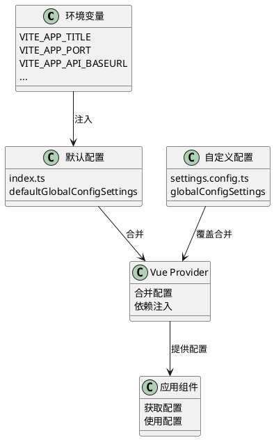
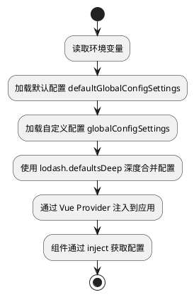

# 系统参数配置

MineAdmin 提供了强大而灵活的系统配置机制，支持多层级配置合并、环境变量集成和运行时动态修改。本文档将详细介绍如何配置和管理系统参数。

## 配置系统概览

::: tip 配置文件
- **默认配置文件**：`src/provider/settings/index.ts` - 系统默认配置
- **自定义配置文件**：`src/provider/settings/settings.config.ts` - 用户自定义配置
- **环境变量文件**：`.env.development` / `.env.production` - 环境相关配置

修改配置时，请将需要自定义的配置项拷贝到 `settings.config.ts` 文件中进行修改，系统会自动合并配置。
:::

## 配置系统架构



## 配置加载流程



## 核心配置详解

### 应用基础配置 (app)

| 配置项 | 类型 | 默认值 | 描述 |
|--------|------|--------|------|
| `colorMode` | `'lightMode' \| 'darkMode' \| 'autoMode'` | `'autoMode'` | 颜色模式，支持明亮、暗黑和自动模式 |
| `useLocale` | `string` | `'zh_CN'` | 系统语言，支持国际化 |
| `whiteRoute` | `string[]` | `['login']` | 白名单路由，无需认证即可访问 |
| `layout` | `'classic' \| 'modern' \| 'minimal'` | `'classic'` | 布局模式 |
| `pageAnimate` | `string` | `'ma-slide-down'` | 页面切换动画效果 |
| `enableWatermark` | `boolean` | `false` | 是否启用水印功能 |
| `primaryColor` | `string` | `'#2563EB'` | 主题色 |
| `asideDark` | `boolean` | `false` | 侧边栏是否使用暗色主题 |
| `showBreadcrumb` | `boolean` | `true` | 是否显示面包屑导航 |
| `loadUserSetting` | `boolean` | `true` | 是否加载用户个人设置 |
| `watermarkText` | `string` | `import.meta.env.VITE_APP_TITLE` | 水印文字内容 |

**配置示例：**
```typescript
app: {
  colorMode: 'autoMode',              // 自动切换主题
  useLocale: 'zh_CN',                 // 使用简体中文
  whiteRoute: ['login', 'register'],  // 登录和注册页面免认证
  layout: 'classic',                  // 经典布局
  pageAnimate: 'ma-fade-in',         // 淡入动画效果
  enableWatermark: true,             // 开启水印
  primaryColor: '#1890ff',           // 自定义主题色
  asideDark: true,                   // 侧边栏暗色主题
  showBreadcrumb: true,              // 显示面包屑
  loadUserSetting: true,             // 加载用户设置
  watermarkText: '我的系统',          // 自定义水印文字
}
```

### 欢迎页配置 (welcomePage)

| 配置项 | 类型 | 默认值 | 描述 |
|--------|------|--------|------|
| `name` | `string` | `'welcome'` | 路由名称 |
| `path` | `string` | `'/welcome'` | 路由路径 |
| `title` | `string` | `'欢迎页'` | 页面标题 |
| `icon` | `string` | `'icon-park-outline:jewelry'` | 图标 |

### 主侧边栏配置 (mainAside)

| 配置项 | 类型 | 默认值 | 描述 |
|--------|------|--------|------|
| `showIcon` | `boolean` | `true` | 是否显示图标 |
| `showTitle` | `boolean` | `true` | 是否显示标题 |
| `enableOpenFirstRoute` | `boolean` | `false` | 是否自动打开第一个路由 |

### 子侧边栏配置 (subAside)

| 配置项 | 类型 | 默认值 | 描述 |
|--------|------|--------|------|
| `showIcon` | `boolean` | `true` | 是否显示图标 |
| `showTitle` | `boolean` | `true` | 是否显示标题 |
| `fixedAsideState` | `boolean` | `false` | 是否固定侧边栏状态 |
| `showCollapseButton` | `boolean` | `true` | 是否显示折叠按钮 |

### 标签栏配置 (tabbar)

| 配置项 | 类型 | 默认值 | 描述 |
|--------|------|--------|------|
| `enable` | `boolean` | `true` | 是否启用标签栏 |
| `mode` | `'rectangle' \| 'round' \| 'card'` | `'rectangle'` | 标签栏样式 |

### 版权信息配置 (copyright)

| 配置项 | 类型 | 默认值 | 描述 |
|--------|------|--------|------|
| `enable` | `boolean` | `true` | 是否显示版权信息 |
| `dates` | `string` | `useDayjs().format('YYYY')` | 版权年份 |
| `company` | `string` | `'MineAdmin Team'` | 公司名称 |
| `website` | `string` | `'https://www.mineadmin.com'` | 官网地址 |
| `putOnRecord` | `string` | `'豫ICP备00000000号-1'` | 备案号 |

## 环境变量配置

### 开发环境配置 (.env.development)

```bash
# 页面标题
VITE_APP_TITLE = MineAdmin开发环境

# 开发服务器端口
VITE_APP_PORT = 2888

# 应用根路径
VITE_APP_ROOT_BASE = /

# API 接口地址
VITE_APP_API_BASEURL = http://127.0.0.1:9501

# 路由模式：hash 或 history
VITE_APP_ROUTE_MODE = hash

# 本地存储前缀
VITE_APP_STORAGE_PREFIX = mine_

# 是否开启代理
VITE_OPEN_PROXY = true

# 代理前缀
VITE_PROXY_PREFIX = /dev

# 是否开启 vConsole（移动端调试）
VITE_OPEN_vCONSOLE = false

# 是否开启开发者工具
VITE_OPEN_DEVTOOLS = true
```

### 生产环境配置 (.env.production)

```bash
# 页面标题
VITE_APP_TITLE = MineAdmin

# 生产服务器端口
VITE_APP_PORT = 80

# 应用根路径
VITE_APP_ROOT_BASE = /admin/

# API 接口地址
VITE_APP_API_BASEURL = https://api.yourdomain.com

# 路由模式
VITE_APP_ROUTE_MODE = history

# 本地存储前缀
VITE_APP_STORAGE_PREFIX = mine_prod_

# 关闭代理
VITE_OPEN_PROXY = false

# 是否生成 sourcemap
VITE_BUILD_SOURCEMAP = false

# 打包压缩方式
VITE_BUILD_COMPRESS = gzip,brotli

# 打包后生成存档
VITE_BUILD_ARCHIVE = 
```

## 自定义配置示例

在 `src/provider/settings/settings.config.ts` 文件中添加自定义配置：

```typescript
import type { SystemSettings } from '#/global'

const globalConfigSettings: SystemSettings.all = {
  // 应用配置
  app: {
    colorMode: 'lightMode',           // 强制明亮模式
    useLocale: 'en_US',               // 使用英语
    primaryColor: '#ff4757',          // 自定义红色主题
    enableWatermark: true,            // 启用水印
    watermarkText: '内部系统',        // 自定义水印文字
    pageAnimate: 'ma-fade-in',        // 淡入动画
  },
  
  // 欢迎页配置
  welcomePage: {
    name: 'dashboard',
    path: '/dashboard',
    title: '控制台',
    icon: 'mdi:view-dashboard',
  },
  
  // 侧边栏配置
  mainAside: {
    showIcon: true,
    showTitle: false,                 // 隐藏主菜单标题
    enableOpenFirstRoute: true,       // 自动打开第一个路由
  },
  
  // 标签栏配置
  tabbar: {
    enable: true,
    mode: 'card',                     // 卡片模式
  },
  
  // 版权信息
  copyright: {
    enable: true,
    company: '我的公司',
    website: 'https://mycompany.com',
    putOnRecord: '京ICP备12345678号',
  },
}

export default globalConfigSettings
```

## 高级配置技巧

### 条件配置

根据不同环境或设备类型设置不同配置：

```typescript
const globalConfigSettings: SystemSettings.all = {
  app: {
    // 根据环境变量决定主题
    colorMode: import.meta.env.MODE === 'development' ? 'autoMode' : 'lightMode',
    
    // 移动端隐藏面包屑
    showBreadcrumb: !/Mobile|Android|iPhone/i.test(navigator.userAgent),
    
    // 生产环境关闭水印
    enableWatermark: import.meta.env.MODE === 'development',
    
    // 动态设置 API 地址
    watermarkText: import.meta.env.VITE_APP_TITLE || '系统',
  },
}
```

### 模块化配置

将大型配置拆分为多个模块：

```typescript
// config/app.config.ts
export const appConfig = {
  colorMode: 'autoMode',
  useLocale: 'zh_CN',
  primaryColor: '#2563EB',
}

// config/layout.config.ts
export const layoutConfig = {
  mainAside: {
    showIcon: true,
    showTitle: true,
  },
  subAside: {
    fixedAsideState: false,
    showCollapseButton: true,
  },
}

// settings.config.ts
import { appConfig } from './config/app.config'
import { layoutConfig } from './config/layout.config'

const globalConfigSettings: SystemSettings.all = {
  app: appConfig,
  ...layoutConfig,
}
```

### 运行时配置修改

在应用运行时动态修改配置：

```typescript
// 在组件中使用
import { inject, reactive } from 'vue'
import type { SystemSettings } from '#/global'

export default defineComponent({
  setup() {
    const settings = inject('defaultSetting') as SystemSettings.all
    
    // 动态切换主题
    const switchTheme = (mode: 'lightMode' | 'darkMode') => {
      settings.app.colorMode = mode
    }
    
    // 动态修改主题色
    const changePrimaryColor = (color: string) => {
      settings.app.primaryColor = color
    }
    
    return {
      settings,
      switchTheme,
      changePrimaryColor,
    }
  },
})
```

## 配置最佳实践

### 1. 版本控制管理

```bash
# .gitignore 文件
.env.local
.env.*.local
src/provider/settings/settings.config.local.ts
```

### 2. 类型安全

利用 TypeScript 确保配置类型安全：

```typescript
import type { SystemSettings } from '#/global'

// 使用类型断言确保配置正确
const globalConfigSettings: SystemSettings.all = {
  app: {
    // TypeScript 会提供类型检查和自动补全
    colorMode: 'lightMode', // 只能是预定义的值
    primaryColor: '#ffffff', // 必须是字符串
  },
} satisfies SystemSettings.all
```

### 3. 配置验证

在配置加载时添加验证：

```typescript
import { z } from 'zod'

const configSchema = z.object({
  app: z.object({
    colorMode: z.enum(['lightMode', 'darkMode', 'autoMode']),
    primaryColor: z.string().regex(/^#[0-9A-Fa-f]{6}$/),
  }),
})

// 验证配置
const validateConfig = (config: unknown) => {
  try {
    return configSchema.parse(config)
  } catch (error) {
    console.error('配置验证失败:', error)
    throw new Error('配置格式不正确')
  }
}
```

## 常见问题与排错

### Q: 配置修改后不生效？

**A:** 检查以下几点：

1. **配置文件路径是否正确**
   ```bash
   # 正确的配置文件路径
   src/provider/settings/settings.config.ts
   ```

2. **配置语法是否正确**
   ```typescript
   // ❌ 错误：语法错误
   const config = {
     app: {
       colorMode: lightMode, // 缺少引号
     }
   }
   
   // ✅ 正确：正确语法
   const config = {
     app: {
       colorMode: 'lightMode',
     }
   }
   ```

3. **是否重新启动了开发服务器**
   ```bash
   pnpm run dev
   ```

### Q: 环境变量无法读取？

**A:** 确保环境变量以 `VITE_` 开头：

```bash
# ❌ 错误：不以 VITE_ 开头
APP_TITLE = MineAdmin

# ✅ 正确：以 VITE_ 开头
VITE_APP_TITLE = MineAdmin
```

### Q: 如何调试配置问题？

**A:** 使用以下方法调试：

```typescript
// 在组件中打印当前配置
const settings = inject('defaultSetting')
console.log('当前配置:', settings)

// 检查环境变量
console.log('环境变量:', import.meta.env)

// 检查配置合并结果
import { defaultsDeep } from 'lodash-es'
console.log('合并后配置:', defaultsDeep(customConfig, defaultConfig))
```

### Q: 配置在生产环境中不生效？

**A:** 检查构建配置：

1. **确认环境变量文件**
   ```bash
   # 生产环境应该有对应的环境变量文件
   .env.production
   ```

2. **检查构建命令**
   ```bash
   # 确保使用正确的构建命令
   pnpm run build
   ```

3. **验证构建产物**
   ```bash
   # 预览构建结果
   pnpm run preview
   ```

## 相关参考

- [布局配置](./layout.md) - 布局系统配置详解

::: warning 注意事项
- 修改配置后需要重启开发服务器才能生效
- 生产环境的配置修改需要重新构建和部署
- 敏感信息不要直接写在配置文件中，建议使用环境变量
:::