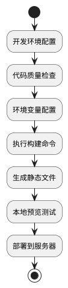

# 构建与预览

本文档详细介绍 MineAdmin 前端项目的构建、预览和部署流程，包含性能优化、环境配置和常见问题解决方案。

## 构建流程概览



## 构建（打包）

### 基础构建

项目开发完成后，需要进行生产环境构建以部署到服务器。

```bash
# 执行构建命令
pnpm run build
```

构建成功后，会在项目根目录的 `./web` 下生成 `dist` 文件夹，包含所有打包好的静态文件。

### 构建前检查

为确保构建质量，建议在构建前执行代码质量检查：

```bash
# 完整的代码质量检查
pnpm run lint

# 或分别执行
pnpm run lint:tsc      # TypeScript 类型检查
pnpm run lint:eslint   # ESLint 代码规范检查
pnpm run lint:stylelint # 样式代码检查
```

### 环境变量配置

#### 基础路径配置

::: warning 重要配置
如果访问地址不是域名的根节点，必须正确配置 `VITE_APP_ROOT_BASE`
:::

```bash
# 域名根节点部署：https://www.example.com/
VITE_APP_ROOT_BASE = /

# 子路径部署：https://www.example.com/app/
VITE_APP_ROOT_BASE = /app/

# 多级子路径：https://www.example.com/admin/system/
VITE_APP_ROOT_BASE = /admin/system/
```

#### 生产环境变量

在 `.env.production` 文件中配置生产环境变量：

```bash
# API 服务地址
VITE_APP_API_BASEURL = http://hyperf:9501

# 代理前缀
VITE_PROXY_PREFIX = /prod

# 是否生成 Source Map（建议生产环境关闭）
VITE_BUILD_SOURCEMAP = false

# 压缩配置
VITE_BUILD_COMPRESS = gzip,brotli

# 打包归档（可选）
VITE_BUILD_ARCHIVE = 
```

## 本地预览

### 预览构建结果

构建完成后，通过本地服务器预览确保项目正常运行：

```bash
# 启动预览服务器
pnpm run serve
```

预览服务器会启动一个 HTTP 服务，自动打开浏览器访问构建后的项目。

### 预览配置说明

预览服务使用 `http-server` 工具，默认配置：
- 服务目录：`./dist`
- 自动打开浏览器：`-o` 参数
- 访问地址：通常为 `http://localhost:8080`

### E2E 测试

在预览阶段可以执行端到端测试：

```bash
# 运行 E2E 测试
pnpm run test:e2e
```

## 构建优化

### 压缩配置

MineAdmin 支持多种压缩算法以减小文件体积：

```bash
# 仅启用 Gzip 压缩
VITE_BUILD_COMPRESS = gzip

# 仅启用 Brotli 压缩（压缩率更高）
VITE_BUILD_COMPRESS = brotli

# 同时启用两种压缩（推荐）
VITE_BUILD_COMPRESS = gzip,brotli
```

::: info 压缩算法对比
- **Gzip**: 兼容性好，压缩比约 70-80%
- **Brotli**: 压缩比约 75-85%，但需要较新的浏览器支持
- **建议**: 同时启用两种算法，服务器根据客户端支持情况自动选择
:::

### 性能优化建议

#### 1. Source Map 控制

```bash
# 生产环境建议关闭（提升构建速度，减小文件体积）
VITE_BUILD_SOURCEMAP = false

# 开发阶段可以开启（便于调试）
VITE_BUILD_SOURCEMAP = true
```

#### 2. 代码分割

Vite 默认会进行代码分割，无需额外配置。构建后会生成：
- `index.[hash].js` - 主入口文件
- `vendor.[hash].js` - 第三方依赖
- `[name].[hash].js` - 异步模块

#### 3. 资源优化

构建过程会自动进行：
- CSS 压缩和合并
- 图片资源优化
- 字体文件处理
- 静态资源 Hash 命名

## 部署配置

### Nginx 配置示例

针对不同的压缩配置，Nginx 需要相应的模块支持：

```nginx
server {
    listen 80;
    server_name your-domain.com;
    root /path/to/dist;
    index index.html;

    # 启用 Gzip 压缩
    gzip on;
    gzip_vary on;
    gzip_min_length 1024;
    gzip_types text/plain text/css application/json application/javascript text/xml application/xml application/xml+rss text/javascript;

    # 启用 Brotli 压缩（需要 nginx-module-brotli）
    brotli on;
    brotli_comp_level 6;
    brotli_types text/plain text/css application/json application/javascript text/xml application/xml application/xml+rss text/javascript;

    # SPA 路由支持
    location / {
        try_files $uri $uri/ /index.html;
    }

    # 静态资源缓存
    location ~* \.(js|css|png|jpg|jpeg|gif|ico|svg)$ {
        expires 1y;
        add_header Cache-Control "public, immutable";
    }
}
```

### CDN 部署

如果使用 CDN 部署，需要配置：

```bash
# CDN 域名
VITE_APP_CDN_URL = https://cdn.example.com

# 启用 CDN 资源路径
VITE_APP_USE_CDN = true
```

## 常见问题与解决方案

### 构建失败

#### 1. TypeScript 类型错误

```bash
# 错误信息示例
error TS2307: Cannot find module 'xxx'

# 解决方案
pnpm run lint:tsc  # 先检查类型错误
# 修复类型问题后重新构建
```

#### 2. 内存不足

```bash
# 增加 Node.js 内存限制
NODE_OPTIONS="--max-old-space-size=4096" pnpm run build
```

#### 3. 依赖问题

```bash
# 清理依赖并重新安装
rm -rf node_modules
rm pnpm-lock.yaml
pnpm install
```

### 预览问题

#### 1. 接口请求失败

检查 `.env.production` 中的 API 地址配置：

```bash
# 确保 API 地址可访问
VITE_APP_API_BASEURL = http://your-api-server:port
```

#### 2. 路由访问 404

确保服务器配置了 SPA 路由支持，或检查路由模式配置：

```bash
# Hash 模式（兼容性更好）
VITE_APP_ROUTE_MODE = hash

# History 模式（需要服务器支持）
VITE_APP_ROUTE_MODE = history
```

#### 3. 静态资源加载失败

检查基础路径配置：

```bash
# 确保与部署路径一致
VITE_APP_ROOT_BASE = /your-app-path/
```

### 性能问题

#### 1. 构建时间过长

```bash
# 使用并行构建
VITE_BUILD_PARALLEL = true

# 跳过某些检查（仅在必要时使用）
VITE_SKIP_TYPE_CHECK = true
```

#### 2. 打包体积过大

分析打包体积：

```bash
# 安装分析工具
pnpm add -D vite-bundle-analyzer

# 分析构建结果
pnpm run build --analyze
```

## 自动化部署

### CI/CD 配置示例

```yaml
# .github/workflows/deploy.yml
name: Deploy

on:
  push:
    branches: [main]

jobs:
  build-and-deploy:
    runs-on: ubuntu-latest
    
    steps:
    - uses: actions/checkout@v3
    
    - name: Setup Node.js
      uses: actions/setup-node@v3
      with:
        node-version: '18'
        
    - name: Install pnpm
      uses: pnpm/action-setup@v2
      with:
        version: 8
        
    - name: Install dependencies
      run: pnpm install
      
    - name: Lint code
      run: pnpm run lint
      
    - name: Build project
      run: pnpm run build
      
    - name: Deploy to server
      run: |
        # 部署脚本
        rsync -avz ./dist/ user@server:/path/to/deployment/
```