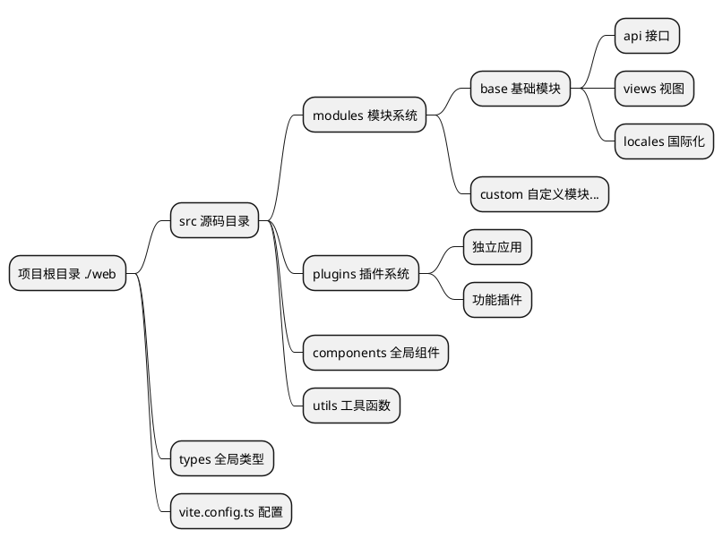
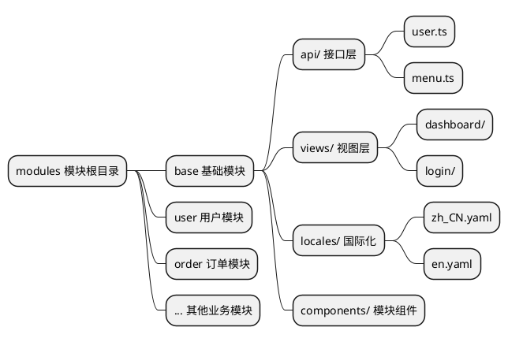
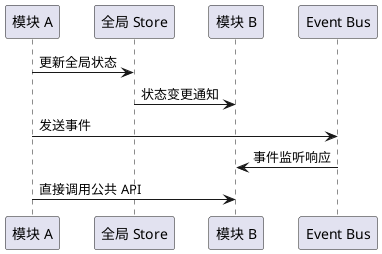
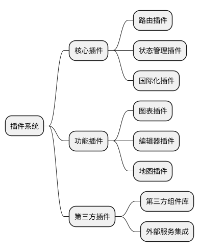
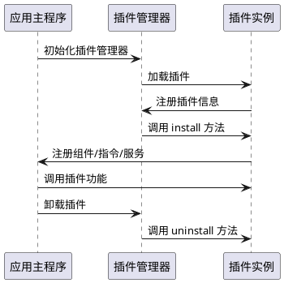
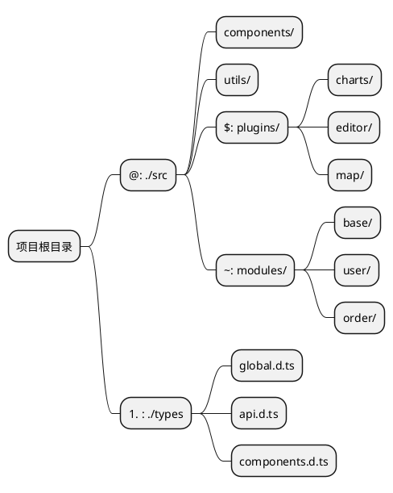
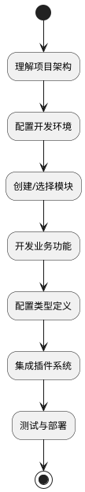

# 基础概念

整个项目进行了重构，现在我们将会介绍一些基础概念，以便于你更好的理解整个文档，请务必仔细先阅读这一部分。

::: tip
以下所讲全部针对源码根目录下的 `./web` 里的结构
:::

## 项目整体架构

本项目采用现代化的前端开发架构，基于 Vue 3 + TypeScript + Vite 构建，实现了模块化、插件化的开发模式。



## 全局类型系统

由于新版采用 `TypeScript` 所写，全局的类型定义都在 `./types` 目录下存放着，可在里面找到相关的数据类型结构。

### 类型文件组织结构

```
./types/
├── api.d.ts          # API 相关类型定义
├── components.d.ts   # 组件类型定义
├── global.d.ts       # 全局类型定义
├── modules.d.ts      # 模块类型定义
└── utils.d.ts        # 工具函数类型定义
```

### 使用示例

在项目中可以通过别名 `#` 快速引入类型：

```typescript
// 引入 API 类型
import type { ApiResponse, UserInfo } from '#/api'

// 引入全局类型
import type { MenuConfig, RouteConfig } from '#/global'

// 在组件中使用
interface ComponentProps {
  userInfo: UserInfo
  menuConfig: MenuConfig[]
}
```

### 类型定义最佳实践

- **命名规范**：使用 PascalCase 命名接口和类型
- **文件组织**：按功能模块划分类型文件
- **类型导出**：使用 `export type` 导出类型定义
- **泛型支持**：合理使用泛型提高类型复用性

## 模块化架构

新版本进行模块化划分，目录为 `./src/modules`。每个模块管理着所属业务的 `api`、`types`、`locales` 以及 `视图文件`，实现业务的完全隔离和独立管理。

### 模块结构设计



### 标准模块目录结构

```
./src/modules/[模块名]/
├── api/                 # API 接口定义
│   ├── user.ts         # 用户相关接口
│   ├── menu.ts         # 菜单相关接口
│   └── index.ts        # 接口统一导出
├── components/          # 模块专用组件
│   ├── UserForm.vue    # 用户表单组件
│   └── MenuTree.vue    # 菜单树组件
├── locales/            # 模块国际化文件
│   ├── zh_CN.yaml      # 中文语言包
│   ├── en.yaml         # 英文语言包
│   └── index.ts        # 语言包导出
├── views/              # 视图页面
│   ├── user/           # 用户管理页面
│   │   ├── index.vue   # 用户列表页
│   │   └── detail.vue  # 用户详情页
│   └── dashboard/      # 仪表板页面
│       └── index.vue
└── index.ts           # 模块统一导出
```

### 模块开发流程

1. **创建模块目录**：在 `./src/modules/` 下创建新的模块文件夹
2. **定义模块结构**：按照标准结构创建相应目录和文件
3. **配置路由**：在模块中定义路由配置
4. **开发业务逻辑**：编写 API、组件和视图
5. **添加国际化**：配置多语言支持
6. **模块导出**：通过 index.ts 统一导出模块内容

### 模块间通信



### 模块使用示例

```typescript
// 在其他模块中使用 base 模块的 API
import { userApi, menuApi } from '~/base/api'
import type { UserInfo } from '~/base/types'

// 在组件中使用模块功能
export default defineComponent({
  async setup() {
    // 调用用户 API
    const userList = await userApi.getUsers()
    
    // 调用菜单 API
    const menuTree = await menuApi.getMenuTree()
    
    return {
      userList,
      menuTree
    }
  }
})
```

## 插件系统

新版前端中新增了一个 `./src/plugins` 目录，专门存放独立应用或者插件等。插件系统支持功能的热插拔，提高了系统的可扩展性和灵活性。

### 插件架构设计



### 插件目录结构

```
./src/plugins/
├── charts/              # 图表插件
│   ├── components/      # 插件组件
│   ├── utils/          # 工具函数
│   ├── types/          # 类型定义
│   └── index.ts        # 插件入口
├── editor/             # 编辑器插件
│   ├── components/
│   ├── config/
│   └── index.ts
├── map/                # 地图插件
└── shared/             # 插件间共享资源
    ├── utils/          # 共享工具
    ├── components/     # 共享组件
    └── types/          # 共享类型
```

### 插件生命周期



### 插件开发规范

#### 1. 插件基本结构

```typescript
// ./src/plugins/example/index.ts
import type { App } from 'vue'
import type { PluginOptions } from './types'

export interface ExamplePlugin {
  install(app: App, options?: PluginOptions): void
  uninstall?(app: App): void
}

export const examplePlugin: ExamplePlugin = {
  install(app: App, options?: PluginOptions) {
    // 注册全局组件
    app.component('ExampleComponent', ExampleComponent)
    
    // 注册全局指令
    app.directive('example', exampleDirective)
    
    // 提供全局方法
    app.config.globalProperties.$example = exampleMethod
    
    // 注册插件配置
    app.provide('exampleConfig', options)
  },
  
  uninstall(app: App) {
    // 清理资源
    delete app.config.globalProperties.$example
  }
}

export default examplePlugin
```

#### 2. 插件配置文件

```typescript
// ./src/plugins/example/config.ts
export interface PluginConfig {
  name: string
  version: string
  description: string
  dependencies?: string[]
  permissions?: string[]
}

export const pluginConfig: PluginConfig = {
  name: 'example-plugin',
  version: '1.0.0',
  description: '示例插件',
  dependencies: ['vue', 'vue-router'],
  permissions: ['read:user', 'write:user']
}
```

### 插件使用示例

#### 1. 注册插件

```typescript
// main.ts
import { createApp } from 'vue'
import App from './App.vue'
import examplePlugin from '$/example'

const app = createApp(App)

// 注册插件
app.use(examplePlugin, {
  // 插件配置选项
  theme: 'dark',
  locale: 'zh-CN'
})

app.mount('#app')
```

#### 2. 在组件中使用插件

```vue
<template>
  <div>
    <!-- 使用插件注册的全局组件 -->
    <ExampleComponent :data="exampleData" />
    
    <!-- 使用插件指令 -->
    <div v-example="directiveOptions">
      插件指令示例
    </div>
  </div>
</template>

<script setup lang="ts">
import { getCurrentInstance } from 'vue'

const instance = getCurrentInstance()

// 使用插件提供的全局方法
const result = instance?.proxy?.$example('param')

// 或者通过 inject 获取插件配置
const exampleConfig = inject('exampleConfig')
</script>
```

### 插件管理最佳实践

- **命名规范**：使用 kebab-case 命名插件目录
- **版本管理**：在插件配置中明确版本信息
- **依赖声明**：清晰声明插件依赖关系
- **资源清理**：实现 uninstall 方法进行资源清理
- **类型支持**：为插件提供完整的 TypeScript 类型定义
- **文档完善**：为每个插件提供使用文档和示例

## 别名系统

在 `vite.config.ts` 文件中定义了路径别名系统，简化文件引入路径，提高开发效率和代码可维护性。

### 别名配置

```typescript
// vite.config.ts
export default defineConfig({
  resolve: {
    alias: {
      '@': path.resolve(__dirname, 'src'),
      '#': path.resolve(__dirname, 'types'),
      '$': path.resolve(__dirname, 'src/plugins'),
      '~': path.resolve(__dirname, 'src/modules'),
    },
  },
})
```

### 别名映射表

| 别名 | 目录路径 | 用途描述 | 使用场景 |
|------|----------|----------|----------|
| `@` | `./src` | 源码根目录 | 引入组件、工具函数、样式等 |
| `#` | `./types` | 全局类型定义 | 引入 TypeScript 类型定义 |
| `$` | `./src/plugins` | 插件目录 | 引入插件内的文件和组件 |
| `~` | `./src/modules` | 模块目录 | 引入模块内的 API、组件、视图 |

### 别名使用示例

#### 1. 基础路径别名 (@)

```typescript
// ❌ 使用相对路径（不推荐）
import Utils from '../../../utils/common'
import Button from '../../../components/Button.vue'

// ✅ 使用别名（推荐）
import Utils from '@/utils/common'
import Button from '@/components/Button.vue'
```

#### 2. 类型定义别名 (#)

```typescript
// 引入全局类型
import type { 
  ApiResponse, 
  UserInfo, 
  MenuConfig 
} from '#/global'

// 引入 API 类型
import type { LoginParams } from '#/api'

// 在接口中使用
interface ComponentProps {
  userInfo: UserInfo
  menuList: MenuConfig[]
}
```

#### 3. 插件别名 ($)

```typescript
// 引入图表插件
import ChartPlugin from '$/charts'
import { useChart } from '$/charts/hooks'

// 引入编辑器插件
import EditorPlugin from '$/editor'
import EditorComponent from '$/editor/components/RichEditor.vue'
```

#### 4. 模块别名 (~)

```typescript
// 引入 base 模块的 API
import { userApi, menuApi } from '~/base/api'

// 引入用户模块的组件
import UserForm from '~/user/components/UserForm.vue'
import UserList from '~/user/views/UserList.vue'

// 引入模块的类型
import type { UserModuleState } from '~/user/types'
```

### 别名系统架构图



### 别名配置最佳实践

#### 1. IDE 支持配置

为了获得更好的 IDE 智能提示和路径跳转支持，需要配置 `tsconfig.json`：

```json
{
  "compilerOptions": {
    "baseUrl": ".",
    "paths": {
      "@/*": ["src/*"],
      "#/*": ["types/*"],
      "$/*": ["src/plugins/*"],
      "~/*": ["src/modules/*"]
    }
  }
}
```

#### 2. 使用规范

- **一致性**：团队内部统一使用别名，避免混用相对路径
- **可读性**：别名应该语义明确，易于理解
- **层级控制**：避免过深的路径层级，合理使用别名简化路径
- **类型安全**：配合 TypeScript 确保路径引用的类型安全

#### 3. 常见使用模式

```typescript
// 组件内综合使用示例
<script setup lang="ts">
// 全局类型
import type { UserInfo, ApiResponse } from '#/global'

// 全局工具
import { formatDate, validateForm } from '@/utils/common'

// 模块 API
import { userApi } from '~/base/api'

// 插件功能
import { useChart } from '$/charts/hooks'

// 全局组件
import MaButton from '@/components/MaButton.vue'

// 模块组件
import UserForm from '~/user/components/UserForm.vue'
</script>
```

### 别名系统优势

1. **简化路径**：避免复杂的相对路径引用
2. **提高可维护性**：文件移动时无需修改大量引用路径
3. **增强可读性**：通过别名快速识别文件所属模块
4. **统一规范**：团队开发中保持一致的引用风格
5. **IDE 友好**：配合 TypeScript 和 IDE 提供更好的开发体验

## 总结

通过以上基础概念的介绍，我们了解了项目的核心架构设计：

### 架构特点

- **模块化设计**：业务功能按模块划分，实现高内聚低耦合
- **插件化架构**：支持功能的热插拔和扩展
- **类型安全**：基于 TypeScript 提供完整的类型支持
- **路径优化**：通过别名系统简化文件引用

### 开发流程



### 下一步

在掌握了这些基础概念后，建议按以下顺序深入学习：

1. **[开始使用](/zh/front/base/start)** - 环境搭建和项目启动
2. **[配置说明](/zh/front/base/configure)** - 详细配置选项
3. **[路由菜单](/zh/front/base/route-menu)** - 路由和菜单配置
4. **[模块开发](/zh/front/advanced/module)** - 深入模块化开发
5. **[插件开发](/zh/front/high/plugins)** - 插件系统详解

通过系统性的学习和实践，你将能够高效地在此架构基础上进行前端开发工作。