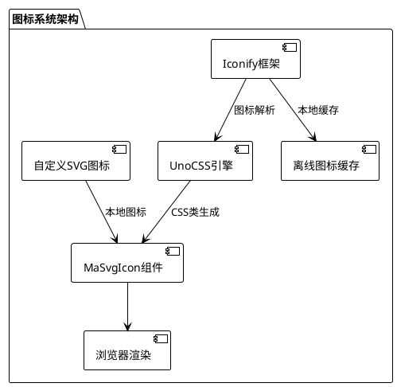
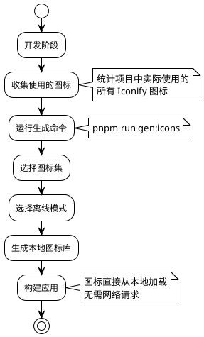

# 图标系统

MineAdmin 采用现代化的图标解决方案，基于 Iconify 图标框架和 UnoCSS 提供强大的图标支持。系统支持在线图标库、离线模式和自定义图标等多种方案。

## 图标架构概览



## 图标解决方案对比

| 解决方案 | 优势 | 适用场景 | 性能 | 维护成本 |
|---------|------|---------|------|---------|
| **Iconify在线** | 图标丰富(200k+)、即用即加载 | 快速开发、原型设计 | ⭐⭐⭐ | 低 |
| **Iconify离线** | 无网络依赖、加载速度快 | 生产环境、内网部署 | ⭐⭐⭐⭐⭐ | 中 |
| **自定义SVG** | 完全可控、品牌定制 | 企业级应用、品牌统一 | ⭐⭐⭐⭐ | 高 |

## Iconify 图标使用

::: tip Iconify 优势
`Iconify` 是目前最全面的图标框架，包含：
- **150+ 图标集合**：FontAwesome、Material Design、Ant Design、Tabler Icons等
- **200,000+ 图标**：涵盖各行各业的设计需求  
- **统一API**：一套语法适配所有图标集
- **按需加载**：只加载使用的图标，减少包体积
:::

### 基础图标使用

<DemoPreview dir="demos/icon-basic" />

### 图标搜索和选择

推荐使用 [Icônes](https://icones.js.org/) 搜索图标，这是基于 Iconify 的专业图标搜索工具：


**搜索技巧：**
1. **按分类浏览**：选择 Material Design、FontAwesome 等知名图标集
2. **关键词搜索**：支持中英文搜索，如 "用户"、"user"、"profile" 
3. **标签筛选**：通过 solid、outline、filled 等标签精确筛选
4. **尺寸预览**：实时预览不同尺寸下的图标效果

::: info 图标命名规范
复制得到的图标格式为：`i-{集合名}:{图标名}`
- 例如：`i-material-symbols:person`
- 例如：`i-heroicons:user-solid`
:::

### MaSvgIcon 组件使用

`MaSvgIcon` 是系统内置的图标组件，提供统一的图标渲染接口：

```vue
<template>
  <!-- 基础使用 -->
  <ma-svg-icon name="i-material-symbols:person" />
  
  <!-- 设置尺寸 -->
  <ma-svg-icon name="i-heroicons:home" size="24" />
  
  <!-- 设置颜色 -->
  <ma-svg-icon name="i-tabler:heart" color="red" />
  
  <!-- 组合使用 -->
  <ma-svg-icon 
    name="i-lucide:settings" 
    size="20" 
    color="#409eff" 
    class="mr-2" 
  />
</template>
```

**组件属性说明：**

| 属性 | 类型 | 默认值 | 说明 |
|------|------|--------|------|
| `name` | string | - | 图标名称（必填） |
| `size` | string\|number | '16' | 图标尺寸（px） |
| `color` | string | 'currentColor' | 图标颜色 |
| `class` | string | - | 自定义CSS类 |

### CSS 类直接使用

对于简单场景，可以直接使用 CSS 类名：

```html
<!-- 基础使用 -->
<i class="i-material-symbols:person"></i>
<span class="i-heroicons:home"></span>

<!-- 结合 UnoCSS 工具类 -->
<i class="i-tabler:heart text-red-500 text-2xl"></i>
<span class="i-lucide:settings w-6 h-6 text-blue-500"></span>
```

::: warning 使用限制
CSS 类方式有以下限制：
- **不支持异步加载**：图标名称必须在构建时确定
- **不支持动态拼接**：`class="i-${iconName}"` 这种写法无效
- **推荐静态使用**：适用于布局固定的场景
:::

### 在路由菜单中使用

<DemoPreview dir="demos/icon-menu" />

在路由配置中使用图标，支持多种图标来源：

```typescript
// 路由配置示例
export const routes = [
  {
    name: 'dashboard',
    path: '/dashboard',
    meta: {
      title: '仪表盘',
      icon: 'i-material-symbols:dashboard',  // Iconify图标
    }
  },
  {
    name: 'users',
    path: '/users',
    meta: {
      title: '用户管理',
      icon: 'i-heroicons:users',  // 另一个图标集
    }
  },
  {
    name: 'settings',
    path: '/settings', 
    meta: {
      title: '系统设置',
      icon: 'custom-gear',  // 自定义SVG图标
    }
  }
]
```

### 离线模式配置

对于生产环境或内网部署，建议使用离线模式以提升性能和稳定性：



**离线模式设置步骤：**

1. **收集图标使用情况**
   ```bash
   # 扫描项目中使用的图标
   grep -r "i-[a-zA-Z-]*:" src/ --include="*.vue" --include="*.ts"
   ```

2. **生成离线图标库**
   ```bash
   # 运行图标生成命令
   pnpm run gen:icons
   ```

3. **按提示选择配置**
   - 选择需要的图标集（如 Material Symbols、Heroicons）
   - 选择使用模式为 "离线模式"  
   - 确认生成配置

::: tip 性能优化建议
- **按需选择**：只选择项目实际使用的图标集
- **定期更新**：当添加新图标时记得重新生成
- **版本控制**：将生成的图标文件纳入版本管理
:::

## 自定义 SVG 图标

对于企业特定的图标需求，可以使用自定义 SVG 图标：

### 图标文件管理

```
src/assets/icons/
├── brand/              # 品牌相关图标
│   ├── logo.svg
│   └── logo-mini.svg
├── business/           # 业务专用图标  
│   ├── order.svg
│   └── product.svg
└── common/             # 通用图标
    ├── export.svg
    └── import.svg
```

### 使用自定义图标

```vue
<template>
  <!-- 使用相对路径（相对于 assets/icons） -->
  <ma-svg-icon name="brand/logo" />
  <ma-svg-icon name="business/order" />
  <ma-svg-icon name="common/export" />
  
  <!-- 直接使用文件名（需放在 icons 根目录） -->
  <ma-svg-icon name="custom-icon" />
</template>
```

### SVG 图标规范

为确保图标在系统中正常显示，请遵循以下规范：

```xml
<!-- 推荐的SVG格式 -->
<svg 
  xmlns="http://www.w3.org/2000/svg" 
  viewBox="0 0 24 24" 
  fill="currentColor"
  width="24" 
  height="24"
>
  <path d="..."/>
</svg>
```

**规范要点：**
- **统一尺寸**：建议使用 24x24 的 viewBox
- **可变颜色**：使用 `currentColor` 支持动态颜色
- **简化路径**：移除不必要的属性和注释
- **语义化命名**：文件名要清晰表达图标含义

## 图标在组件中的应用

### 表格操作按钮

```vue
<script setup lang="tsx">
import { MaProTableSchema } from '@mineadmin/pro-table'

const schema: MaProTableSchema = {
  tableColumns: [
    {
      type: 'operation',
      operationConfigure: {
        actions: [
          {
            name: 'edit',
            text: '编辑',
            icon: 'i-heroicons:pencil-square',  // 编辑图标
            onClick: (data) => editUser(data.row)
          },
          {
            name: 'delete', 
            text: '删除',
            icon: 'i-heroicons:trash',  // 删除图标
            onClick: (data) => deleteUser(data.row)
          }
        ]
      }
    }
  ]
}
</script>
```

### 表单组件图标

```vue
<template>
  <ma-form :items="formItems" />
</template>

<script setup>
const formItems = [
  {
    label: '用户信息',
    prop: 'user',
    render: 'input',
    icon: 'i-heroicons:user',  // 字段图标
    placeholder: '请输入用户名'
  }
]
</script>
```

### 状态指示器

<DemoPreview dir="demos/icon-status" />

```vue
<template>
  <div class="status-list">
    <!-- 在线状态 -->
    <div class="flex items-center">
      <ma-svg-icon name="i-heroicons:signal" color="green" />
      <span class="ml-2">在线</span>
    </div>
    
    <!-- 离线状态 -->  
    <div class="flex items-center">
      <ma-svg-icon name="i-heroicons:signal-slash" color="gray" />
      <span class="ml-2">离线</span>
    </div>
  </div>
</template>
```

## 实践指南

### 图标选择原则

1. **一致性原则**
   ```vue
   <!-- 推荐：统一使用一个图标集 -->
   <ma-svg-icon name="i-heroicons:user" />
   <ma-svg-icon name="i-heroicons:cog-6-tooth" />
   <ma-svg-icon name="i-heroicons:home" />
   
   <!-- 避免：混用多个风格的图标集 -->
   <ma-svg-icon name="i-heroicons:user" />          <!-- outline 风格 -->
   <ma-svg-icon name="i-material-symbols:settings" />  <!-- filled 风格 -->  
   <ma-svg-icon name="i-ant-design:home-filled" />     <!-- 不同设计语言 -->
   ```

2. **语义化原则**
   ```vue
   <!-- 推荐：图标语义与功能匹配 -->
   <el-button @click="save">
     <ma-svg-icon name="i-heroicons:bookmark" /> 保存
   </el-button>
   
   <!-- 避免：图标语义不明确 -->
   <el-button @click="save">
     <ma-svg-icon name="i-heroicons:star" /> 保存  
   </el-button>
   ```

### 性能优化策略

```typescript
// 图标预加载配置
const criticalIcons = [
  'i-heroicons:home',
  'i-heroicons:user', 
  'i-heroicons:cog-6-tooth',
  'i-heroicons:bell'
]

// 在应用启动时预加载关键图标
criticalIcons.forEach(icon => {
  // 触发图标加载
  document.createElement('i').className = icon
})
```

### 无障碍访问支持

```vue
<template>
  <!-- 添加适当的 aria 标签 -->
  <button aria-label="设置">
    <ma-svg-icon name="i-heroicons:cog-6-tooth" />
  </button>
  
  <!-- 装饰性图标使用 aria-hidden -->
  <h2>
    <ma-svg-icon name="i-heroicons:star" aria-hidden="true" />
    重要通知
  </h2>
</template>
```

## 常见问题排查

### 图标不显示

**问题现象：**
- 图标位置显示空白
- 控制台出现 404 错误

**排查步骤：**
1. **检查图标名称**
   ```vue
   <!-- 检查图标名是否正确 -->
   <ma-svg-icon name="i-heroicons:user-solid" />
   <!--           ↑ 确认集合名和图标名 -->
   ```

2. **验证网络连接**
   ```javascript
   // 在浏览器控制台检查
   fetch('https://api.iconify.design/heroicons.json')
     .then(r => r.json())
     .then(data => console.log('图标集数据:', data))
   ```

3. **检查离线配置**
   ```bash
   # 确认离线图标是否包含所需图标
   ls dist/assets/icons/  # 检查生成的图标文件
   ```

### 图标加载缓慢

**优化方案：**
```typescript
// 1. 启用图标预加载
const iconPreloader = {
  preload: ['i-heroicons:user', 'i-heroicons:home'],
  
  init() {
    this.preload.forEach(icon => {
      const link = document.createElement('link')
      link.rel = 'preload'
      link.href = `https://api.iconify.design/${icon.replace('i-', '').replace(':', '/')}.svg`
      link.as = 'image'
      document.head.appendChild(link)
    })
  }
}

// 2. 使用离线模式
// 运行 pnpm run gen:icons 生成本地图标库
```

### 图标样式问题

```vue
<template>
  <!-- 问题：图标尺寸不一致 -->
  <ma-svg-icon name="i-heroicons:user" class="text-sm" />
  <ma-svg-icon name="i-heroicons:home" class="text-lg" />
  
  <!-- 解决：统一设置尺寸 -->
  <ma-svg-icon name="i-heroicons:user" size="20" />
  <ma-svg-icon name="i-heroicons:home" size="20" />
  
  <!-- 或使用 CSS 类统一控制 -->
  <ma-svg-icon name="i-heroicons:user" class="icon-standard" />
  <ma-svg-icon name="i-heroicons:home" class="icon-standard" />
</template>

<style>
.icon-standard {
  width: 20px;
  height: 20px;
}
</style>
```

## 最佳实践总结

### 开发阶段
- ✅ 使用 [Icônes](https://icones.js.org/) 搜索和预览图标
- ✅ 选择一致的图标集合（推荐 Heroicons 或 Material Symbols）
- ✅ 为图标添加语义化的名称和注释
- ✅ 建立项目图标使用规范文档

### 生产部署  
- ✅ 生成离线图标库提升加载性能
- ✅ 启用图标预加载优化首屏体验
- ✅ 配置 CDN 加速图标资源加载
- ✅ 监控图标加载性能和错误率

### 维护阶段
- ✅ 定期清理未使用的图标引用
- ✅ 跟踪图标集版本更新
- ✅ 建立图标变更的代码审查机制
- ✅ 维护自定义图标的设计规范