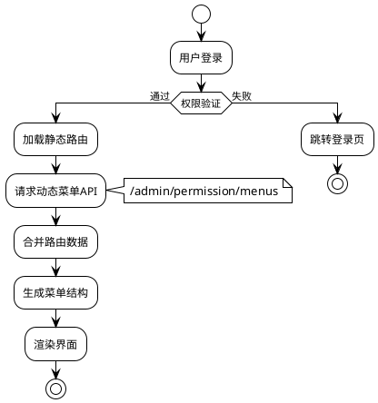
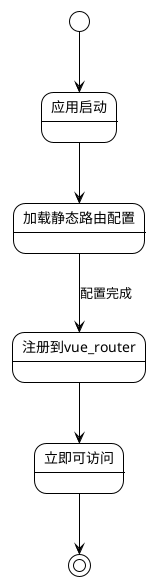
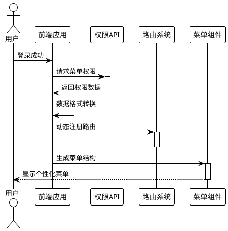

# 路由和菜单

MineAdmin 基于 `vue-router` 提供了一套完整的路由系统，支持**静态路由**和**动态路由**两种模式，为企业级权限管理提供强大支撑。

## 系统架构概览



## 路由类型选择指南

### 📊 选择决策矩阵

| 场景 | 静态路由 | 动态路由 | 推荐理由 |
|------|---------|----------|---------|
| 公共页面(登录、404) | ✅ | ❌ | 无需权限验证，快速加载 |
| 基础管理页面 | ❌ | ✅ | 需要权限控制 |
| 多租户系统 | ❌ | ✅ | 不同租户菜单结构不同 |
| 开发调试页面 | ✅ | ❌ | 仅开发环境使用 |
| 高频访问页面 | ✅ | ❌ | 减少网络请求，提升性能 |

## 路由、菜单详细说明

### 🔹 静态路由

静态路由在前端预先定义，应用启动时立即可用，适用于无需权限控制的页面。

**特点:**
- 前端预定义，启动时可用
- 无需网络请求，加载快速
- 适合公共页面和基础功能

**配置位置:** `src/router/static-routes` 目录

**工作流程:**


::: tip 💡 未来规划
系统考虑引入**文件路由**模式（文件即路由），但目前在 MineAdmin 场景中使用频率不高。
未来可能会根据社区需求添加此功能。
:::

### 🔹 动态路由

动态路由基于用户权限动态生成，提供精细化的权限控制。

**生成流程:**
1. 用户登录验证通过
2. 请求 `/admin/permission/menus` 接口
3. 服务器返回用户权限菜单数据
4. 前端转换为路由配置
5. 动态注册到 vue-router
6. 生成对应菜单结构



### 🔹 菜单系统

菜单是路由的可视化表现，将路由配置转换为用户界面元素。

**菜单与路由关系:**
- 一个路由可能对应一个或多个菜单项
- 菜单支持多层级嵌套结构
- 支持图标、徽章、国际化等丰富展示

## 路由配置详解

### 基础数据类型

系统在 `#/types/global.d.ts` 中定义了完整的路由类型：

::: details 📋 路由数据类型定义
```typescript
declare namespace MineRoute {
  interface routeRecord {
    name?: string                    // 路由名称，必须唯一
    path?: string                   // 路由路径
    redirect?: string               // 重定向地址
    expand?: boolean               // 是否展开子菜单
    component?: () => Promise<any>  // 异步组件
    components?: () => Promise<any> // 命名视图组件
    meta?: RouteMeta              // 路由元数据
    children?: routeRecord[]       // 子路由配置
  }
  
  interface RouteMeta {
    // 基础信息
    title?: string | (() => string)     // 页面标题
    i18n?: string | (() => string)      // 国际化键名
    icon?: string                       // 图标（支持iconify）
    badge?: () => string | number       // 徽章内容
    
    // 显示控制
    hidden?: boolean                    // 是否隐藏菜单
    subForceShow?: boolean             // 强制显示子菜单
    affix?: boolean                    // 是否固定标签页
    
    // 功能配置
    cache?: boolean                    // 是否缓存页面
    copyright?: boolean                // 是否显示版权信息
    breadcrumbEnable?: boolean         // 是否显示面包屑
    
    // 路由类型
    type?: 'M' | 'B' | 'I' | 'L' | string  // M:菜单 B:按钮 I:iframe L:外链
    link?: string                          // 外链/iframe地址
    
    // 权限控制
    auth?: string[]                    // 权限码数组
    role?: string[]                   // 角色数组  
    user?: string[]                   // 用户ID数组
    
    // 系统内部
    activeName?: string               // 激活菜单名称
    breadcrumb?: routeRecord[]        // 面包屑路径（自动生成）
  }
}
```
:::

### 完整配置示例

```typescript
// 标准菜单页面配置
const menuRoute: MineRoute.routeRecord = {
  name: 'system',
  path: '/system',
  redirect: '/system/user',
  meta: {
    title: '系统管理',
    i18n: 'menu.system',
    icon: 'icon-park-outline:setting-two',
    type: 'M'
  },
  children: [
    {
      name: 'system-user',
      path: '/system/user',
      component: () => import('~/modules/system/views/user/index.vue'),
      meta: {
        title: '用户管理',
        i18n: 'menu.system.user',
        icon: 'icon-park-outline:user',
        cache: true,
        auth: ['system:user:list']
      }
    }
  ]
}
```

## META 配置详解

### 🏷️ 基础显示配置

#### title - 页面标题
```typescript
meta: {
  title: '用户管理',           // 直接指定标题
  // 或
  title: () => `用户管理(${count})` // 动态标题
}
```
**应用场景:** 菜单显示、标签页标题、浏览器标题

#### icon - 图标配置  
```typescript
meta: {
  icon: 'icon-park-outline:user',      // Iconify图标
  icon: 'mdi:user',                   // Material Design图标
  icon: '/custom-icon.svg'            // 自定义SVG图标
}
```
**支持图标库:** Iconify、Material Design Icons、自定义SVG

#### badge - 徽章配置
```typescript
meta: {
  badge: () => store.unreadCount,     // 动态徽章
  badge: () => 'NEW'                  // 固定徽章
}
```

### 🎯 路由类型配置

#### type - 路由类型
```typescript
type RouteType = 'M' | 'B' | 'I' | 'L'

// M: 菜单类型（默认）
meta: { type: 'M' }  // 显示在菜单中，可有子路由

// B: 按钮类型  
meta: { type: 'B' }  // 不显示菜单，无子路由，权限控制

// I: iframe类型
meta: { 
  type: 'I', 
  link: 'https://admin.example.com'
}

// L: 外链类型
meta: { 
  type: 'L', 
  link: 'https://docs.example.com'
}
```

### 🔐 权限控制配置

#### 多层级权限控制
```typescript
meta: {
  // 权限码控制（推荐）
  auth: ['system:user:list', 'system:user:create'],
  
  // 角色控制
  role: ['admin', 'manager'],
  
  // 用户控制
  user: ['1001', '1002']
}
```

**权限验证优先级:** `user > role > auth`

### 🚀 性能配置

#### cache - 页面缓存
```typescript
// 组件中配置
defineOptions({ 
  name: 'SystemUser'  // 必须与路由name一致
})

// 路由中启用
meta: {
  cache: true
}
```

#### 懒加载配置
```typescript
// 基础懒加载
component: () => import('~/views/user/index.vue')

// 分组懒加载（webpack魔法注释）
component: () => import(
  /* webpackChunkName: "system" */ 
  '~/modules/system/views/user/index.vue'
)
```

## 实际应用案例

### 📝 案例1: 标准CRUD模块

```typescript
// 用户管理完整配置
export const userManagementRoutes: MineRoute.routeRecord = {
  name: 'user-management',
  path: '/users',
  redirect: '/users/list',
  meta: {
    title: '用户管理',
    i18n: 'menu.users',
    icon: 'icon-park-outline:user',
    type: 'M'
  },
  children: [
    // 列表页面
    {
      name: 'user-list',
      path: '/users/list',
      component: () => import('~/modules/user/views/list.vue'),
      meta: {
        title: '用户列表',
        cache: true,
        auth: ['user:list']
      }
    },
    // 详情页面（隐藏菜单）
    {
      name: 'user-detail',
      path: '/users/:id',
      component: () => import('~/modules/user/views/detail.vue'),
      meta: {
        title: '用户详情',
        hidden: true,
        cache: true,
        activeName: 'user-list',  // 激活父菜单
        auth: ['user:view']
      }
    },
    // 权限控制按钮
    {
      name: 'user-delete',
      path: '/users/delete',
      meta: {
        type: 'B',  // 按钮类型，不显示菜单
        auth: ['user:delete']
      }
    }
  ]
}
```

### 🌐 案例2: 外部集成

```typescript
// iframe和外链配置
export const externalRoutes: MineRoute.routeRecord = {
  name: 'external',
  path: '/external',
  meta: {
    title: '外部系统',
    icon: 'icon-park-outline:link'
  },
  children: [
    // iframe嵌入
    {
      name: 'external-monitor',
      path: '/external/monitor',
      meta: {
        title: '监控中心',
        type: 'I',
        link: 'https://monitor.company.com',
        auth: ['system:monitor']
      }
    },
    // 外链跳转  
    {
      name: 'external-docs',
      path: '/external/docs',
      meta: {
        title: '接口文档',
        type: 'L', 
        link: 'https://api-docs.company.com'
      }
    }
  ]
}
```

### 🏢 案例3: 复杂工作流

```typescript
// 多层级工作流配置
export const workflowRoutes: MineRoute.routeRecord = {
  name: 'workflow',
  path: '/workflow',
  meta: {
    title: '工作流程',
    icon: 'icon-park-outline:flow-chart',
    badge: () => store.pendingTasks
  },
  children: [
    {
      name: 'workflow-pending',
      path: '/workflow/pending',
      component: () => import('~/workflow/pending.vue'),
      meta: {
        title: '待办事项',
        affix: true,  // 固定标签页
        cache: true
      }
    },
    {
      name: 'workflow-approval',
      path: '/workflow/approval',
      redirect: '/workflow/approval/my',
      meta: {
        title: '审批管理',
        role: ['manager', 'admin']
      },
      children: [
        {
          name: 'my-approval',
          path: '/workflow/approval/my',
          component: () => import('~/workflow/my-approval.vue'),
          meta: {
            title: '我的审批',
            cache: true
          }
        }
      ]
    }
  ]
}
```

## 最佳实践

### 📝 命名规范

**✅ 推荐做法:**
```typescript
// 路由名称使用kebab-case
name: 'system-user-list'

// 路径使用小写+连字符
path: '/system/user-management'

// 国际化键名分层级
i18n: 'menu.system.user.list'
```

**❌ 避免的做法:**
```typescript
// 避免驼峰命名
name: 'SystemUserList'

// 避免特殊字符
path: '/system/user_management'

// 避免过深层级
i18n: 'menu.system.management.user.list.page'
```

### 🏗️ 路由结构设计

**层级控制原则:**
- 菜单层级不超过3层
- 每个层级子项数量不超过8个
- 相关功能模块归类组织

**权限粒度设计:**
```typescript
// 功能级权限（推荐）
auth: ['user:list', 'user:create', 'user:edit']

// 避免过细粒度
auth: ['user:list:name', 'user:list:email']  // ❌

// 避免过粗粒度  
auth: ['user:all']  // ❌
```

### ⚡ 性能优化策略

#### 路由懒加载优化
```typescript
// 按模块分组加载
const UserRoutes = () => import(
  /* webpackChunkName: "user-module" */
  '~/modules/user/routes'
)

// 预加载关键路由
const Dashboard = () => import(
  /* webpackChunkName: "dashboard" */
  /* webpackPreload: true */
  '~/views/dashboard.vue'
)
```

#### 菜单渲染优化
```typescript
// 大量菜单项时使用虚拟滚动
meta: {
  virtualScroll: true  // 启用虚拟滚动
}

// 延迟加载非关键菜单
meta: {
  lazyLoad: true
}
```

## 问题排查指南

### 🐛 常见问题及解决方案

#### 1. 路由无法访问

**症状:** 输入URL后显示404或空白页

**排查步骤:**
```typescript
// 1. 检查路由是否正确注册
console.log('已注册路由:', router.getRoutes())

// 2. 验证路由配置
const route = {
  name: 'user-list',  // ✅ 确保name唯一
  path: '/users',     // ✅ 确保路径正确
  component: () => import('~/views/users.vue')  // ✅ 组件路径存在
}

// 3. 检查权限配置
const hasPermission = await checkAuth(['user:list'])
```

#### 2. 菜单不显示

**可能原因及解决:**
```typescript
// 原因1: hidden设置为true
meta: { hidden: false }  // 确保未隐藏

// 原因2: 权限验证失败
meta: { auth: ['correct:permission'] }  // 检查权限码

// 原因3: 路由类型错误
meta: { type: 'M' }  // 确保是菜单类型
```

#### 3. 页面缓存失效

**解决方案:**
```vue
<!-- 组件中必须定义name -->
<script setup>
defineOptions({ 
  name: 'UserList'  // 必须与路由name匹配
})
</script>
```

```typescript
// 路由配置
meta: {
  cache: true,
  // 确保组件name与路由name一致
  name: 'UserList'  
}
```

### 🔍 调试工具

#### 路由调试助手
```typescript
// 路由调试函数
export const debugRoute = () => {
  const router = useRouter()
  const currentRoute = useRoute()
  
  console.group('路由调试信息')
  console.log('当前路由:', currentRoute.name)
  console.log('路由参数:', currentRoute.params)
  console.log('查询参数:', currentRoute.query)
  console.log('路由元数据:', currentRoute.meta)
  console.log('所有路由:', router.getRoutes())
  console.groupEnd()
}

// 权限调试
export const debugPermission = async (route: RouteRecord) => {
  const { auth, role, user } = route.meta
  
  console.group('权限调试')
  console.log('所需权限:', auth)
  console.log('所需角色:', role)
  console.log('所需用户:', user)
  
  if (auth) {
    console.log('权限验证结果:', await checkAuth(auth))
  }
  console.groupEnd()
}
```

#### 菜单验证工具
```typescript
// 菜单结构验证
export const validateMenuStructure = (routes: MineRoute.routeRecord[]) => {
  const issues = []
  
  const checkRoute = (route: MineRoute.routeRecord, depth = 0) => {
    // 检查层级深度
    if (depth > 3) {
      issues.push(`路由 ${route.name} 层级过深 (${depth})`)
    }
    
    // 检查必要字段
    if (!route.name) {
      issues.push(`路由缺少name字段: ${route.path}`)
    }
    
    // 递归检查子路由
    route.children?.forEach(child => 
      checkRoute(child, depth + 1)
    )
  }
  
  routes.forEach(route => checkRoute(route))
  return issues
}
```