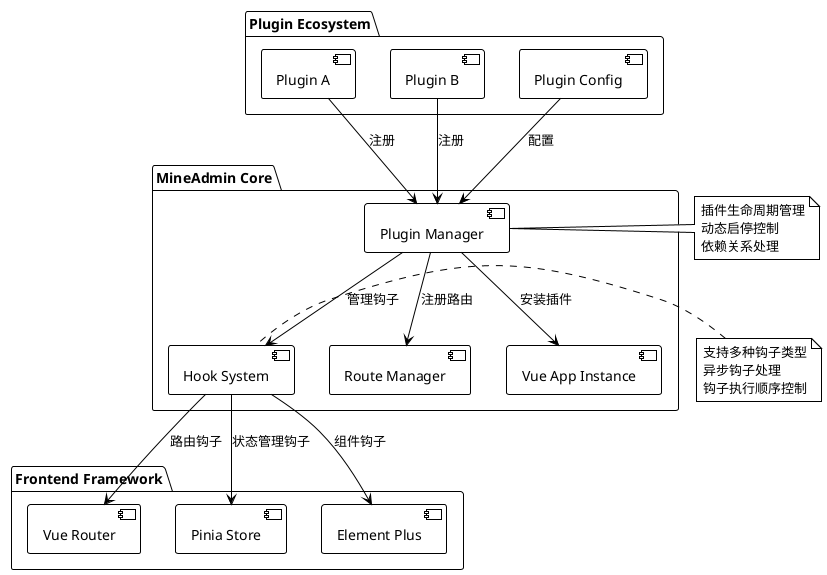
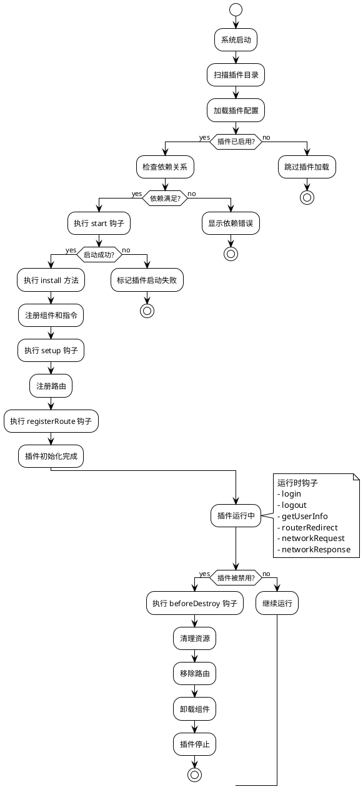

# 插件系统

::: tip 插件系统说明
`3.0` 前端从核心层面支持了插件系统，相比 `2.0` 在设计之初没有考虑插件功能，
在改变系统界面或者行为、功能的时候都需要去修改源代码，而后导致后续无法升级，跟官方代码差别越来越大，
后面增加了应用商店功能，虽然可以强行支持插件，插件也必须修改源代码，而且在需要初始化的地方，插件无法去扩展实现，只能去修改 `main.js`。

**现在以上问题全部都不存在了，前端插件系统提供了强有力的支持，从替换界面、增加功能、引入第三方组件或者自研组件都可以无缝融入到系统里去，
而且还提供了多种 `hooks(钩子）` ，甚至可以去影响和改变前端的运行**
:::

## 插件系统架构概览

插件系统基于现代前端架构设计，提供了完整的生命周期管理和扩展能力：



### 核心特性

- **零侵入设计**: 插件开发无需修改核心代码
- **动态加载**: 支持插件的动态启用和禁用
- **生命周期管理**: 完整的插件生命周期钩子
- **类型安全**: 完整的 TypeScript 类型定义
- **性能优化**: 懒加载和按需加载支持
- **错误隔离**: 插件错误不影响主应用运行

## 插件数据类型介绍

::: info 类型定义文件
类型定义在 `types/global.d.ts` 内
:::

:::details 点击查看完整类型定义
```ts
declare namespace Plugin {
  /**
   * 插件基础信息
   */
  interface Info {
    /** 插件名称，格式：作者名称空间/插件名 */
    name: string
    /** 插件版本，遵循语义化版本 */
    version: string
    /** 插件作者 */
    author: string
    /** 插件描述 */
    description: string
    /** 插件启动顺序，数值越大越先启动，默认为 0 */
    order?: number
    /** 插件依赖列表 */
    dependencies?: string[]
    /** 插件关键词，用于搜索 */
    keywords?: string[]
    /** 插件主页地址 */
    homepage?: string
    /** 插件许可证 */
    license?: string
    /** 最低系统版本要求 */
    minSystemVersion?: string
  }

  /**
   * 插件配置
   */
  interface Config {
    /** 插件基础信息 */
    info: Info
    /** 是否启用插件 */
    enable: boolean
    /** 插件开发模式，用于调试 */
    devMode?: boolean
    /** 插件自定义配置项 */
    settings?: Record<string, any>
  }

  /**
   * 插件视图路由定义
   */
  interface Views extends Route.RouteRecordRaw {
    /** 路由元信息扩展 */
    meta?: {
      /** 页面标题 */
      title?: string
      /** 国际化键值 */
      i18n?: string
      /** 页面图标 */
      icon?: string
      /** 是否需要权限验证 */
      requireAuth?: boolean
      /** 所需权限列表 */
      permissions?: string[]
      /** 是否缓存页面 */
      keepAlive?: boolean
      /** 页面是否隐藏 */
      hidden?: boolean
      /** 菜单排序 */
      order?: number
    }
  }

  /**
   * 钩子函数类型定义
   */
  interface HookHandlers {
    /** 插件启动钩子，可用于初始化验证 */
    start?: (config: Config) => Promise<boolean | void> | boolean | void
    /** 系统初始化完成钩子，可访问 Vue 上下文 */
    setup?: () => Promise<void> | void
    /** 路由注册钩子，可修改路由配置 */
    registerRoute?: (router: Router, routesRaw: Route.RouteRecordRaw[] | Views[] | MineRoute.routeRecord[]) => Promise<void> | void
    /** 用户登录钩子 */
    login?: (formInfo: LoginFormData) => Promise<void> | void
    /** 用户退出登录钩子 */
    logout?: () => Promise<void> | void
    /** 获取用户信息钩子 */
    getUserInfo?: (userInfo: UserInfo) => Promise<void> | void
    /** 路由跳转钩子（外链无效） */
    routerRedirect?: (context: { from: RouteLocationNormalized, to: RouteLocationNormalized }, router: Router) => Promise<void> | void
    /** 网络请求拦截钩子 */
    networkRequest?: <T = any>(request: AxiosRequestConfig) => Promise<AxiosRequestConfig> | AxiosRequestConfig
    /** 网络响应拦截钩子 */
    networkResponse?: <T = any>(response: AxiosResponse<T>) => Promise<AxiosResponse<T>> | AxiosResponse<T>
    /** 错误处理钩子 */
    error?: (error: Error, context?: string) => Promise<void> | void
    /** 页面加载完成钩子 */
    mounted?: () => Promise<void> | void
    /** 页面销毁钩子 */
    beforeDestroy?: () => Promise<void> | void
  }

  /**
   * 插件主配置接口
   */
  interface PluginConfig {
    /** 插件安装函数，注册组件、指令等 */
    install: (app: App<Element>) => Promise<void> | void
    /** 插件配置信息 */
    config: Config
    /** 插件路由定义 */
    views?: Views[]
    /** 插件钩子函数 */
    hooks?: HookHandlers
    /** 插件自定义属性 */
    [key: string]: any
  }

  /**
   * 插件存储状态
   */
  interface PluginStore {
    /** 已安装的插件列表 */
    plugins: Map<string, PluginConfig>
    /** 插件启用状态 */
    enabledPlugins: Set<string>
    /** 插件加载状态 */
    loadingPlugins: Set<string>
    /** 插件错误信息 */
    pluginErrors: Map<string, Error>
  }

  /**
   * 插件管理器接口
   */
  interface PluginManager {
    /** 注册插件 */
    register(name: string, plugin: PluginConfig): Promise<boolean>
    /** 卸载插件 */
    unregister(name: string): Promise<boolean>
    /** 启用插件 */
    enable(name: string): Promise<boolean>
    /** 禁用插件 */
    disable(name: string): Promise<boolean>
    /** 获取插件信息 */
    getPlugin(name: string): PluginConfig | null
    /** 获取所有插件 */
    getAllPlugins(): Map<string, PluginConfig>
    /** 检查插件依赖 */
    checkDependencies(name: string): Promise<boolean>
  }
}

/**
 * 登录表单数据类型
 */
interface LoginFormData {
  username: string
  password: string
  captcha?: string
  remember?: boolean
}

/**
 * 用户信息类型
 */
interface UserInfo {
  id: number
  username: string
  nickname: string
  email: string
  avatar: string
  roles: string[]
  permissions: string[]
  [key: string]: any
}
```
:::

## 创建插件

### 目录结构与命名规范

所有插件都放在 `src/plugins` 目录下，且插件有别名 `$` 指向了此目录，插件跟后端结构相同，
由 `开发作者名称空间/插件名称` 组成插件目录。斜杠左边是**作者名称空间**，可在 [MineAdmin官网设置](https://www.mineadmin.com)，
斜杠右边则为**插件名称**，在这个作者名称空间下唯一。

#### 标准插件目录结构

```bash
src/plugins/
├── mine-admin/          # 官方插件命名空间
│   ├── app-store/       # 应用商店插件
│   ├── basic-ui/        # 基础UI库插件
│   └── demo/            # 官方演示插件
├── author-name/         # 第三方开发者命名空间
│   └── plugin-name/     # 具体插件目录
│       ├── index.ts     # 插件入口文件（必须）
│       ├── config.ts    # 插件配置文件（可选）
│       ├── package.json # 插件包信息（推荐）
│       ├── README.md    # 插件说明文档（推荐）
│       ├── views/       # 页面组件目录
│       │   ├── index.vue
│       │   └── components/
│       ├── components/  # 可复用组件
│       ├── composables/ # 组合式函数
│       ├── utils/       # 工具函数
│       ├── assets/      # 静态资源
│       ├── locales/     # 国际化文件
│       │   ├── zh.json
│       │   ├── en.json
│       │   └── ja.json
│       ├── types/       # TypeScript 类型定义
│       └── tests/       # 测试文件
```

#### 命名规范建议

- **插件名称**: 使用小写字母和连字符，如 `file-manager`、`data-export`
- **作者空间**: 使用小写字母和连字符，避免特殊字符
- **文件命名**: 遵循 kebab-case 规范
- **组件名称**: 使用 PascalCase，如 `FileUploader.vue`

::: tip 最佳实践
- 本地开发的插件也可以被系统识别，但无法上传到 MineAdmin 应用市场
- 建议为插件添加 `package.json` 以便管理依赖和版本
- 使用 TypeScript 开发可获得更好的类型提示和错误检查
- 遵循 Vue 3 组合式 API 最佳实践
:::

::: warning 注意事项
- 插件名称在同一作者空间下必须唯一
- 避免使用系统保留字作为插件名称
- 插件目录一旦创建，不建议随意更改名称
:::

### 插件生命周期



## 插件开发指南

### 基础插件示例

让我们通过一个完整的文件管理插件来了解插件开发的完整流程：

#### 1. 创建插件入口文件 `index.ts`

```ts
// src/plugins/zhang-san/file-manager/index.ts
import type { App } from 'vue'
import type { Router, RouteRecordRaw } from 'vue-router'
import type { Plugin } from '#/global'
import { ElMessage, ElNotification } from 'element-plus'

// 导入插件组件
import FileManagerComponent from './components/FileManager.vue'
import FileUploader from './components/FileUploader.vue'

// 导入工具函数
import { formatFileSize, validateFileType } from './utils/fileUtils'

// 插件配置
const pluginConfig: Plugin.PluginConfig = {
  // 插件安装方法 - 在这里注册全局组件、指令、插件等
  async install(app: App) {
    try {
      // 注册全局组件
      app.component('FileManager', FileManagerComponent)
      app.component('FileUploader', FileUploader)
      
      // 注册全局指令
      app.directive('file-drop', {
        mounted(el, binding) {
          el.addEventListener('dragover', (e: DragEvent) => {
            e.preventDefault()
            e.stopPropagation()
          })
          
          el.addEventListener('drop', async (e: DragEvent) => {
            e.preventDefault()
            e.stopPropagation()
            const files = Array.from(e.dataTransfer?.files || [])
            await binding.value(files)
          })
        }
      })
      
      // 添加全局属性
      app.config.globalProperties.$fileUtils = {
        formatSize: formatFileSize,
        validateType: validateFileType
      }
      
      console.log('文件管理插件安装成功')
    } catch (error) {
      console.error('文件管理插件安装失败:', error)
      throw error
    }
  },

  // 插件基础配置
  config: {
    enable: import.meta.env.NODE_ENV !== 'production', // 生产环境禁用
    devMode: import.meta.env.DEV,
    info: {
      name: 'zhang-san/file-manager',
      version: '2.1.0',
      author: '张三',
      description: '企业级文件管理插件，支持上传、下载、预览、权限控制等功能',
      keywords: ['文件管理', '文件上传', '权限控制'],
      homepage: 'https://github.com/zhang-san/file-manager',
      license: 'MIT',
      minSystemVersion: '3.0.0',
      dependencies: ['mine-admin/basic-ui'],
      order: 10 // 较高优先级
    },
    settings: {
      maxFileSize: 50 * 1024 * 1024, // 50MB
      allowedTypes: ['image/*', 'application/pdf', '.docx', '.xlsx'],
      uploadChunkSize: 1024 * 1024, // 1MB
      enablePreview: true,
      enableVersionControl: false
    }
  },

  // 插件钩子函数
  hooks: {
    // 插件启动验证
    async start(config) {
      console.log('文件管理插件启动中...', config.info.name)
      
      // 检查必要的权限
      const hasPermission = await checkFilePermissions()
      if (!hasPermission) {
        ElMessage.error('文件管理插件需要文件操作权限')
        return false // 阻止插件启动
      }
      
      // 初始化插件设置
      await initializeSettings(config.settings)
      return true
    },

    // 系统初始化完成后执行
    async setup() {
      // 初始化文件存储
      await initFileStorage()
      
      // 注册文件类型映射
      registerFileTypes()
      
      // 监听系统事件
      window.addEventListener('beforeunload', handleBeforeUnload)
    },

    // 路由注册钩子
    async registerRoute(router: Router, routesRaw) {
      // 动态添加文件管理相关路由
      const adminRoutes = routesRaw.find(route => route.path === '/admin')
      if (adminRoutes && adminRoutes.children) {
        adminRoutes.children.push({
          path: 'files',
          name: 'FileManagement',
          component: () => import('./views/FileManagement.vue'),
          meta: {
            title: '文件管理',
            icon: 'FolderOpened',
            requireAuth: true,
            permissions: ['file:read'],
            keepAlive: true
          }
        })
      }
      
      console.log('文件管理路由注册完成')
    },

    // 用户登录后钩子
    async login(formInfo) {
      console.log('用户登录，初始化文件权限')
      await refreshFilePermissions(formInfo.username)
    },

    // 用户登出钩子
    async logout() {
      console.log('用户登出，清理文件缓存')
      await clearFileCache()
    },

    // 获取用户信息后钩子
    async getUserInfo(userInfo) {
      // 根据用户角色设置文件权限
      await setFilePermissions(userInfo.roles, userInfo.permissions)
    },

    // 网络请求拦截
    async networkRequest(config) {
      // 为文件上传请求添加特殊处理
      if (config.url?.includes('/upload')) {
        config.timeout = 300000 // 5分钟超时
        config.headers = {
          ...config.headers,
          'X-File-Plugin': 'zhang-san/file-manager'
        }
      }
      return config
    },

    // 网络响应拦截
    async networkResponse(response) {
      // 处理文件下载响应
      if (response.headers['content-type']?.includes('application/octet-stream')) {
        const contentDisposition = response.headers['content-disposition']
        if (contentDisposition) {
          const filename = extractFilename(contentDisposition)
          response.metadata = { filename }
        }
      }
      return response
    },

    // 错误处理
    async error(error, context) {
      if (context === 'file-upload') {
        ElNotification.error({
          title: '文件上传失败',
          message: error.message,
          duration: 5000
        })
      }
    },

    // 插件销毁前清理
    async beforeDestroy() {
      console.log('文件管理插件即将销毁，清理资源...')
      
      // 取消进行中的上传任务
      await cancelAllUploads()
      
      // 清理事件监听器
      window.removeEventListener('beforeunload', handleBeforeUnload)
      
      // 清理临时文件
      await cleanupTempFiles()
    }
  },

  // 插件路由定义
  views: [
    {
      name: 'zhangsan:filemanager:index',
      path: '/plugins/file-manager',
      component: () => import('./views/FileManagerIndex.vue'),
      meta: {
        title: '文件管理器',
        i18n: 'plugin.fileManager.title',
        icon: 'FolderOpened',
        requireAuth: true,
        permissions: ['file:read'],
        keepAlive: true,
        hidden: false
      }
    },
    {
      name: 'zhangsan:filemanager:upload',
      path: '/plugins/file-manager/upload',
      component: () => import('./views/FileUpload.vue'),
      meta: {
        title: '文件上传',
        i18n: 'plugin.fileManager.upload',
        icon: 'Upload',
        requireAuth: true,
        permissions: ['file:create'],
        keepAlive: false
      }
    }
  ]
}

// 辅助函数
async function checkFilePermissions(): Promise<boolean> {
  try {
    // 检查文件API是否可用
    return 'File' in window && 'FileReader' in window && 'FileList' in window
  } catch {
    return false
  }
}

async function initializeSettings(settings: Record<string, any>) {
  // 初始化插件配置
  const userSettings = await getUserPluginSettings('zhang-san/file-manager')
  Object.assign(settings, userSettings)
}

async function initFileStorage() {
  // 初始化文件存储配置
  console.log('初始化文件存储系统')
}

function registerFileTypes() {
  // 注册支持的文件类型
  console.log('注册文件类型映射')
}

function handleBeforeUnload(event: BeforeUnloadEvent) {
  // 检查是否有未完成的上传任务
  if (hasOngoingUploads()) {
    event.preventDefault()
    event.returnValue = '您有文件正在上传，确定要离开吗？'
  }
}

// 导出插件配置
export default pluginConfig

// 导出类型定义供其他插件使用
export type { FileManagerConfig } from './types/index'
```

#### 2. 插件配置文件 `config.ts`

```ts
// src/plugins/zhang-san/file-manager/config.ts
export interface FileManagerUserConfig {
  // 上传配置
  upload: {
    maxFileSize: number
    allowedTypes: string[]
    chunkSize: number
    concurrent: number
  }
  
  // 预览配置
  preview: {
    enabled: boolean
    supportedTypes: string[]
    maxPreviewSize: number
  }
  
  // 存储配置
  storage: {
    provider: 'local' | 'oss' | 's3' | 'cos'
    bucket?: string
    region?: string
    accessKey?: string
    secretKey?: string
  }
  
  // 安全配置
  security: {
    enableVirusScan: boolean
    allowExecutableFiles: boolean
    quarantineEnabled: boolean
  }
}

export const defaultConfig: FileManagerUserConfig = {
  upload: {
    maxFileSize: 50 * 1024 * 1024, // 50MB
    allowedTypes: [
      'image/jpeg', 'image/png', 'image/gif', 'image/webp',
      'application/pdf',
      'application/vnd.openxmlformats-officedocument.wordprocessingml.document',
      'application/vnd.openxmlformats-officedocument.spreadsheetml.sheet',
      'text/plain'
    ],
    chunkSize: 1024 * 1024, // 1MB
    concurrent: 3
  },
  
  preview: {
    enabled: true,
    supportedTypes: ['image/*', 'application/pdf', 'text/plain'],
    maxPreviewSize: 10 * 1024 * 1024 // 10MB
  },
  
  storage: {
    provider: 'local'
  },
  
  security: {
    enableVirusScan: false,
    allowExecutableFiles: false,
    quarantineEnabled: true
  }
}
```

::: info 开发完成
以上展示了一个完整的企业级插件开发示例，包含了错误处理、权限验证、资源清理等最佳实践。
:::

### Vue 组件集成示例

#### 创建插件组件

```vue
<!-- src/plugins/zhang-san/file-manager/components/FileManager.vue -->
<template>
  <div class="file-manager">
    <el-card class="manager-header">
      <el-row :gutter="16" justify="space-between">
        <el-col :span="12">
          <el-breadcrumb separator="/">
            <el-breadcrumb-item 
              v-for="(item, index) in breadcrumbs" 
              :key="index"
              @click="navigateToPath(item.path)"
              class="cursor-pointer"
            >
              {{ item.name }}
            </el-breadcrumb-item>
          </el-breadcrumb>
        </el-col>
        <el-col :span="12" class="text-right">
          <el-space>
            <el-button 
              type="primary" 
              :icon="Upload" 
              @click="showUploadDialog = true"
            >
              上传文件
            </el-button>
            <el-button 
              :icon="FolderAdd" 
              @click="createFolder"
            >
              新建文件夹
            </el-button>
          </el-space>
        </el-col>
      </el-row>
    </el-card>

    <el-card class="manager-content">
      <el-table
        v-loading="loading"
        :data="fileList"
        style="width: 100%"
        @selection-change="handleSelectionChange"
        @row-dblclick="handleRowDoubleClick"
      >
        <el-table-column type="selection" width="55" />
        
        <el-table-column prop="name" label="名称" min-width="200">
          <template #default="{ row }">
            <el-space>
              <el-icon :size="18">
                <component :is="getFileIcon(row)" />
              </el-icon>
              <span>{{ row.name }}</span>
            </el-space>
          </template>
        </el-table-column>
        
        <el-table-column prop="size" label="大小" width="120">
          <template #default="{ row }">
            {{ formatFileSize(row.size) }}
          </template>
        </el-table-column>
        
        <el-table-column prop="type" label="类型" width="120" />
        
        <el-table-column prop="modifiedAt" label="修改时间" width="180">
          <template #default="{ row }">
            {{ formatDate(row.modifiedAt) }}
          </template>
        </el-table-column>
        
        <el-table-column label="操作" width="200">
          <template #default="{ row }">
            <el-space>
              <el-button 
                size="small" 
                type="primary" 
                text 
                @click="previewFile(row)"
                :disabled="!canPreview(row)"
              >
                预览
              </el-button>
              <el-button 
                size="small" 
                type="success" 
                text 
                @click="downloadFile(row)"
              >
                下载
              </el-button>
              <el-button 
                size="small" 
                type="danger" 
                text 
                @click="deleteFile(row)"
              >
                删除
              </el-button>
            </el-space>
          </template>
        </el-table-column>
      </el-table>
    </el-card>

    <!-- 上传对话框 -->
    <FileUploadDialog 
      v-model="showUploadDialog"
      :current-path="currentPath"
      @upload-success="refreshFileList"
    />
    
    <!-- 文件预览对话框 -->
    <FilePreviewDialog
      v-model="showPreviewDialog"
      :file="previewFile"
    />
  </div>
</template>

<script setup lang="ts">
import { ref, computed, onMounted } from 'vue'
import { ElMessage, ElMessageBox } from 'element-plus'
import { Upload, FolderAdd, Document, Picture, VideoPlay, Folder } from '@element-plus/icons-vue'
import { useFileManagerStore } from '../composables/useFileManager'
import FileUploadDialog from './FileUploadDialog.vue'
import FilePreviewDialog from './FilePreviewDialog.vue'
import type { FileItem } from '../types/index'

// 响应式数据
const fileManagerStore = useFileManagerStore()
const loading = ref(false)
const showUploadDialog = ref(false)
const showPreviewDialog = ref(false)
const selectedFiles = ref<FileItem[]>([])
const previewFile = ref<FileItem | null>(null)

// 计算属性
const fileList = computed(() => fileManagerStore.currentFiles)
const currentPath = computed(() => fileManagerStore.currentPath)
const breadcrumbs = computed(() => fileManagerStore.breadcrumbs)

// 方法
const refreshFileList = async () => {
  loading.value = true
  try {
    await fileManagerStore.loadFiles(currentPath.value)
  } catch (error) {
    ElMessage.error('加载文件列表失败')
  } finally {
    loading.value = false
  }
}

const handleSelectionChange = (selection: FileItem[]) => {
  selectedFiles.value = selection
}

const handleRowDoubleClick = (row: FileItem) => {
  if (row.type === 'folder') {
    fileManagerStore.navigateToFolder(row.path)
  } else {
    previewFile(row)
  }
}

const getFileIcon = (file: FileItem) => {
  if (file.type === 'folder') return Folder
  if (file.mimeType?.startsWith('image/')) return Picture
  if (file.mimeType?.startsWith('video/')) return VideoPlay
  return Document
}

const formatFileSize = (bytes: number): string => {
  if (bytes === 0) return '0 B'
  const k = 1024
  const sizes = ['B', 'KB', 'MB', 'GB']
  const i = Math.floor(Math.log(bytes) / Math.log(k))
  return parseFloat((bytes / Math.pow(k, i)).toFixed(2)) + ' ' + sizes[i]
}

const formatDate = (dateString: string): string => {
  return new Date(dateString).toLocaleString('zh-CN')
}

const canPreview = (file: FileItem): boolean => {
  const previewTypes = ['image/', 'text/', 'application/pdf']
  return previewTypes.some(type => file.mimeType?.startsWith(type))
}

const previewFile = (file: FileItem) => {
  if (canPreview(file)) {
    previewFile.value = file
    showPreviewDialog.value = true
  } else {
    ElMessage.warning('该文件类型不支持预览')
  }
}

const downloadFile = async (file: FileItem) => {
  try {
    await fileManagerStore.downloadFile(file)
    ElMessage.success('文件下载已开始')
  } catch (error) {
    ElMessage.error('文件下载失败')
  }
}

const deleteFile = async (file: FileItem) => {
  try {
    await ElMessageBox.confirm(
      `确定要删除文件 "${file.name}" 吗？`,
      '删除确认',
      { type: 'warning' }
    )
    
    await fileManagerStore.deleteFile(file)
    ElMessage.success('文件删除成功')
    await refreshFileList()
  } catch (error) {
    if (error !== 'cancel') {
      ElMessage.error('文件删除失败')
    }
  }
}

const createFolder = async () => {
  try {
    const { value: folderName } = await ElMessageBox.prompt(
      '请输入文件夹名称',
      '新建文件夹',
      { inputPattern: /^[^\\/:*?"<>|]+$/, inputErrorMessage: '文件夹名称不能包含特殊字符' }
    )
    
    await fileManagerStore.createFolder(currentPath.value, folderName)
    ElMessage.success('文件夹创建成功')
    await refreshFileList()
  } catch (error) {
    if (error !== 'cancel') {
      ElMessage.error('文件夹创建失败')
    }
  }
}

const navigateToPath = (path: string) => {
  fileManagerStore.navigateToFolder(path)
}

// 生命周期
onMounted(() => {
  refreshFileList()
})
</script>

<style scoped lang="scss">
.file-manager {
  height: 100%;
  display: flex;
  flex-direction: column;
  
  .manager-header {
    margin-bottom: 16px;
    flex-shrink: 0;
  }
  
  .manager-content {
    flex: 1;
    overflow: hidden;
    
    :deep(.el-card__body) {
      height: 100%;
      padding: 0;
    }
    
    :deep(.el-table) {
      height: 100%;
    }
  }
  
  .cursor-pointer {
    cursor: pointer;
    
    &:hover {
      color: var(--el-color-primary);
    }
  }
}
</style>
```

## 组合式函数（Composables）

插件可以提供可复用的组合式函数，供其他组件使用：

```ts
// src/plugins/zhang-san/file-manager/composables/useFileManager.ts
import { ref, reactive, computed } from 'vue'
import { ElMessage } from 'element-plus'
import type { FileItem, FileManagerState } from '../types/index'

export function useFileManager() {
  // 状态管理
  const state = reactive<FileManagerState>({
    currentPath: '/',
    files: [],
    selectedFiles: [],
    loading: false,
    uploadProgress: new Map()
  })

  // 计算属性
  const currentFiles = computed(() => state.files)
  const breadcrumbs = computed(() => {
    const paths = state.currentPath.split('/').filter(Boolean)
    const breadcrumbs = [{ name: '根目录', path: '/' }]
    
    let currentPath = ''
    for (const path of paths) {
      currentPath += `/${path}`
      breadcrumbs.push({ name: path, path: currentPath })
    }
    
    return breadcrumbs
  })

  // 文件操作方法
  const loadFiles = async (path: string = state.currentPath): Promise<void> => {
    state.loading = true
    try {
      const response = await fetch(`/api/files?path=${encodeURIComponent(path)}`)
      if (!response.ok) throw new Error('Failed to load files')
      
      const files = await response.json()
      state.files = files
      state.currentPath = path
    } catch (error) {
      ElMessage.error('加载文件列表失败')
      throw error
    } finally {
      state.loading = false
    }
  }

  const uploadFile = async (file: File, path: string): Promise<void> => {
    const uploadId = `${path}/${file.name}`
    state.uploadProgress.set(uploadId, 0)

    try {
      const formData = new FormData()
      formData.append('file', file)
      formData.append('path', path)

      const response = await fetch('/api/files/upload', {
        method: 'POST',
        body: formData,
        onUploadProgress: (progressEvent) => {
          if (progressEvent.total) {
            const percent = Math.round((progressEvent.loaded * 100) / progressEvent.total)
            state.uploadProgress.set(uploadId, percent)
          }
        }
      })

      if (!response.ok) throw new Error('Upload failed')
      
      ElMessage.success(`文件 ${file.name} 上传成功`)
      await loadFiles(path)
    } catch (error) {
      ElMessage.error(`文件 ${file.name} 上传失败`)
      throw error
    } finally {
      state.uploadProgress.delete(uploadId)
    }
  }

  const deleteFile = async (file: FileItem): Promise<void> => {
    try {
      const response = await fetch(`/api/files?path=${encodeURIComponent(file.path)}`, {
        method: 'DELETE'
      })
      
      if (!response.ok) throw new Error('Delete failed')
      ElMessage.success('文件删除成功')
    } catch (error) {
      ElMessage.error('文件删除失败')
      throw error
    }
  }

  const createFolder = async (parentPath: string, folderName: string): Promise<void> => {
    try {
      const response = await fetch('/api/folders', {
        method: 'POST',
        headers: { 'Content-Type': 'application/json' },
        body: JSON.stringify({ parent: parentPath, name: folderName })
      })
      
      if (!response.ok) throw new Error('Create folder failed')
      ElMessage.success('文件夹创建成功')
    } catch (error) {
      ElMessage.error('文件夹创建失败')
      throw error
    }
  }

  const navigateToFolder = async (path: string): Promise<void> => {
    await loadFiles(path)
  }

  const downloadFile = async (file: FileItem): Promise<void> => {
    try {
      const response = await fetch(`/api/files/download?path=${encodeURIComponent(file.path)}`)
      if (!response.ok) throw new Error('Download failed')
      
      const blob = await response.blob()
      const url = window.URL.createObjectURL(blob)
      const a = document.createElement('a')
      a.href = url
      a.download = file.name
      a.click()
      window.URL.revokeObjectURL(url)
    } catch (error) {
      ElMessage.error('文件下载失败')
      throw error
    }
  }

  return {
    // 状态
    ...toRefs(state),
    
    // 计算属性
    currentFiles,
    breadcrumbs,
    
    // 方法
    loadFiles,
    uploadFile,
    deleteFile,
    createFolder,
    navigateToFolder,
    downloadFile
  }
}
```

## 高级插件模式

### 插件间通信

插件可以通过事件系统进行通信：

```ts
// 插件A：发布事件
import { EventBus } from '@/utils/eventBus'

// 在插件钩子中
hooks: {
  setup() {
    // 发布文件上传完成事件
    EventBus.emit('file:uploaded', {
      fileName: 'example.pdf',
      fileSize: 1024,
      uploadTime: new Date()
    })
  }
}

// 插件B：监听事件
hooks: {
  setup() {
    // 监听文件上传完成事件
    EventBus.on('file:uploaded', (fileInfo) => {
      console.log('文件上传完成:', fileInfo)
      // 执行相关业务逻辑
      updateFileStats(fileInfo)
    })
  },
  
  beforeDestroy() {
    // 清理事件监听器
    EventBus.off('file:uploaded')
  }
}
```

### 插件依赖管理

```ts
// 高级插件依赖示例
const pluginConfig: Plugin.PluginConfig = {
  config: {
    info: {
      name: 'zhang-san/advanced-file-manager',
      dependencies: [
        'mine-admin/basic-ui@^2.0.0',    // 版本范围
        'li-si/image-processor@latest',   // 最新版本
        'wang-wu/cloud-storage'           // 任意版本
      ]
    }
  },

  hooks: {
    async start(config) {
      // 检查依赖是否满足
      const dependencyChecker = usePluginDependencies()
      const unsatisfiedDeps = await dependencyChecker.check(config.info.dependencies)
      
      if (unsatisfiedDeps.length > 0) {
        console.error('未满足的依赖:', unsatisfiedDeps)
        return false
      }
      
      return true
    }
  }
}
```

### 插件配置发布与管理

```bash
# 发布插件配置到用户可编辑目录
pnpm plugin:publish zhang-san/file-manager

# 批量发布所有插件配置
pnpm plugin:publish-all

# 重置插件配置到默认状态
pnpm plugin:reset zhang-san/file-manager
```

插件配置发布后的使用：

```ts
// 获取用户自定义配置
import { usePluginConfig } from '@/composables/usePlugin'

const { config, updateConfig } = usePluginConfig('zhang-san/file-manager')

// 在组件中使用配置
const maxFileSize = computed(() => config.value.upload.maxFileSize)

// 更新配置
const updateUploadConfig = async (newConfig: Partial<UploadConfig>) => {
  await updateConfig({
    upload: {
      ...config.value.upload,
      ...newConfig
    }
  })
}
```

## 动态插件管理

### 插件状态控制

```ts
// 获取插件管理器实例
const pluginManager = usePluginManager()

// 启用插件
const enablePlugin = async (pluginName: string) => {
  try {
    const success = await pluginManager.enable(pluginName)
    if (success) {
      ElMessage.success(`插件 ${pluginName} 已启用`)
    } else {
      ElMessage.error('插件启用失败，请检查依赖关系')
    }
  } catch (error) {
    ElMessage.error(`启用插件时发生错误: ${error.message}`)
  }
}

// 禁用插件
const disablePlugin = async (pluginName: string) => {
  try {
    const success = await pluginManager.disable(pluginName)
    if (success) {
      ElMessage.success(`插件 ${pluginName} 已禁用`)
    }
  } catch (error) {
    ElMessage.error(`禁用插件时发生错误: ${error.message}`)
  }
}

// 传统方式（兼容性保持）
const { disabled, enabled } = usePluginStore()

// 启用插件
enabled('zhang-san/demo')

// 停用插件
disabled('li-si/demo')
```

### 插件热重载（开发环境）

```ts
// 开发环境下支持插件热重载
if (import.meta.hot) {
  import.meta.hot.accept('./index.ts', (newModule) => {
    console.log('插件热重载中...')
    
    // 重新注册插件
    pluginManager.unregister('zhang-san/file-manager')
    pluginManager.register('zhang-san/file-manager', newModule.default)
    
    console.log('插件热重载完成')
  })
}
```

## 插件故障排查

### 常见问题与解决方案

#### 1. 插件加载失败

**问题现象**: 插件在系统启动时不被识别或加载失败

**排查步骤**:
1. 检查插件目录结构是否正确
2. 确认 `index.ts` 文件存在且语法正确
3. 验证插件配置是否完整
4. 查看浏览器控制台错误信息

**解决方案**:
```ts
// 插件诊断工具
const diagnosePlugin = (pluginName: string) => {
  console.group(`诊断插件: ${pluginName}`)
  
  // 检查插件是否存在
  const plugin = pluginManager.getPlugin(pluginName)
  if (!plugin) {
    console.error('❌ 插件未找到，请检查目录结构')
    return false
  }
  
  // 检查必要配置
  const requiredFields = ['config', 'install']
  for (const field of requiredFields) {
    if (!(field in plugin)) {
      console.error(`❌ 缺少必要字段: ${field}`)
      return false
    }
  }
  
  console.log('✅ 插件配置检查通过')
  console.groupEnd()
  return true
}
```

#### 2. 依赖关系错误

**问题现象**: 插件因依赖不满足而无法启动

**解决方案**:
```ts
// 检查并安装缺失依赖
const fixDependencies = async (pluginName: string) => {
  const plugin = pluginManager.getPlugin(pluginName)
  const dependencies = plugin.config.info.dependencies || []
  
  for (const dep of dependencies) {
    const [name, version] = dep.split('@')
    if (!pluginManager.getPlugin(name)) {
      console.warn(`缺少依赖: ${name}`)
      // 提示用户安装依赖
      ElMessageBox.confirm(
        `插件 ${pluginName} 需要依赖 ${name}，是否现在安装？`,
        '依赖确认',
        { type: 'warning' }
      ).then(() => {
        // 跳转到应用商店安装依赖
        router.push(`/plugins/app-store?search=${name}`)
      })
    }
  }
}
```

#### 3. 性能问题

**问题现象**: 插件运行缓慢或占用资源过多

**解决方案**:
```ts
// 性能监控工具
const monitorPluginPerformance = (pluginName: string) => {
  const metrics = {
    memory: 0,
    executionTime: new Map(),
    errorCount: 0
  }
  
  // 监控内存使用
  const checkMemory = () => {
    if (performance.memory) {
      metrics.memory = performance.memory.usedJSHeapSize
    }
  }
  
  // 监控函数执行时间
  const wrapFunction = (obj: any, methodName: string) => {
    const originalMethod = obj[methodName]
    obj[methodName] = function(...args: any[]) {
      const start = performance.now()
      const result = originalMethod.apply(this, args)
      const end = performance.now()
      
      metrics.executionTime.set(methodName, end - start)
      if (end - start > 100) { // 超过100ms警告
        console.warn(`${pluginName}.${methodName} 执行时间: ${(end - start).toFixed(2)}ms`)
      }
      
      return result
    }
  }
  
  return metrics
}
```

### 调试技巧

#### 1. 启用详细日志

```ts
// 在插件中添加详细日志
const debug = (message: string, data?: any) => {
  if (import.meta.env.DEV) {
    console.log(`[${pluginName}] ${message}`, data)
  }
}

hooks: {
  start(config) {
    debug('插件启动', config)
    return true
  },
  
  setup() {
    debug('插件初始化完成')
  }
}
```

#### 2. 使用开发者工具

```ts
// 暴露调试接口到浏览器控制台
if (import.meta.env.DEV) {
  window.__PLUGIN_DEBUG__ = {
    getPlugin: (name: string) => pluginManager.getPlugin(name),
    listPlugins: () => pluginManager.getAllPlugins(),
    enablePlugin: (name: string) => pluginManager.enable(name),
    disablePlugin: (name: string) => pluginManager.disable(name),
    reloadPlugin: (name: string) => {
      pluginManager.unregister(name)
      // 重新导入并注册插件
    }
  }
}
```

## 插件生态系统

### 官方插件

在 `src/plugins/mine-admin` 下是官方插件，目前内置了：

#### `basic-ui` - 基础UI组件库
- **功能**: 提供系统基础UI组件和样式
- **版本**: 2.0.0+
- **依赖**: 无
- **说明**: 为其他插件提供统一的UI基础

```ts
// 使用基础UI组件
import { MButton, MCard, MTable } from 'mine-admin/basic-ui'

// 在插件中使用
install(app) {
  // basic-ui 已经全局注册，可直接使用
  app.component('CustomButton', {
    template: `<m-button type="primary"><slot /></m-button>`
  })
}
```

#### `app-store` - 应用市场
- **功能**: 插件商店，支持插件的安装、更新、卸载
- **版本**: 1.5.0+
- **依赖**: `mine-admin/basic-ui`
- **说明**: 连接MineAdmin应用市场，管理第三方插件

#### `demo` - 演示插件
- **功能**: 展示插件系统各种功能的示例代码
- **版本**: 1.0.0+
- **依赖**: `mine-admin/basic-ui`
- **说明**: 开发者参考示例，包含各种钩子使用方法

### 第三方插件生态

#### 推荐插件类别

**文件管理类**
- `file-manager/core` - 企业级文件管理
- `storage/cloud-sync` - 云存储同步
- `media/gallery` - 多媒体画廊

**数据处理类**
- `data/excel-tools` - Excel处理工具
- `report/builder` - 报表构建器
- `chart/visualization` - 数据可视化

**系统增强类**
- `theme/switcher` - 主题切换
- `security/two-fa` - 双因素认证
- `performance/optimizer` - 性能优化

### 插件开发资源

- **官方文档**: [https://docs.mineadmin.com/plugins](https://docs.mineadmin.com/plugins)
- **插件模板**: [https://github.com/mineadmin/plugin-template](https://github.com/mineadmin/plugin-template)
- **开发工具**: [MineAdmin CLI](https://www.npmjs.com/package/@mineadmin/cli)
- **社区论坛**: [https://community.mineadmin.com](https://community.mineadmin.com)

## 总结

MineAdmin 3.0 的前端插件系统提供了企业级的扩展能力，通过本文档的指导，您可以：

### 核心优势
1. **零侵入设计** - 无需修改核心代码即可扩展功能
2. **类型安全** - 完整的 TypeScript 类型定义确保开发质量
3. **生命周期管理** - 丰富的钩子系统支持精细控制
4. **动态管理** - 支持插件的热插拔和状态管理
5. **性能优化** - 内置懒加载和资源管理机制

### 开发建议
1. **遵循规范** - 使用标准的目录结构和命名规范
2. **注重测试** - 编写充分的单元测试和集成测试
3. **考虑性能** - 采用最佳实践避免内存泄漏和性能问题
4. **保障安全** - 实施输入验证和权限控制
5. **维护文档** - 为插件提供清晰的使用文档

### 未来展望

插件系统将持续发展，计划支持更多特性：
- **可视化插件编辑器** - 图形化配置插件
- **插件市场集成** - 一键安装和更新
- **云端同步** - 插件配置云端备份
- **AI辅助开发** - 智能代码生成和优化建议

::: tip 最佳实践
建议开发者从简单的插件开始，逐步掌握系统的各项功能。参考官方演示插件的实现，在实践中不断改进和优化。
:::

::: warning 兼容性提醒
在开发插件时，请注意 MineAdmin 版本兼容性，确保插件能在目标环境中稳定运行。建议定期关注系统更新，及时适配新版本特性。
:::
