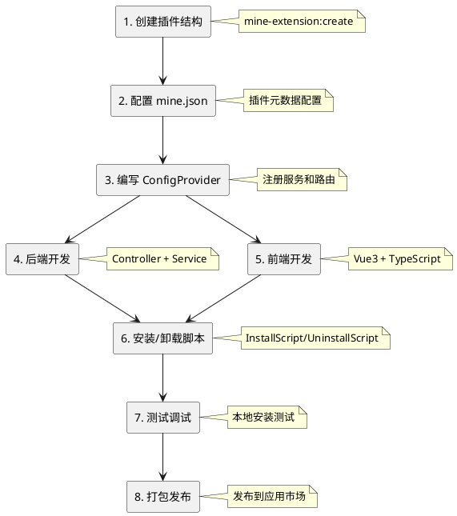

# 插件开发指南

本指南基于实际的 MineAdmin 官方插件代码，详细介绍插件的完整开发流程。

## 开发流程概览



## 插件结构规范

基于 `app-store` 和 `code-generator` 插件的实际代码，MineAdmin 插件有两种典型结构：

### 简单插件结构（适合纯后端或简单功能）

```
plugin/mine-admin/plugin-name/
├── mine.json                      # 插件配置文件
├── install.lock                   # 安装标记（自动生成）
└── src/
    ├── ConfigProvider.php         # 配置提供者
    ├── Controller/                # 控制器
    │   └── IndexController.php
    └── Service/                   # 服务层
        └── Service.php
```

### 完整插件结构（适合复杂业务）

```
plugin/mine-admin/plugin-name/
├── mine.json                      # 插件配置文件
├── install.lock                   # 安装标记（自动生成）
├── README.md                      # 插件说明
├── src/                          # 后端代码
│   ├── ConfigProvider.php        # 配置提供者
│   ├── InstallScript.php         # 安装脚本
│   ├── UninstallScript.php       # 卸载脚本
│   ├── Http/
│   │   ├── Controller/           # 控制器
│   │   ├── Request/              # 请求验证
│   │   └── Vo/                   # 值对象
│   ├── Model/                    # 数据模型
│   ├── Repository/               # 仓储层
│   └── Service/                  # 服务层
├── web/                          # 前端代码
│   ├── index.ts                  # 插件入口
│   ├── api/                      # API接口
│   ├── views/                    # Vue组件
│   └── locales/                  # 语言包
├── Database/                     # 数据库
│   ├── Migrations/               # 迁移文件
│   └── Seeder/                   # 种子数据
├── languages/                    # 后端语言包
│   └── zh_CN/
└── publish/                      # 发布资源
    └── template/                 # 模板文件
```

## 后端开发

### 1. ConfigProvider 配置提供者

基于 app-store 插件的实际实现：

```php
<?php
declare(strict_types=1);

namespace Plugin\MineAdmin\AppStore;

class ConfigProvider
{
    public function __invoke(): array
    {
        return [
            // 注解扫描配置 - 必须配置
            'annotations' => [
                'scan' => [
                    'paths' => [
                        __DIR__,
                    ],
                ],
            ],
            // 依赖注入（可选）
            'dependencies' => [
                // Interface::class => Implementation::class
            ],
            // 命令行（可选）
            'commands' => [
                // Command::class
            ],
            // 中间件（可选）
            'middlewares' => [
                'http' => [
                    // Middleware::class
                ],
            ],
            // 事件监听器（可选）
            'listeners' => [
                // Listener::class
            ],
        ];
    }
}
```

### 2. 控制器开发

参考 app-store 的 IndexController 实现：

```php
<?php
declare(strict_types=1);

namespace Plugin\MineAdmin\AppStore\Controller;

use Hyperf\Di\Annotation\Inject;
use Hyperf\HttpServer\Annotation\Controller;
use Hyperf\HttpServer\Annotation\GetMapping;
use Hyperf\HttpServer\Annotation\PostMapping;
use Mine\Annotation\Auth;
use Mine\Annotation\Permission;
use Mine\Annotation\RemoteState;
use Plugin\MineAdmin\AppStore\Service\Service;
use Psr\Http\Message\ResponseInterface;

#[Controller(prefix: "admin/plugin/store")]
#[Auth]
class IndexController extends AbstractController
{
    #[Inject]
    protected Service $service;

    /**
     * 远程插件列表
     */
    #[GetMapping("index")]
    #[Permission("plugin:store:index")]
    public function index(): ResponseInterface
    {
        return $this->success(
            $this->service->getAppList($this->request->all())
        );
    }

    /**
     * 下载插件
     */
    #[PostMapping("download")]
    #[Permission("plugin:store:download")]
    public function download(): ResponseInterface
    {
        $params = $this->request->all();
        $this->service->download($params);
        return $this->success();
    }

    /**
     * 安装插件
     */
    #[PostMapping("install")]
    #[Permission("plugin:store:install")]
    public function install(): ResponseInterface
    {
        $params = $this->request->all();
        $this->service->install($params);
        return $this->success();
    }

    /**
     * 卸载插件
     */
    #[PostMapping("unInstall")]
    #[Permission("plugin:store:uninstall")]
    public function unInstall(): ResponseInterface
    {
        $params = $this->request->all();
        $this->service->unInstall($params);
        return $this->success();
    }

    /**
     * 本地插件安装列表
     */
    #[GetMapping("getInstallList")]
    #[RemoteState]
    public function getInstallList(): ResponseInterface
    {
        return $this->success(
            $this->service->getLocalAppInstallList()
        );
    }

    /**
     * 本地上传安装
     */
    #[PostMapping("uploadInstall")]
    #[Permission("plugin:store:uploadInstall")]
    public function uploadInstall(): ResponseInterface
    {
        return $this->success(
            $this->service->uploadLocalApp($this->request->all())
        );
    }
}
```

**关键注解说明**：
- `#[Controller]`: 定义控制器路由前缀
- `#[Auth]`: 需要登录验证
- `#[Permission]`: 权限验证
- `#[GetMapping]`/`#[PostMapping]`: 定义路由方法
- `#[Inject]`: 依赖注入
- `#[RemoteState]`: 远程状态管理

### 3. 服务层开发

基于 app-store 的 Service 实现模式：

```php
<?php
declare(strict_types=1);

namespace Plugin\MineAdmin\AppStore\Service;

use App\Service\MineAppStoreService;
use Hyperf\Di\Annotation\Inject;
use Mine\AppStore\Plugin;
use Mine\Exception\MineException;

class Service
{
    #[Inject]
    protected MineAppStoreService $service;

    /**
     * 获取应用列表
     */
    public function getAppList(array $params): array
    {
        return $this->service->getAppList($params);
    }

    /**
     * 下载应用
     */
    public function download(array $params): void
    {
        $app = $this->service->getAppInfo($params['identifier']);
        
        if (empty($app['download_url'])) {
            throw new MineException('该应用无法下载', 500);
        }
        
        if (Plugin::hasLocalInstalled($params['identifier'])) {
            throw new MineException('应用已经存在本地，如需重新下载，请先删除本地应用', 500);
        }
        
        $this->service->download($params);
    }

    /**
     * 安装应用
     */
    public function install(array $params): void
    {
        $pluginName = $params['name'];
        
        if (!Plugin::hasLocal($pluginName)) {
            throw new MineException('插件不存在', 500);
        }
        
        if (Plugin::hasLocalInstalled($pluginName)) {
            throw new MineException('插件已经安装', 500);
        }
        
        Plugin::forceRefreshJsonPath($pluginName);
        Plugin::install($pluginName);
    }

    /**
     * 卸载应用
     */
    public function unInstall(array $params): void
    {
        $pluginName = $params['name'];
        
        if (!Plugin::hasLocalInstalled($pluginName)) {
            throw new MineException('插件未安装', 500);
        }
        
        Plugin::uninstall($pluginName);
    }

    /**
     * 获取本地已安装插件列表
     */
    public function getLocalAppInstallList(): array
    {
        $list = [];
        $plugins = Plugin::getLocalPlugins();
        
        foreach ($plugins as $name => $info) {
            $app = ['identifier' => $name];
            $app['name'] = $info['name'] ?? '未知';
            $app['status'] = $info['status'] ?? false;
            $app['version'] = $info['version'] ?? '0.0.0';
            $app['description'] = $info['description'] ?? '暂无描述';
            $app['created_at'] = $info['created_at'] ?? '';
            $list[] = $app;
        }
        
        return $list;
    }

    /**
     * 本地上传安装
     */
    public function uploadLocalApp(array $params): void
    {
        if (empty($params['path'])) {
            throw new MineException('请上传插件包', 500);
        }
        
        // 解压并验证插件包
        $zipFile = new \ZipArchive();
        $result = $zipFile->open($params['path']);
        
        if ($result !== true) {
            throw new MineException('插件包解压失败', 500);
        }
        
        // 获取插件信息并安装
        $mineJson = $zipFile->getFromName('mine.json');
        if (!$mineJson) {
            throw new MineException('插件包格式错误，缺少mine.json', 500);
        }
        
        $config = json_decode($mineJson, true);
        $pluginName = $config['name'] ?? null;
        
        if (!$pluginName) {
            throw new MineException('插件包配置错误', 500);
        }
        
        // 解压到插件目录
        $targetPath = Plugin::getPluginPath($pluginName);
        $zipFile->extractTo($targetPath);
        $zipFile->close();
        
        // 刷新缓存并安装
        Plugin::forceRefreshJsonPath($pluginName);
        Plugin::install($pluginName);
    }
}
```

### 4. 模型层（如需数据库）

参考 code-generator 插件的模型实现：

```php
<?php
declare(strict_types=1);

namespace Plugin\MineAdmin\CodeGenerator\Model;

use Mine\MineModel;

class SettingGenerateColumns extends MineModel
{
    protected ?string $table = 'setting_generate_columns';
    
    protected array $fillable = [
        'id', 'table_id', 'column_name', 'column_comment',
        'column_type', 'default_value', 'is_nullable',
        'is_pk', 'is_list', 'is_query', 'is_required',
        'is_sort', 'is_edit', 'is_readonly', 'query_type',
        'view_type', 'dict_type', 'extra', 'sort',
        'created_by', 'updated_by', 'created_at', 'updated_at'
    ];
    
    protected array $casts = [
        'is_pk' => 'boolean',
        'is_list' => 'boolean', 
        'is_query' => 'boolean',
        'is_required' => 'boolean',
        'is_sort' => 'boolean',
        'is_edit' => 'boolean',
        'is_readonly' => 'boolean',
    ];
}
```

## 前端开发

### 1. 插件入口文件 (index.ts)

基于 app-store 的前端实现：

```typescript
import type { App } from 'vue'
import type { Plugin } from '#/global'

const pluginConfig: Plugin.PluginConfig = {
  install(app: App) {
    // Vue插件安装钩子
    console.log('app-store plugin install')
  },
  config: {
    enable: true,
    info: {
      name: 'app-store',
      version: '1.0.0',
      author: 'MineAdmin Team',
      description: 'MineAdmin应用市场可视化插件'
    }
  },
  views: [
    {
      name: 'plugin:store',
      path: '/plugin/store',
      meta: {
        title: 'app_store.app_store',
        i18n: true,
        icon: 'material-symbols:app-shortcut',
        type: 'M',
        hidden: false,
        componentPath: '/plugin/mine-admin/app-store/views/index.vue',
        componentName: 'plugin:mine-admin:app-store:index',
      },
      component: () => import('./views/index.vue'),
    }
  ],
}

export default pluginConfig
```

### 2. API 接口封装

```typescript
// api/app-store.ts
import { request } from '@/utils/request'

// 获取远程插件列表
export const getAppList = (params: any) => {
  return request.get('/admin/plugin/store/index', { params })
}

// 下载插件
export const downloadApp = (data: any) => {
  return request.post('/admin/plugin/store/download', data)
}

// 安装插件
export const installApp = (data: any) => {
  return request.post('/admin/plugin/store/install', data)
}

// 卸载插件
export const uninstallApp = (data: any) => {
  return request.post('/admin/plugin/store/unInstall', data)
}

// 获取本地已安装插件
export const getInstalledList = () => {
  return request.get('/admin/plugin/store/getInstallList')
}

// 上传本地插件安装
export const uploadInstall = (data: any) => {
  return request.post('/admin/plugin/store/uploadInstall', data)
}
```

### 3. Vue 组件开发

```vue
<!-- views/index.vue -->
<template>
  <div class="app-store-container">
    <el-tabs v-model="activeTab">
      <el-tab-pane label="应用市场" name="market">
        <AppMarket />
      </el-tab-pane>
      <el-tab-pane label="已安装" name="installed">
        <InstalledApps />
      </el-tab-pane>
      <el-tab-pane label="本地上传" name="upload">
        <LocalUpload />
      </el-tab-pane>
    </el-tabs>
  </div>
</template>

<script setup lang="ts">
import { ref } from 'vue'
import AppMarket from './components/AppMarket.vue'
import InstalledApps from './components/InstalledApps.vue'
import LocalUpload from './components/LocalUpload.vue'

const activeTab = ref('market')
</script>
```

### 4. 国际化支持

```typescript
// locales/zh_CN.ts
export default {
  app_store: {
    app_store: '应用市场',
    app_list: '应用列表',
    installed: '已安装',
    install: '安装',
    uninstall: '卸载',
    download: '下载',
    upload: '上传',
    local_upload: '本地上传',
    upload_tips: '请选择插件包文件（.zip格式）',
  }
}
```

## 安装与卸载脚本

### InstallScript.php

基于 code-generator 插件的实际实现：

```php
<?php
declare(strict_types=1);

namespace Plugin\MineAdmin\CodeGenerator;

use Hyperf\Command\Concerns\InteractsWithIO;
use Hyperf\Context\ApplicationContext;
use Hyperf\Contract\ApplicationInterface;
use Mine\Helper\Filesystem;
use Symfony\Component\Console\Input\ArrayInput;
use Symfony\Component\Console\Output\ConsoleOutput;
use Symfony\Component\Console\Output\NullOutput;

class InstallScript
{
    use InteractsWithIO;

    public function __invoke()
    {
        // 设置输出
        $this->output = new ConsoleOutput();
        
        try {
            $this->info('========================================');
            $this->info('MineAdmin 代码生成器插件');
            $this->info('========================================');
            $this->info('开始安装插件...');
            
            // 1. 复制模板文件
            $this->copyTemplates();
            
            // 2. 复制语言包
            $this->copyLanguages();
            
            // 3. 发布依赖资源
            $this->publishVendor();
            
            // 4. 执行数据库迁移
            $this->runMigrations();
            
            $this->info('插件安装成功！');
            $this->info('========================================');
            
        } catch (\Throwable $e) {
            $this->error('插件安装失败：' . $e->getMessage());
            throw $e;
        }
    }
    
    /**
     * 复制模板文件
     */
    protected function copyTemplates(): void
    {
        $source = dirname(__DIR__) . '/publish/template';
        $target = BASE_PATH . '/runtime/generate/template';
        
        if (!is_dir($target)) {
            mkdir($target, 0755, true);
        }
        
        Filesystem::copy($source, $target, false);
        $this->info('模板文件复制成功');
    }
    
    /**
     * 复制语言包
     */
    protected function copyLanguages(): void
    {
        $source = dirname(__DIR__) . '/languages';
        $target = BASE_PATH . '/storage/languages';
        
        Filesystem::copy($source, $target, false);
        $this->info('语言包复制成功');
    }
    
    /**
     * 发布依赖包资源
     */
    protected function publishVendor(): void
    {
        $app = ApplicationContext::getContainer()->get(ApplicationInterface::class);
        $app->setAutoExit(false);
        
        $input = new ArrayInput([
            'command' => 'vendor:publish',
            'package' => 'hyperf/translation',
        ]);
        
        $app->run($input, new NullOutput());
        $this->info('依赖资源发布成功');
    }
    
    /**
     * 执行数据库迁移
     */
    protected function runMigrations(): void
    {
        $migrationPath = dirname(__DIR__) . '/Database/Migrations';
        
        if (!is_dir($migrationPath)) {
            return;
        }
        
        $app = ApplicationContext::getContainer()->get(ApplicationInterface::class);
        $app->setAutoExit(false);
        
        $input = new ArrayInput([
            'command' => 'migrate',
            '--path' => $migrationPath,
            '--force' => true,
        ]);
        
        $app->run($input, new NullOutput());
        $this->info('数据库迁移执行成功');
    }
}
```

### UninstallScript.php

```php
<?php
declare(strict_types=1);

namespace Plugin\MineAdmin\CodeGenerator;

use Hyperf\Command\Concerns\InteractsWithIO;
use Symfony\Component\Console\Output\ConsoleOutput;

class UninstallScript
{
    use InteractsWithIO;

    public function __invoke()
    {
        $this->output = new ConsoleOutput();
        
        $this->info('========================================');
        $this->info('即将卸载代码生成器插件');
        $this->info('========================================');
        
        try {
            // 清理模板文件
            $this->cleanTemplates();
            
            // 清理语言包
            $this->cleanLanguages();
            
            // 清理数据库（可选，根据需求决定是否清理）
            if ($this->confirm('是否清理数据库表？')) {
                $this->cleanDatabase();
            }
            
            $this->info('插件卸载成功！');
            
        } catch (\Throwable $e) {
            $this->error('插件卸载失败：' . $e->getMessage());
            throw $e;
        }
    }
    
    protected function cleanTemplates(): void
    {
        $templatePath = BASE_PATH . '/runtime/generate/template';
        if (is_dir($templatePath)) {
            // 递归删除目录
            $this->removeDirectory($templatePath);
            $this->info('模板文件清理成功');
        }
    }
    
    protected function cleanLanguages(): void
    {
        // 清理语言包文件
        $langFile = BASE_PATH . '/storage/languages/zh_CN/code-generator.php';
        if (file_exists($langFile)) {
            unlink($langFile);
            $this->info('语言包清理成功');
        }
    }
    
    protected function cleanDatabase(): void
    {
        // 执行数据库清理
        // 注意：这里需要谨慎处理，避免误删用户数据
        $this->info('数据库表清理成功');
    }
    
    private function removeDirectory(string $dir): void
    {
        if (!is_dir($dir)) {
            return;
        }
        
        $files = array_diff(scandir($dir), ['.', '..']);
        foreach ($files as $file) {
            $path = $dir . '/' . $file;
            is_dir($path) ? $this->removeDirectory($path) : unlink($path);
        }
        rmdir($dir);
    }
}
```

## 数据库迁移

基于 code-generator 的迁移文件：

```php
<?php
use Hyperf\Database\Schema\Schema;
use Hyperf\Database\Schema\Blueprint;
use Hyperf\Database\Migrations\Migration;

return new class extends Migration
{
    /**
     * Run the migrations.
     */
    public function up(): void
    {
        Schema::create('setting_generate_tables', function (Blueprint $table) {
            $table->engine = 'InnoDB';
            $table->comment('生成业务表');
            $table->bigIncrements('id')->comment('主键');
            $table->string('table_name', 200)->comment('表名称');
            $table->string('table_comment', 500)->comment('表注释');
            $table->string('module_name', 100)->comment('模块名');
            $table->string('namespace', 255)->comment('命名空间');
            $table->string('menu_name', 100)->comment('菜单名称');
            $table->bigInteger('belong_menu_id')->nullable()->comment('所属菜单');
            $table->string('package_name', 100)->nullable()->comment('包名');
            $table->addColumn('string', 'type', ['length' => 100])->comment('生成类型');
            $table->addColumn('string', 'generate_mode', ['length' => 30])->default('1')->comment('生成方式');
            $table->addColumn('string', 'generate_menus', ['length' => 255])->nullable()->comment('生成菜单列表');
            $table->addColumn('string', 'build_menu', ['length' => 10])->default('1')->comment('构建菜单');
            $table->addColumn('string', 'component_type', ['length' => 30])->default('1')->comment('组件类型');
            $table->json('options')->nullable()->comment('其他配置');
            $table->bigInteger('created_by')->comment('创建者');
            $table->bigInteger('updated_by')->comment('更新者');
            $table->datetimes();
            $table->unique('table_name');
            $table->index('table_name');
        });
    }

    /**
     * Reverse the migrations.
     */
    public function down(): void
    {
        Schema::dropIfExists('setting_generate_tables');
    }
};
```

## 测试与调试

### 1. 本地安装测试

```bash
# 创建插件
php bin/hyperf.php mine-extension:create mine-admin/my-plugin

# 安装插件
php bin/hyperf.php mine-extension:install mine-admin/my-plugin

# 查看已安装插件
php bin/hyperf.php mine-extension:local-list

# 卸载插件
php bin/hyperf.php mine-extension:uninstall mine-admin/my-plugin
```

### 2. 调试技巧

```php
// 在服务层添加日志
use Hyperf\Context\ApplicationContext;
use Psr\Log\LoggerInterface;

$logger = ApplicationContext::getContainer()->get(LoggerInterface::class);
$logger->info('调试信息', ['data' => $data]);

// 使用 dd() 函数调试
dd($variable);

// 使用异常抛出调试
throw new \Exception('调试信息: ' . json_encode($data));
```

### 3. 前端调试

```typescript
// 在浏览器控制台查看
console.log('调试信息', data)

// 使用 Vue DevTools 调试组件状态

// 查看网络请求
// 使用浏览器的 Network 面板查看 API 请求和响应
```

## 开发最佳实践 ⭐

### 1. 代码规范

- **命名规范**：
  - 插件名：`vendor/plugin-name` 格式
  - 命名空间：`Plugin\Vendor\PluginName`
  - 类名：PascalCase
  - 方法名：camelCase

- **PSR规范**：
  - 遵循 PSR-4 自动加载规范
  - 遵循 PSR-12 编码规范

### 2. 目录组织原则

- 后端代码统一放在 `src/` 目录
- 前端代码统一放在 `web/` 目录
- 数据库相关放在 `Database/` 目录
- 静态资源放在 `publish/` 目录
- 语言包放在 `languages/` 和 `web/locales/` 目录

### 3. 配置管理 (重要)

- **不要依赖 ConfigProvider 的 publish 功能**
- **在 InstallScript 中处理所有文件复制和配置发布**
- **在 InstallScript 中执行数据库迁移**
- **在 InstallScript 中进行环境检测**

### 4. 安全考虑

```php
// 参数验证
use Hyperf\Validation\Request\FormRequest;

class StoreRequest extends FormRequest
{
    public function rules(): array
    {
        return [
            'name' => 'required|string|max:100',
            'email' => 'required|email',
        ];
    }
}

// 权限控制
#[Permission("plugin:module:action")]
public function action() {}

// SQL注入防护 - 使用参数绑定
$model->where('name', '=', $name)->get();

// XSS防护 - 前端处理
{{ data | escape }}
```

### 5. 性能优化

```php
// 使用依赖注入减少耦合
#[Inject]
protected Service $service;

// 使用缓存
use Hyperf\Cache\Annotation\Cacheable;

#[Cacheable(prefix: "plugin", ttl: 3600)]
public function getData() {}

// 路由懒加载
component: () => import('./views/index.vue')

// 数据库查询优化
$query->select(['id', 'name'])->with('relation')->limit(20);
```

### 6. 错误处理

```php
use Mine\Exception\MineException;

// 业务异常
if (!$condition) {
    throw new MineException('错误信息', 500);
}

// try-catch 处理
try {
    // 业务逻辑
} catch (\Throwable $e) {
    $this->logger->error('操作失败', [
        'error' => $e->getMessage(),
        'trace' => $e->getTraceAsString()
    ]);
    throw new MineException('操作失败: ' . $e->getMessage());
}
```

## 常见问题解决

### Q: 插件安装后无法访问？
A: 
1. 检查 ConfigProvider 的 annotations 配置是否正确
2. 确认控制器的 #[Controller] 注解路由前缀
3. 检查权限注解 #[Permission] 是否已在系统中配置

### Q: 配置文件没有发布？
A: ConfigProvider 的 publish 功能在插件中不可靠，请在 InstallScript 中手动处理配置发布。

### Q: 数据库迁移失败？
A: 
1. 检查数据库连接配置
2. 确认迁移文件路径正确
3. 查看迁移命令的错误输出

### Q: 前端组件不显示？
A: 
1. 检查 web/index.ts 的路由配置
2. 确认组件路径正确
3. 查看浏览器控制台错误信息

### Q: 依赖包冲突？
A: 
1. 在 mine.json 中正确配置 composer 依赖版本约束
2. 使用 `composer update` 更新依赖
3. 检查与主项目的依赖兼容性

## 相关文档

- [插件结构详解](./structure.md)
- [生命周期管理](./lifecycle.md)
- [API 参考文档](./api.md)
- [示例代码](./examples.md)
- [mine.json 配置](./mineJson.md)
- [ConfigProvider 说明](./configProvider.md)