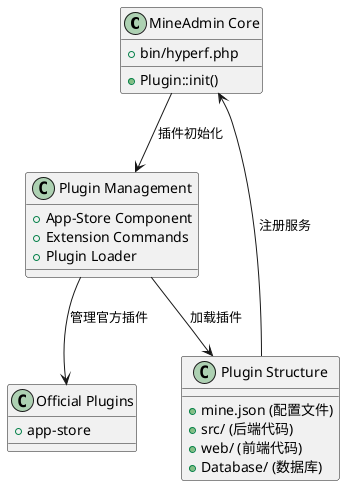

# MineAdmin 插件系统

MineAdmin 插件系统提供了强大的扩展能力，允许开发者创建可复用的功能模块，实现系统的模块化和可扩展性。

## 插件系统架构

MineAdmin 的插件系统基于 Hyperf 框架的 ConfigProvider 机制，提供了完整的插件生命周期管理和自动化部署能力。



## 核心组件

### 1. 插件加载器
- **文件**: `bin/hyperf.php` ([GitHub](https://github.com/mineadmin/mineadmin/blob/master/bin/hyperf.php))
- **原理**: 通过 `Plugin::init()` 方法在应用启动时自动加载所有已安装的插件
- **实现**: 扫描 `plugin/` 目录下的所有插件并注册其 ConfigProvider

### 2. App-Store 组件
- **仓库**: [mineadmin/appstore](https://github.com/mineadmin/appstore)
- **功能**: 提供插件的下载、安装、卸载、更新等管理功能
- **配置**: 通过 `ConfigProvider` 注册服务和配置

### 3. 插件配置系统
- **核心文件**: `mine.json` 
- **原理**: 定义插件的元数据、依赖关系、安装脚本等信息
- **加载**: 在插件安装时解析并注册到系统中

## 官方插件

MineAdmin 默认提供以下官方插件：

| 插件名称 | 功能描述 | 仓库地址 |
|---------|----------|----------|
| app-store | 应用市场管理插件，提供插件的下载、安装、卸载、更新等管理功能 | [GitHub](https://github.com/mineadmin/appstore) |

> 注：其他插件如代码生成器、定时任务管理等可通过应用市场获取或自行开发

## 插件类型

MineAdmin 支持三种类型的插件：

### Mixed (混合型插件)
包含前端和后端完整功能的插件，提供完整的业务模块。

### Backend (后端插件) 
仅包含后端逻辑的插件，主要提供 API 服务和业务逻辑。

### Frontend (前端插件)
仅包含前端界面的插件，主要提供用户界面组件。

## 快速开始

### 环境准备

开发 MineAdmin 插件需要：

1. **熟悉技术栈**：MineAdmin 和 Hyperf 框架
2. **获取 AccessToken**：
   - 登录 [MineAdmin 官网](https://www.mineadmin.com/login)
   - 进入个人中心 → [设置页面](https://www.mineadmin.com/member/setting)
   - 获取 AccessToken

3. **配置环境变量**：
```ini
# .env 文件
MINE_ACCESS_TOKEN=你的AccessToken
```

::: warning 注意
请妥善保管 AccessToken，避免泄露！
:::

### 开发者认证

- **本地开发**：无需认证，可自由开发和分发
- **应用市场发布**：需要开发者认证，联系 MineAdmin 团队开通权限

## 相关文档

- [快速入门指南](./guide.md) - 创建第一个插件
- [开发指南](./develop.md) - 详细开发流程
- [插件结构](./structure.md) - 目录结构规范
- [生命周期管理](./lifecycle.md) - 安装卸载流程
- [API 参考](./api.md) - 接口文档
- [示例代码](./examples.md) - 实际案例