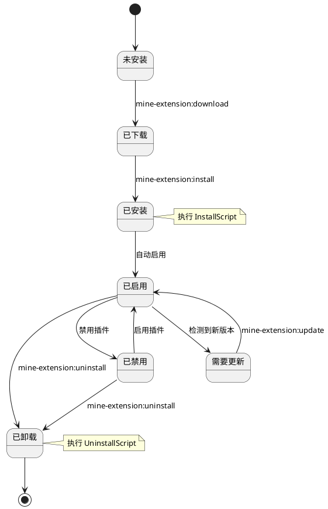
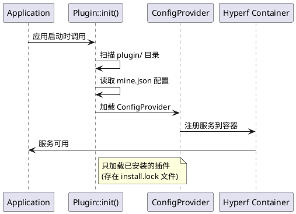
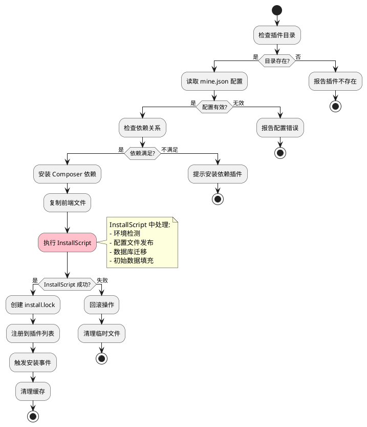
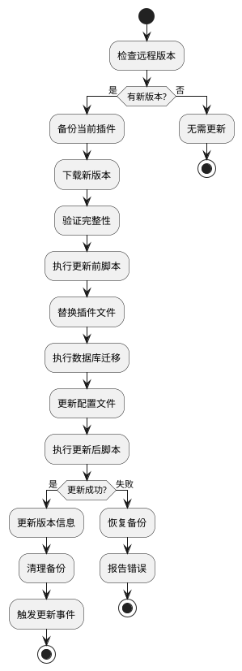
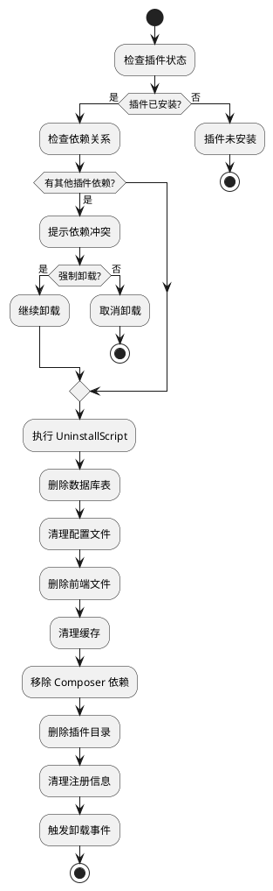

# 插件生命周期管理

详细介绍 MineAdmin 插件的生命周期管理，包括安装、启用、禁用、更新和卸载的完整流程。

## 生命周期概览

MineAdmin 插件的生命周期包括以下几个阶段：



## 插件发现与加载

### 1. 插件发现机制

**核心实现**: `Plugin::init()` 方法在 `bin/hyperf.php` ([GitHub](https://github.com/mineadmin/mineadmin/blob/master/bin/hyperf.php)) 中调用



### 2. 加载过程详解

1. **扫描插件目录**: 遍历 `plugin/` 目录下的所有子目录
2. **检查安装状态**: 验证是否存在 `install.lock` 文件
3. **读取配置**: 解析 `mine.json` 配置文件
4. **加载 ConfigProvider**: 注册插件服务到 Hyperf 容器
5. **注册路由**: 自动注册控制器路由
6. **加载中间件**: 注册插件中间件
7. **注册事件监听器**: 加载事件监听器

## 下载阶段

### 命令使用

```bash
# 下载指定插件
php bin/hyperf.php mine-extension:download --name plugin-name

# 查看可下载的插件列表
php bin/hyperf.php mine-extension:list
```

### 下载过程

1. **验证 AccessToken**: 检查 `MINE_ACCESS_TOKEN` 环境变量
2. **请求远程仓库**: 从 MineAdmin 官方仓库获取插件信息
3. **下载插件包**: 下载压缩包到本地临时目录
4. **解压文件**: 解压到 `plugin/vendor/plugin-name/` 目录
5. **验证完整性**: 检查 `mine.json` 文件是否存在且格式正确

### 实现原理

**核心服务**: App-Store 组件 ([GitHub](https://github.com/mineadmin/appstore)) 提供下载功能

```php
// 伪代码示例
class DownloadService 
{
    public function download(string $pluginName): bool
    {
        // 1. 验证访问令牌
        $this->validateAccessToken();
        
        // 2. 获取插件信息
        $pluginInfo = $this->getPluginInfo($pluginName);
        
        // 3. 下载插件包
        $packagePath = $this->downloadPackage($pluginInfo['download_url']);
        
        // 4. 解压到目标目录
        $this->extractPackage($packagePath, $this->getPluginPath($pluginName));
        
        return true;
    }
}
```

## 安装阶段

### 命令使用

```bash
# 安装插件
php bin/hyperf.php mine-extension:install vendor/plugin-name --yes

# 强制重新安装
php bin/hyperf.php mine-extension:install vendor/plugin-name --force
```

### 安装流程详解

> ⚠️ **重要提示**: 配置文件发布、环境检测和数据库迁移应在 `InstallScript` 中处理，而不是依赖 ConfigProvider 的 publish 功能。



### 1. 前置检查

```php
// 安装前检查逻辑
class InstallChecker
{
    public function check(string $pluginPath): array
    {
        $errors = [];
        
        // 检查插件目录
        if (!is_dir($pluginPath)) {
            $errors[] = '插件目录不存在';
        }
        
        // 检查 mine.json
        $configPath = $pluginPath . '/mine.json';
        if (!file_exists($configPath)) {
            $errors[] = 'mine.json 配置文件不存在';
        }
        
        // 检查依赖关系
        $config = json_decode(file_get_contents($configPath), true);
        foreach ($config['require'] ?? [] as $dependency => $version) {
            if (!$this->isDependencyMet($dependency, $version)) {
                $errors[] = "依赖 {$dependency} 版本 {$version} 不满足";
            }
        }
        
        return $errors;
    }
}
```

### 2. Composer 依赖安装

安装过程会处理插件的 Composer 依赖：

```json
// mine.json 中的 composer 配置
{
  "composer": {
    "require": {
      "hyperf/async-queue": "^3.0",
      "symfony/console": "^6.0"
    },
    "psr-4": {
      "Plugin\\Vendor\\PluginName\\": "src"
    }
  }
}
```

系统会自动执行：
```bash
composer require hyperf/async-queue:^3.0 symfony/console:^6.0
```

### 3. InstallScript 处理 ⭐

> **最佳实践**: 数据库迁移、配置发布和环境检测应在 `InstallScript` 中处理：

```php
// 在 InstallScript 中处理所有安装逻辑
class InstallScript
{
    public function handle(): bool
    {
        // 1. 环境检测
        if (!$this->checkEnvironment()) {
            echo "环境不满足要求\n";
            return false;
        }
        
        // 2. 发布配置文件（不使用 ConfigProvider 的 publish）
        $this->publishConfig();
        
        // 3. 执行数据库迁移
        if (!$this->runMigrations()) {
            echo "数据库迁移失败\n";
            return false;
        }
        
        // 4. 初始化数据
        $this->seedData();
        
        return true;
    }
    
    private function publishConfig(): void
    {
        $source = __DIR__ . '/../publish/config/plugin.php';
        $target = BASE_PATH . '/config/autoload/plugin.php';
        
        if (!file_exists($target)) {
            copy($source, $target);
            echo "配置文件已发布\n";
        }
    }
    
    private function runMigrations(): bool
    {
        $migrationPath = __DIR__ . '/../Database/Migrations';
        
        if (is_dir($migrationPath)) {
            // 使用 Hyperf 的迁移命令
            $container = \Hyperf\Context\ApplicationContext::getContainer();
            $application = $container->get(\Hyperf\Contract\ApplicationInterface::class);
            
            $input = new \Symfony\Component\Console\Input\ArrayInput([
                'command' => 'migrate',
                '--path' => $migrationPath,
            ]);
            
            $output = new \Symfony\Component\Console\Output\BufferedOutput();
            $exitCode = $application->run($input, $output);
            
            return $exitCode === 0;
        }
        
        return true;
    }
}
```

### 4. 前端文件复制

将 `web/` 目录下的文件复制到前端项目：

```
plugin/vendor/plugin-name/web/    →    前端项目对应目录
├── views/example.vue             →    src/views/plugin/vendor/plugin-name/example.vue
├── components/ExampleComp.vue    →    src/components/plugin/vendor/plugin-name/ExampleComp.vue
└── api/example.js                →    src/api/plugin/vendor/plugin-name/example.js
```

### 5. 配置文件发布 ⚠️

> **注意**: ConfigProvider 中的 `publish` 功能在插件系统中不可靠，应在 InstallScript 中手动处理：

```php
// 不推荐：ConfigProvider 中的 publish 可能不生效
'publish' => [
    // 这种方式在插件中可能不会执行
]

// 推荐：在 InstallScript 中手动发布
protected function publishConfig(): void
{
    $configs = [
        [
            'source' => __DIR__ . '/../publish/config/plugin.php',
            'target' => BASE_PATH . '/config/autoload/plugin.php',
        ],
        [
            'source' => __DIR__ . '/../publish/config/routes.php',
            'target' => BASE_PATH . '/config/routes/plugin.php',
        ],
    ];
    
    foreach ($configs as $config) {
        if (!file_exists($config['target'])) {
            copy($config['source'], $config['target']);
            echo "配置文件已发布: {$config['target']}\n";
        }
    }
}
```

### 6. 创建安装锁文件

安装成功后创建 `install.lock` 文件标记安装状态：

```
plugin/vendor/plugin-name/install.lock
```

文件内容包含安装信息：
```json
{
  "installed_at": "2024-01-01 12:00:00",
  "version": "1.0.0",
  "installer": "admin",
  "checksum": "abc123..."
}
```

## 启用/禁用管理

### 插件状态控制

MineAdmin 支持在不卸载插件的情况下临时禁用插件：

```bash
# 禁用插件
php bin/hyperf.php mine-extension:disable vendor/plugin-name

# 启用插件  
php bin/hyperf.php mine-extension:enable vendor/plugin-name

# 查看插件状态
php bin/hyperf.php mine-extension:status vendor/plugin-name
```

### 状态管理机制

状态信息存储在 `install.lock` 文件中：

```json
{
  "installed_at": "2024-01-01 12:00:00",
  "version": "1.0.0",
  "status": "enabled",  // enabled | disabled
  "disabled_at": null,
  "disabled_reason": null
}
```

## 更新阶段

### 更新检查

```bash
# 检查插件更新
php bin/hyperf.php mine-extension:check-updates

# 更新指定插件
php bin/hyperf.php mine-extension:update vendor/plugin-name

# 更新所有插件
php bin/hyperf.php mine-extension:update-all
```

### 更新流程



### 版本兼容性处理

更新时会检查版本兼容性：

```php
class UpdateManager
{
    public function checkCompatibility(string $currentVersion, string $newVersion): bool
    {
        // 检查主版本兼容性
        $current = $this->parseVersion($currentVersion);
        $new = $this->parseVersion($newVersion);
        
        // 主版本不同时可能存在破坏性更新
        if ($current['major'] !== $new['major']) {
            return $this->checkBreakingChanges($currentVersion, $newVersion);
        }
        
        return true;
    }
}
```

## 卸载阶段

### 命令使用

```bash
# 卸载插件
php bin/hyperf.php mine-extension:uninstall vendor/plugin-name --yes

# 强制卸载 (忽略错误)
php bin/hyperf.php mine-extension:uninstall vendor/plugin-name --force
```

### 卸载流程



### 卸载脚本执行

```php
// UninstallScript 示例
class UninstallScript
{
    public function handle(): bool
    {
        try {
            // 1. 清理数据库
            $this->cleanDatabase();
            
            // 2. 清理配置文件
            $this->cleanConfigFiles();
            
            // 3. 清理缓存数据
            $this->cleanCache();
            
            // 4. 清理日志文件
            $this->cleanLogs();
            
            // 5. 执行自定义清理逻辑
            $this->customCleanup();
            
            return true;
        } catch (\Exception $e) {
            logger()->error('插件卸载失败: ' . $e->getMessage());
            return false;
        }
    }
    
    private function cleanDatabase(): void
    {
        // 删除插件相关表
        DB::statement('DROP TABLE IF EXISTS plugin_example');
        
        // 清理配置数据
        DB::table('system_config')->where('key', 'like', 'plugin.example.%')->delete();
    }
}
```

## 错误处理与回滚

### 安装错误回滚

如果安装过程中出现错误，系统会自动回滚：

```php
class InstallRollback
{
    public function rollback(string $pluginPath, array $operations): void
    {
        foreach (array_reverse($operations) as $operation) {
            try {
                switch ($operation['type']) {
                    case 'database':
                        $this->rollbackDatabase($operation['data']);
                        break;
                    case 'files':
                        $this->rollbackFiles($operation['data']);
                        break;
                    case 'config':
                        $this->rollbackConfig($operation['data']);
                        break;
                }
            } catch (\Exception $e) {
                logger()->error('回滚操作失败: ' . $e->getMessage());
            }
        }
    }
}
```

### 依赖冲突处理

当插件之间存在依赖冲突时的处理策略：

```php
class DependencyResolver
{
    public function resolveConflicts(array $conflicts): array
    {
        $solutions = [];
        
        foreach ($conflicts as $conflict) {
            $solution = match($conflict['type']) {
                'version_conflict' => $this->resolveVersionConflict($conflict),
                'circular_dependency' => $this->resolveCircularDependency($conflict),
                'missing_dependency' => $this->resolveMissingDependency($conflict),
                default => null
            };
            
            if ($solution) {
                $solutions[] = $solution;
            }
        }
        
        return $solutions;
    }
}
```

## 事件系统

插件生命周期的各个阶段都会触发相应事件：

### 事件列表

```php
// 插件生命周期事件
class PluginEvents
{
    const BEFORE_INSTALL = 'plugin.before_install';
    const AFTER_INSTALL = 'plugin.after_install';
    const BEFORE_UNINSTALL = 'plugin.before_uninstall';
    const AFTER_UNINSTALL = 'plugin.after_uninstall';
    const BEFORE_UPDATE = 'plugin.before_update';
    const AFTER_UPDATE = 'plugin.after_update';
    const ENABLED = 'plugin.enabled';
    const DISABLED = 'plugin.disabled';
}
```

### 事件监听器示例

```php
use Hyperf\Event\Annotation\Listener;
use Hyperf\Event\Contract\ListenerInterface;

#[Listener]
class PluginInstallListener implements ListenerInterface
{
    public function listen(): array
    {
        return [
            PluginEvents::AFTER_INSTALL,
        ];
    }

    public function process(object $event): void
    {
        // 插件安装后的处理逻辑
        logger()->info('插件安装完成', [
            'plugin' => $event->getPluginName(),
            'version' => $event->getVersion()
        ]);
        
        // 清理缓存
        $this->clearCache($event->getPluginName());
        
        // 发送通知
        $this->sendNotification($event);
    }
}
```

## 状态查询

### 查看插件状态

```bash
# 查看所有本地插件状态
php bin/hyperf.php mine-extension:local-list

# 查看远程可用插件
php bin/hyperf.php mine-extension:list

# 查看特定插件详情
php bin/hyperf.php mine-extension:info vendor/plugin-name
```

### 状态信息结构

```json
{
  "name": "vendor/plugin-name",
  "version": "1.0.0",
  "status": "enabled",
  "installed_at": "2024-01-01 12:00:00",
  "last_updated": "2024-01-15 10:30:00",
  "dependencies": [
    "vendor/dependency-plugin"
  ],
  "dependents": [
    "vendor/dependent-plugin"
  ],
  "file_integrity": "valid",
  "database_status": "migrated"
}
```

## 最佳实践

### 1. 安装脚本设计

- 实现幂等性：多次执行结果一致
- 提供详细的错误信息
- 支持事务回滚
- 记录操作日志

### 2. 卸载脚本设计  

- 完全清理插件数据
- 保留用户重要数据的备份选项
- 处理依赖关系
- 优雅降级

### 3. 版本管理

- 遵循语义化版本规范
- 提供升级路径说明
- 标注破坏性更新
- 维护更新日志

## 相关文档

- [插件开发指南](./develop.md) - 开发流程
- [插件结构说明](./structure.md) - 目录结构
- [API 参考](./api.md) - 接口文档
- [示例代码](./examples.md) - 实践案例