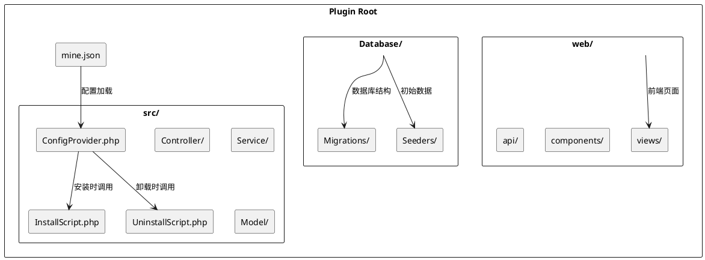

# 插件目录结构

详细介绍 MineAdmin 插件的标准目录结构、文件规范和组织方式。

## 标准目录结构

一个完整的 MineAdmin 插件目录结构如下：

```
plugin/vendor/plugin-name/           # 插件根目录
├── mine.json                        # 插件核心配置文件 ⭐
├── README.md                        # 插件说明文档
├── LICENSE                          # 许可证文件
├── composer.json                    # Composer 依赖配置 (可选)
├── src/                            # 后端源码目录 ⭐
│   ├── ConfigProvider.php          # 配置提供者 ⭐
│   ├── InstallScript.php           # 安装脚本 ⭐
│   ├── UninstallScript.php         # 卸载脚本 ⭐
│   ├── Controller/                 # 控制器目录
│   │   ├── AdminController.php     # 管理员控制器
│   │   └── ApiController.php       # API 控制器
│   ├── Service/                    # 服务层目录
│   │   └── ExampleService.php      # 业务服务类
│   ├── Repository/                 # 仓库层目录
│   │   └── ExampleRepository.php   # 数据仓库类
│   ├── Model/                      # 模型目录
│   │   └── Example.php             # 数据模型
│   ├── Request/                    # 请求验证目录
│   │   ├── CreateRequest.php       # 创建请求验证
│   │   └── UpdateRequest.php       # 更新请求验证
│   ├── Resource/                   # 资源转换目录
│   │   └── ExampleResource.php     # 资源转换类
│   ├── Middleware/                 # 中间件目录
│   │   └── ExampleMiddleware.php   # 自定义中间件
│   ├── Command/                    # 命令行目录
│   │   └── ExampleCommand.php      # 自定义命令
│   ├── Listener/                   # 事件监听器目录
│   │   └── ExampleListener.php     # 事件监听器
│   └── Exception/                  # 异常处理目录
│       └── ExampleException.php    # 自定义异常
├── web/                            # 前端源码目录 ⭐
│   ├── views/                      # 页面组件目录
│   │   ├── index.vue               # 主页面
│   │   ├── list.vue                # 列表页面
│   │   └── form.vue                # 表单页面
│   ├── components/                 # 公共组件目录
│   │   └── ExampleComponent.vue    # 通用组件
│   ├── api/                        # API 接口目录
│   │   └── example.js              # 接口定义
│   ├── router/                     # 路由配置目录
│   │   └── index.js                # 路由配置
│   ├── store/                      # 状态管理目录
│   │   └── example.js              # 状态管理
│   └── assets/                     # 静态资源目录
│       ├── images/                 # 图片资源
│       └── styles/                 # 样式文件
├── Database/                       # 数据库相关目录 ⭐
│   ├── Migrations/                 # 数据库迁移文件
│   │   └── 2024_01_01_000000_create_example_table.php
│   └── Seeders/                    # 数据填充文件
│       └── ExampleSeeder.php       # 数据填充类
├── config/                         # 配置文件目录
│   └── example.php                 # 插件配置文件
├── publish/                        # 发布文件目录
│   ├── config/                     # 配置文件模板
│   │   └── example.php             # 配置文件模板
│   └── assets/                     # 静态资源模板
├── tests/                          # 测试文件目录
│   ├── Unit/                       # 单元测试
│   ├── Feature/                    # 功能测试
│   └── TestCase.php                # 测试基类
├── docs/                           # 文档目录
│   ├── installation.md             # 安装文档
│   ├── usage.md                    # 使用文档
│   └── api.md                      # API 文档
└── .gitignore                      # Git 忽略文件
```

## 核心文件详解

### 1. mine.json (插件配置文件)

**文件路径**: `mine.json` ([配置详解](./mineJson.md))

插件的核心配置文件，定义插件的基本信息、依赖关系和加载配置：

```json
{
  "name": "vendor/plugin-name",
  "description": "插件描述",
  "version": "1.0.0",
  "type": "mixed",
  "author": [
    {
      "name": "Author Name",
      "email": "author@example.com",
      "role": "developer"
    }
  ],
  "keywords": ["mineadmin", "plugin"],
  "homepage": "https://github.com/vendor/plugin-name",
  "license": "MIT",
  "require": {
    "php": ">=8.1",
    "hyperf/framework": "^3.0"
  },
  "package": {
    "dependencies": {
      "vue": "^3.0",
      "element-plus": "^2.0"
    }
  },
  "composer": {
    "require": {
      "hyperf/async-queue": "^3.0"
    },
    "psr-4": {
      "Plugin\\Vendor\\PluginName\\": "src"
    },
    "config": "Plugin\\Vendor\\PluginName\\ConfigProvider"
  }
}
```

### 2. ConfigProvider.php (配置提供者)

**文件路径**: `src/ConfigProvider.php`
**实现原理**: 基于 Hyperf ConfigProvider 机制 ([GitHub](https://github.com/hyperf/hyperf/blob/master/src/config-provider/src/ConfigProvider.php))

> ⚠️ **注意**: ConfigProvider 中的 `publish` 功能在插件系统中存在问题，建议在 InstallScript 中处理配置文件发布。

```php
<?php

namespace Plugin\Vendor\PluginName;

class ConfigProvider
{
    public function __invoke(): array
    {
        return [
            'dependencies' => [],
            'annotations' => [
                'scan' => [
                    'paths' => [__DIR__],
                ],
            ],
            'commands' => [],
            'listeners' => [],
            // publish 功能在插件中不推荐使用
            // 请在 InstallScript 中处理配置文件发布
        ];
    }
}
```

### 3. InstallScript.php (安装脚本) ⭐

**文件路径**: `src/InstallScript.php`
**调用时机**: 执行 `mine-extension:install` 命令时
**重要性**: 推荐在此处理配置发布、环境检测和数据库迁移

```php
<?php

namespace Plugin\Vendor\PluginName;

use Hyperf\Contract\ApplicationInterface;
use Hyperf\Database\Commands\Migrations\MigrateCommand;

class InstallScript
{
    public function handle(): bool
    {
        // 1. 检测环境依赖
        if (!$this->checkEnvironment()) {
            echo "环境检测失败\n";
            return false;
        }
        
        // 2. 发布配置文件
        $this->publishConfig();
        
        // 3. 执行数据库迁移
        $this->runMigrations();
        
        // 4. 初始化数据
        $this->seedData();
        
        echo "插件安装成功\n";
        return true;
    }
    
    protected function checkEnvironment(): bool
    {
        // 检查 PHP 版本
        if (version_compare(PHP_VERSION, '8.1.0', '<')) {
            echo "PHP 版本需要 >= 8.1\n";
            return false;
        }
        
        // 检查必要的扩展
        $requiredExtensions = ['redis', 'pdo', 'json'];
        foreach ($requiredExtensions as $ext) {
            if (!extension_loaded($ext)) {
                echo "缺少 PHP 扩展: {$ext}\n";
                return false;
            }
        }
        
        return true;
    }
    
    protected function publishConfig(): void
    {
        $source = __DIR__ . '/../publish/config/plugin.php';
        $target = BASE_PATH . '/config/autoload/plugin.php';
        
        if (!file_exists($target)) {
            copy($source, $target);
            echo "配置文件已发布: {$target}\n";
        }
    }
    
    protected function runMigrations(): void
    {
        $migrationPath = __DIR__ . '/../Database/Migrations';
        
        if (is_dir($migrationPath)) {
            // 执行迁移命令
            $container = \Hyperf\Context\ApplicationContext::getContainer();
            $application = $container->get(ApplicationInterface::class);
            $application->setAutoExit(false);
            
            $input = new \Symfony\Component\Console\Input\ArrayInput([
                'command' => 'migrate',
                '--path' => $migrationPath,
            ]);
            
            $output = new \Symfony\Component\Console\Output\BufferedOutput();
            $application->run($input, $output);
            
            echo "数据库迁移完成\n";
        }
    }
    
    protected function seedData(): void
    {
        // 初始化默认数据
        // 例如创建默认配置、菜单等
    }
}
```

### 4. UninstallScript.php (卸载脚本) ⭐

**文件路径**: `src/UninstallScript.php`
**调用时机**: 执行 `mine-extension:uninstall` 命令时
**重要性**: 清理配置文件、数据表和相关资源

```php
<?php

namespace Plugin\Vendor\PluginName;

use Hyperf\DbConnection\Db;

class UninstallScript
{
    public function handle(): bool
    {
        // 1. 备份重要数据（可选）
        $this->backupData();
        
        // 2. 删除数据库表
        $this->dropTables();
        
        // 3. 清理配置文件
        $this->removeConfig();
        
        // 4. 清理缓存
        $this->clearCache();
        
        echo "插件卸载完成\n";
        return true;
    }
    
    protected function backupData(): void
    {
        // 备份重要数据到指定目录
        $backupPath = BASE_PATH . '/runtime/backup/plugin_' . date('YmdHis') . '.sql';
        // 实现备份逻辑
    }
    
    protected function dropTables(): void
    {
        // 删除插件创建的数据表
        $tables = ['plugin_example_table', 'plugin_settings'];
        
        foreach ($tables as $table) {
            if (Db::schema()->hasTable($table)) {
                Db::schema()->drop($table);
                echo "已删除数据表: {$table}\n";
            }
        }
    }
    
    protected function removeConfig(): void
    {
        $configFile = BASE_PATH . '/config/autoload/plugin.php';
        
        if (file_exists($configFile)) {
            unlink($configFile);
            echo "配置文件已删除: {$configFile}\n";
        }
    }
    
    protected function clearCache(): void
    {
        // 清理插件相关缓存
        $redis = \Hyperf\Context\ApplicationContext::getContainer()
            ->get(\Hyperf\Redis\Redis::class);
        
        $redis->del('plugin:cache:*');
        echo "缓存已清理\n";
    }
}
```

## 目录结构图解



## 不同类型插件的结构差异

### Mixed (混合型插件)
包含完整的 `src/` 和 `web/` 目录，提供前后端完整功能。

### Backend (后端插件)
只包含 `src/` 目录，专注于提供 API 服务和业务逻辑：

```
plugin/vendor/backend-plugin/
├── mine.json
├── src/
│   ├── ConfigProvider.php
│   ├── Controller/
│   ├── Service/
│   └── Model/
└── Database/
```

### Frontend (前端插件)
只包含 `web/` 目录，专注于前端界面和交互：

```
plugin/vendor/frontend-plugin/
├── mine.json
├── web/
│   ├── views/
│   ├── components/
│   └── assets/
└── src/
    └── ConfigProvider.php  # 最小配置
```

## 命名规范

### 1. 目录命名
- 使用小写字母和连字符：`user-management`
- 避免使用下划线和空格

### 2. 文件命名
- PHP 类文件使用 PascalCase：`UserController.php`
- Vue 组件使用 PascalCase：`UserList.vue`
- 配置文件使用小写：`user.php`

### 3. 命名空间规范
遵循 PSR-4 自动加载标准：

```php
// 插件路径: plugin/mineadmin/user-manager/
// 命名空间: Plugin\MineAdmin\UserManager\
namespace Plugin\MineAdmin\UserManager\Controller;
```

## 文件权限和安全

### 1. 文件权限设置
```bash
# 设置合适的文件权限
find plugin/ -type f -name "*.php" -exec chmod 644 {} \;
find plugin/ -type d -exec chmod 755 {} \;
```

### 2. 安全注意事项
- 敏感配置使用环境变量
- 避免在代码中硬编码密钥
- 验证和过滤用户输入
- 使用 HTTPS 传输敏感数据

## 最佳实践

### 1. 文件组织
- 按功能模块组织代码
- 保持目录结构清晰
- 使用有意义的文件名

### 2. 代码规范
- 遵循 PSR-12 编码标准
- 添加适当的注释
- 使用类型声明

### 3. 版本控制
- 使用 `.gitignore` 排除不必要的文件
- 创建清晰的提交信息
- 使用语义化版本号

## 示例项目结构

查看官方插件的实际结构：

**App-Store 插件**:  MineAdmin 官方应用市场插件，展示了标准的混合型插件结构

## 常见问题

### Q: 插件目录应该放在哪里？
A: 插件应该放在项目根目录的 `plugin/` 目录下，按 `vendor/plugin-name` 格式组织。

### Q: 如何处理插件之间的依赖？
A: 在 `mine.json` 的 `require` 字段中声明依赖的其他插件。

### Q: 前端文件安装后放在哪里？
A: `web/` 目录下的文件会在安装时复制到前端项目的对应位置。

### Q: 数据库迁移文件如何执行？
A: 在 `InstallScript.php` 中调用迁移执行逻辑，或使用 Hyperf 的迁移命令。