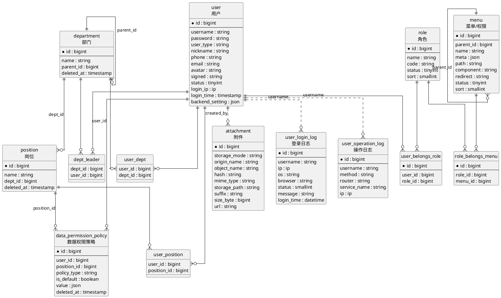

# 数据模型契约

数据模型契约定义 MineAdmin 后端实现之间共享的核心实体、字段语义和关联关系。不同框架可以使用不同 ORM 或数据访问方式，但对外暴露给前台模板、权限系统、接口元数据和审计日志的模型含义需要保持一致。

本文依据 MineAdmin 当前迁移文件和模型关系整理，重点覆盖管理后台稳定依赖的实体。

## 核心实体

| 实体 | 表 | 作用 |
|------|----|------|
| 用户 | `user` | 后台账号主体，保存登录凭据、用户类型、昵称、联系方式、头像、状态、最后登录 IP/时间、后台个人设置和审计创建/更新人。 |
| 角色 | `role` | 权限分组主体，保存角色名称、唯一角色代码、状态和排序；用户通过角色获得菜单、按钮和接口权限。 |
| 菜单/权限 | `menu` | 前台路由、菜单树和权限标识的统一载体；`parent_id` 组织菜单层级，`path`、`component`、`redirect` 和 `meta` 支撑前台渲染，`name` 参与权限判断。 |
| 部门 | `department` | 组织树节点，通过 `parent_id` 表达上下级部门；用于用户归属、部门负责人和数据权限范围计算。 |
| 岗位 | `position` | 部门下的岗位节点，通过 `dept_id` 归属部门；用户可以关联多个岗位，岗位也可以承载数据权限策略。 |
| 数据权限策略 | `data_permission_policy` | 数据范围控制规则，按当前迁移通过 `user_id` 或 `position_id` 绑定到用户或岗位，使用 `policy_type` 和 `value` 描述部门、自定义范围或函数规则。 |
| 附件 | `attachment` | 上传文件索引，记录存储模式、原始文件名、对象名、哈希、MIME、存储路径、后缀、大小、访问 URL 和审计创建/更新人；前台文件选择、预览和下载能力依赖该实体。 |
| 登录日志 | `user_login_log` | 登录审计记录，保存用户名、登录 IP、操作系统、浏览器、登录状态、提示消息和登录时间，用于安全审计和登录轨迹查询。 |
| 操作日志 | `user_operation_log` | 操作审计记录，保存用户名、请求方法、路由、业务名称、请求 IP 和时间信息，用于追踪后台功能调用和问题排查。 |

## 关联表

| 关联表 | 关系 | 说明 |
|--------|------|------|
| `user_belongs_role` | 用户 N:N 角色 | 一个用户可以拥有多个角色，一个角色可以分配给多个用户。 |
| `role_belongs_menu` | 角色 N:N 菜单 | 一个角色可以拥有多个菜单/权限，一个菜单/权限也可以授权给多个角色。 |
| `user_dept` | 用户 N:N 部门 | 一个用户可以归属多个部门，用于组织展示和数据权限上下文。 |
| `user_position` | 用户 N:N 岗位 | 一个用户可以拥有多个岗位，岗位策略可作为用户策略的后备来源。 |
| `dept_leader` | 部门 N:N 负责人用户 | 一个部门可以配置多个负责人，一个用户也可以负责多个部门。 |

## 关系约定

- 用户与角色通过 `user_belongs_role` 多对多关联；用户权限由角色关联的菜单/权限集合汇总而来。
- 角色与菜单通过 `role_belongs_menu` 多对多关联；菜单树由 `menu.parent_id` 自关联构成。
- 用户与部门通过 `user_dept` 多对多关联；部门树由 `department.parent_id` 自关联构成。
- 岗位通过 `position.dept_id` 归属部门，用户与岗位通过 `user_position` 多对多关联。
- 部门负责人通过 `dept_leader` 关联用户和部门，不等同于普通部门归属。
- 数据权限策略按当前迁移使用 `data_permission_policy.user_id` 或 `position_id` 绑定；用户读取策略时优先使用用户策略，没有用户策略时再检查用户岗位上的策略。
- 附件、登录日志、操作日志是支撑型实体，不改变权限主链路，但前台和后台接口应保持字段语义稳定。
- 登录日志和操作日志按 `username` 建索引，不包含 `user_id` 字段；它们与用户实体是审计追踪关系，不是数据库外键关系。
- 图中实线表示模型关系或关联表关系，点线表示审计字段形成的逻辑追踪关系。

## ER 图

